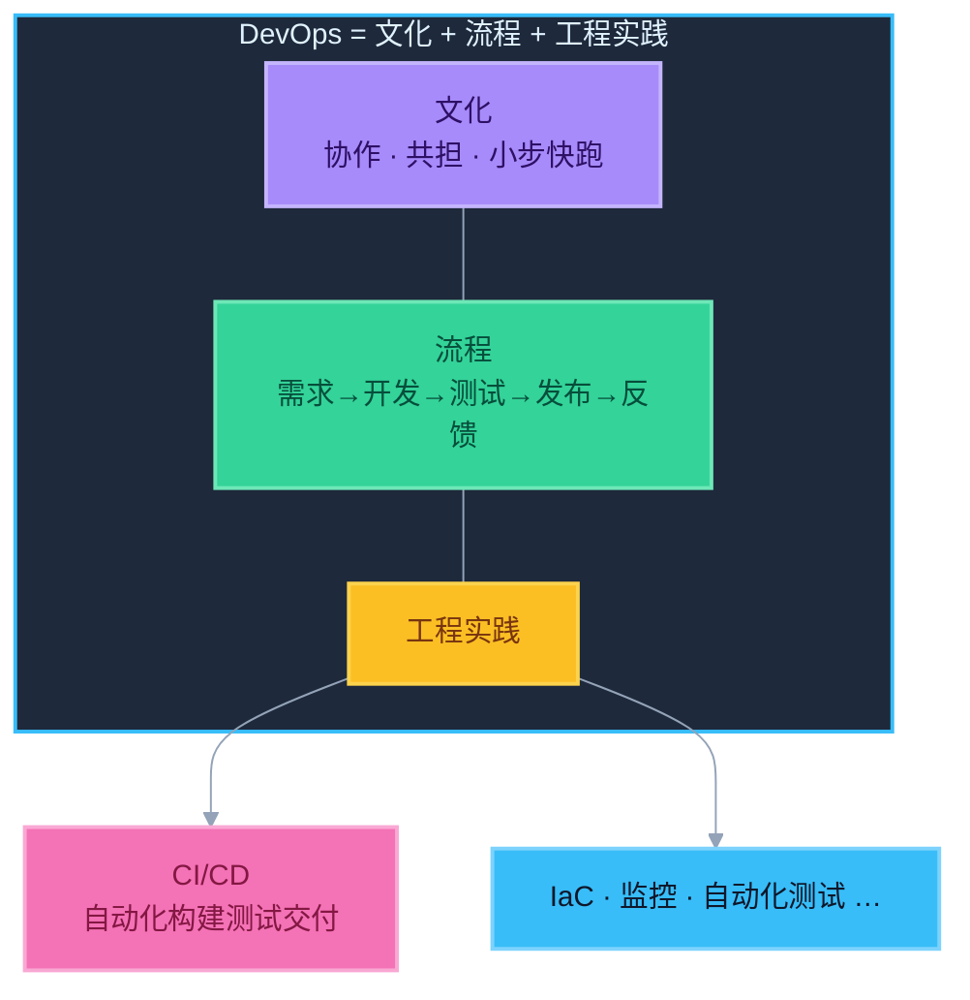

# 4. DevOps 基础认知

> 要求：能简单口述，区分 **DevOps ≠ CI/CD**。

---

## 一句话定义

**DevOps**：一套让开发（Dev）与运维（Ops）协同更快、更稳交付软件的文化、流程与工程实践。

它不只是工具，更不只是装一套 Jenkins / GitLab CI。

---

## DevOps 里通常包含什么（知道轮廓即可）

| 方面 | 例子 |
|------|------|
| 文化 | 协作、共担责任、小步快跑 |
| 流程 | 需求 → 开发 → 测试 → 发布 → 反馈闭环 |
| 工程实践 | CI/CD、IaC、监控告警、自动化测试 |
| 工具链 | Git、CI 平台、制品库、容器、观测系统 |

---

## 核心考点：DevOps ≠ CI/CD

| | DevOps | CI/CD |
|---|--------|-------|
| 是什么 | 文化 + 流程 + 实践的总称 | 具体的工程实践 / 流水线能力 |
| 范围 | 更宽 | 更窄，偏自动化构建测试发布 |
| 关系 | 上位概念 | DevOps 落地的关键手段之一 |

### 面试标准答法

> 「DevOps 是研发效能与协同的整体理念；CI/CD 是其中把集成、交付自动化的具体实践。可以说做好 CI/CD 是在践行 DevOps，但不能说装了流水线就等于做了 DevOps。」

### 反例（别这样说）

- ❌ 「我们上了 GitLab CI，所以已经完全 DevOps 了」
- ❌ 「DevOps 工程师 = 只会写 yml 的人」

---

## 和你岗位的关系（转岗话术）

你可以这样定位自己：

> 「我主攻 CI：把合并门禁、构建测试、制品产出做稳做快。这是 DevOps 里非常核心的一环；CD 侧我了解持续交付的边界——制品随时可发、生产保留确认。」

这样既诚实（主攻 CI），又显得懂全局。

---

## 30 秒口述稿

> DevOps 强调开发和运维一起对交付结果负责，用自动化和反馈缩短交付周期。  
> CI/CD 是它的关键实践：CI 保证频繁合入后自动验证，持续交付让制品随时可上线。  
> 所以 DevOps 大于 CI/CD；CI/CD 是落地抓手，不是 DevOps 的全部。
