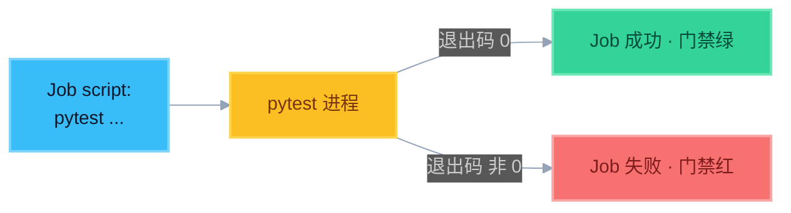

# 1. 安装与第一次跑通

> **动手 Demo**：[demos/01-install-run](./demos/01-install-run/)  
> 先按下面建好 venv，再 `cd demos/01-install-run && pytest -v`

## 安装（请用虚拟环境）

> WSL / Debian / Ubuntu 上直接 `python3 -m pip install pytest` 常会报  
> `externally-managed-environment`（PEP 668）——**这是正常保护，不要用 `--break-system-packages`**。  
> 正确做法：先建 `.venv`，再在环境里装。

在 `02-pytest/` 目录执行：

```bash
# 若提示没有 venv 模块：sudo apt install python3-venv python3-full
cd /mnt/d/workspace/doc/面试狂魔/人工智能面试题/AI_coding_interview/10-CICD/02-pytest

python3 -m venv .venv
source .venv/bin/activate          # 提示符前应出现 (.venv)
python -m pip install -U pip
python -m pip install -r requirements.txt
pytest --version
```

Windows（PowerShell，可选）：

```powershell
cd ...\10-CICD\02-pytest
python -m venv .venv
.\.venv\Scripts\Activate.ps1
python -m pip install -r requirements.txt
pytest --version
```

以后每次新开终端，先 `source .venv/bin/activate`（或 Windows 的 `Activate.ps1`）再跑 demo。

---

## 最小示例

`tests/smoke/test_add.py`：

```python
def test_add():
    assert 1 + 1 == 2
```

运行：

```bash
pytest
# 或指定路径
pytest tests/smoke
# 更啰嗦的输出
pytest -v
```

常见输出含义：

| 符号 | 含义 |
|------|------|
| `.` | 通过 |
| `F` | 失败（Failed） |
| `E` | 出错（Error，常是导入/夹具问题） |
| `s` | 跳过（skipped） |

---

## 和 CI 的第一层关系



> 记住：**pytest 失败 = 进程非 0 = CI Job 失败**。门禁变红往往就是这里。

---

## 练习

1. 建一个小目录，写 1 个通过、1 个故意失败的用例  
2. 跑 `pytest -v`，看失败栈  
3. 在 PowerShell / bash 看退出码（Windows：`echo $LASTEXITCODE`）  
