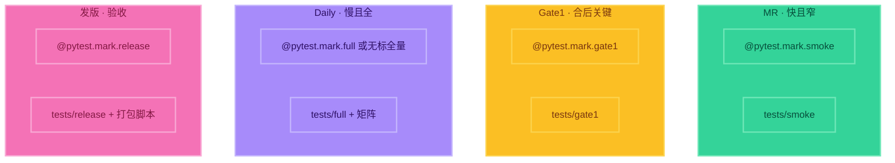

# 3. marker 与门禁分流【重点】

> 这一节直接对接你公司的多门禁：**触发不同，case 集也不同**。  
> **动手 Demo**：[demos/03-markers](./demos/03-markers/)  
> `cd demos/03-markers && pytest -m smoke -v`（再试 gate1 / full / release，并对比 `tests/smoke` 陷阱）

## 两种分流手段（常一起用）

| 手段 | 做法 | 命令例子 |
|------|------|----------|
| **目录** | 用例放不同文件夹 | `pytest tests/smoke` |
| **marker** | 给用例打标签 | `pytest -m smoke` |

推荐：**目录粗分 + marker 细分**（或两者对齐：`tests/smoke` 里都标 `@pytest.mark.smoke`）。

---

## 注册与使用 marker

`pytest.ini`（或 `pyproject.toml`）里登记，避免警告：

```ini
[pytest]
markers =
    smoke: MR 预检，冒烟快测
    gate1: Merge 后关键链路
    full: Daily 全量
    release: 发版验收
```

用例上打标：

```python
import pytest

@pytest.mark.smoke
def test_health():
    assert True

@pytest.mark.gate1
def test_critical_path():
    assert True

@pytest.mark.full
def test_long_regression():
    assert True

@pytest.mark.release
def test_package_checklist():
    assert True
```

运行：

```bash
pytest -m smoke
pytest -m gate1
pytest -m "smoke or gate1"    # 组合
pytest -m "not full"          # 排除重测
```

---

## 四门禁 × case 集（对照背）



| 门禁 | pytest 怎么选 case | 内容特征 |
|------|-------------------|----------|
| MR | `-m smoke` 或 `tests/smoke` | 冒烟、分钟级 |
| Gate1 | `-m gate1` 或 `tests/gate1` | 主干集成、关键路径 |
| Daily | `tests/full`（可加平台参数） | 全量/矩阵/长稳 |
| 发版 | `-m release` + 打包脚本 | 验收清单，偏发布质量 |

---

## 口述模板

> 「我们用 pytest 的目录和 marker 维护多套用例集。MR 只跑 smoke；合入后 Gate1 跑关键链路标记；Daily 跑 full；发版跑 release 验收。CI 的 rules 决定何时触发，pytest 的路径/`-m` 决定跑哪批 case——触发和内容都分流。」

---

## 练习

1. 四个文件或四个函数，分别打上 `smoke/gate1/full/release`  
2. 分别执行四条 `-m` 命令，确认每次只跑对应子集  
3. 故意把一个 `full` 用例放进 `tests/smoke` 但不打 `smoke` 标，体会「目录与 marker 不一致」的坑  
