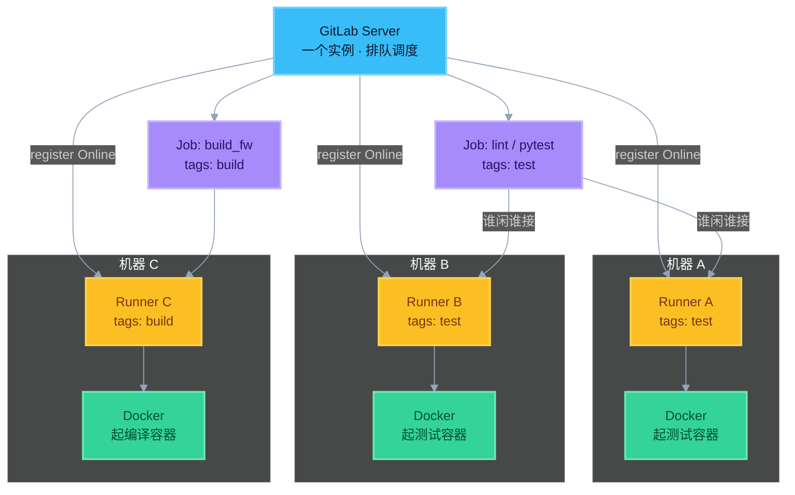

# 0. GitLab 安装与部署（面试够用）

先分清装的是哪两样：

| 组件 | 是什么 | 谁装 |
|------|--------|------|
| **GitLab（Server）** | Web / Git / CI 协调端（排队 Job） | 公司平台组，或用 gitlab.com |
| **GitLab Runner** | 真正执行 Job 的工人 | 平台组 / 项目组在构建机上注册 |

开发岗多数**不亲手装 Server**；要会说步骤和「Server ≠ Runner」。

---

## 路径 A：不装 Server（最常见）

用 **GitLab.com** 或公司已有实例 → 你只配仓库 `.gitlab-ci.yml`，必要时注册 Runner。

---

## 路径 B：自建 GitLab Server（Omnibus，官方常用）

以 Linux（Ubuntu/Debian）为例，面试记主干即可：

```
1. 准备机器：够用的 CPU/内存/磁盘；固定域名或 IP；开放 80/443（SSH 22）
2. 安装依赖：curl、openssh、时区等
3. 添加 GitLab 官方源 / 下载 Omnibus 包
4. 安装：apt install gitlab-ee   或   gitlab-ce
5. 改 /etc/gitlab/gitlab.rb 里 external_url（https://git.example.com）
6. sudo gitlab-ctl reconfigure   ← 生成并启动全套服务
7. 浏览器打开 → 设 root 密码 → 建组/项目
8. （建议）配 HTTPS、备份、邮件；大团队再上对象存储等
```

常用运维命令（了解）：

```bash
sudo gitlab-ctl status
sudo gitlab-ctl reconfigure
sudo gitlab-ctl restart
```

其他装法（知道名字即可）：

| 方式 | 场景 |
|------|------|
| **Docker / Compose** | 试验、小环境 |
| **Helm / K8s** | 云原生、大规模 |
| **Omnibus 包** | 传统机房自建最常见 |

---

## 路径 C：安装并注册 Runner（和 CI 直接相关）

**可以、也经常装在多台机器上。** 每台装一个（或多个）Runner，都 register 到同一个 GitLab；Job 会派给 tags 匹配且有空位的那台——这就是扩容 / 分流。

```
1. 在构建机安装 gitlab-runner（包管理器或官方脚本）
2. 安装 Docker（若用 Docker 执行器）
3. gitlab-runner register
     - GitLab URL
     - Registration / authentication token（项目或实例 Settings → CI/CD → Runners）
     - 执行器选 docker
     - 默认 image 如 python:3.12 / alpine
4. 打 tags（如 test、build）
5. 在 config.toml 设 concurrent
6. gitlab-runner start / status → GitLab UI 显示 Online
7. （可选）再在机器 B、C 重复 1–6 → UI 里出现多个 Online Runner
```

| 做法 | 效果 |
|------|------|
| 多台机器各装 Runner，同 tag | 同类型 Job 分流，提高吞吐 |
| 不同机器不同 tags（test / build） | 分池：轻测试 / 重编译分开 |
| 单机只调大 `concurrent` | 也能并行，但受这一台 CPU/磁盘上限 |

### 彩色图：多机 Runner



> 蓝 = GitLab｜琥珀 = 各机 Runner｜绿 = Docker 容器｜紫 = Job  
> A/B 同属 test 池分流；C 专跑 build。

---

## 彩色关系图（安装顺序）


---

## 面试口述（30 秒）

> 「GitLab 分两块：Server 负责仓库和调度，常用 Omnibus 安装后改 external_url 再 reconfigure；Runner 装在构建机上 register，执行器选 Docker。开发侧主要写 yml；很多公司直接用已有 GitLab，我们只注册 Runner。」
