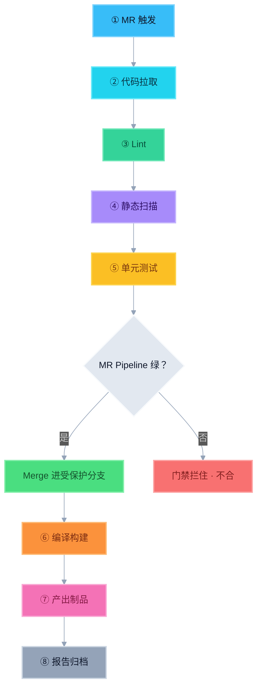
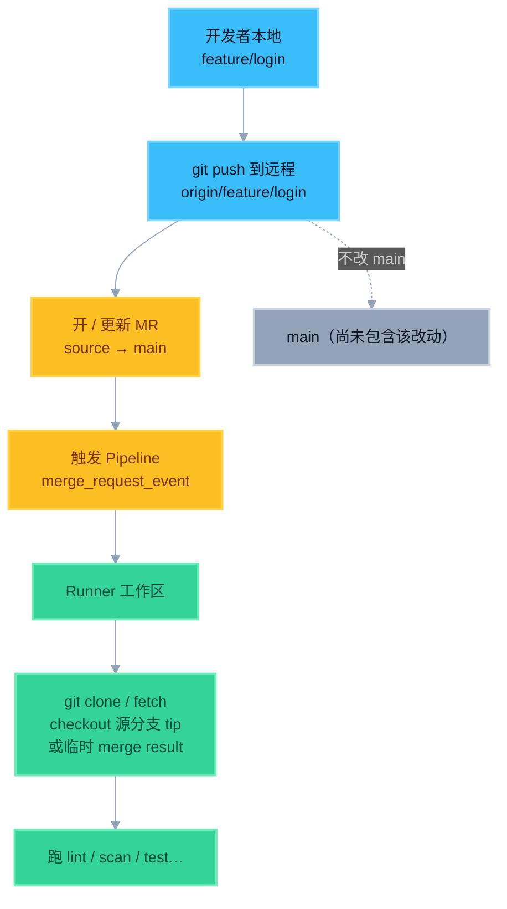
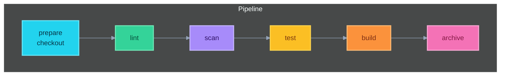

# 3. 标准 CI 流水线流程（背诵）

## 背诵版（大纲能力清单）

大纲把 CI 能力串成一条：

```
MR 触发 → 拉代码 → Lint → 静态扫描 → 单元测试
  → 编译构建 → 产出制品 → 报告归档
```

但**合入时机**要切开看（多数公司真实做法）：

```
【MR 门禁】拉代码 → Lint → 扫描 → 单元测试 →（绿）→ Merge
【合入后 / Gate1】编译构建 → 产出制品 → 报告归档（可再加集成测）
```

> 面试别说成「测完还在 MR 上必打完整包才允许合」。更贴地气：**MR 拦住质量，合进主干后再出正式制品。**

### 彩色总览图（推荐记这张）



> 颜色记忆：蓝 = 触发/拉取｜绿 = Lint｜紫 = 扫描｜琥珀 = 测试｜**绿框 = Merge**｜橙 = 构建｜粉 = 制品｜灰 = 归档｜红 = 不合

**为什么⑤之后是 Merge，不是⑥？**

| | MR 上 | Merge 之后（Gate1 / main） |
|--|-------|---------------------------|
| 目的 | 快拦坏代码，别污染主干 | 用已合入的代码打正式包 |
| 典型 Job | lint / scan / pytest | build / 制品 / 归档（+ 集成） |
| Demo 对应 | `python run_pipeline.py --gate mr_fast` | Gate1 / standard 里的 build+archive |

- Merge **不是** YAML 里的 Job，是「MR 门禁绿了 → 人点合 / 自动合」。
- 少数团队会在 MR 上**预编译**防合入后才发现编不过；那是加严，不是默认必背顺序。
- 本地 Demo 的 `--gate standard` 把全步骤串在一条里，是为了**一次跑齐能力清单**；真实分流看 `rules` + 多门禁。

### 还没 Merge 的代码，怎么 checkout？

关键一句：**没合进 `main`，不代表代码不在 Git 里。**  
功能分支推到远程后，提交已经存在；MR 流水线拉的就是**这条源分支上的 commit**，不是合完之后的主干。



| 疑问 | 事实 |
|------|------|
| 还没 merge，仓库里有代码吗？ | 有。在 **source 分支**（如 `feature/xxx`）上，远程已有 commit |
| checkout 拉的是谁？ | 默认拉 **MR 源分支当前 tip**（`$CI_COMMIT_SHA`） |
| 会不会动到 `main`？ | 不会。这只是 Runner 临时工作区里的检出 |
| 那 merge 门禁验的是什么？ | 验的是「若按现在这份分支代码合进去，质量过不过」 |

GitLab 常见两种检出（了解即可）：

1. **Branch pipeline / 普通 MR pipeline**：检出源分支 commit  
2. **Merged result pipeline**（可选）：GitLab 在后台把 source **临时合并进** target，检出这个临时结果再测——仍**不会**把 merge 写进真正的 `main`

口述：

> 「MR 流水线 checkout 的是功能分支上已经 push 上去的提交，不是 main。main 要等 MR 合并后才会更新；合并前的 Pipeline 只是在 Runner 沙箱里验这份未合入的代码。」

### Stage 视角（和 yml 对齐）



---

## 动手跑通（完整 Demo）

> 目录：[demos/mini-pipeline/](./demos/mini-pipeline/)  
> 默认命令：`python run_pipeline.py`（`--gate standard`）

| 背诵步骤 | Demo Job | 产物 |
|----------|----------|------|
| MR 触发 + 代码拉取 | `checkout` | `artifacts/checkout-meta.json` |
| Lint | `lint` | ruff 检查 |
| 静态扫描 | `scan` | `artifacts/scan-report.json` |
| 单元测试 | `unit_test` | `artifacts/report-standard.xml` |
| 编译构建 + 产出制品 | `build_pkg` | `dist/mini-app-<ver>+<sha>.txt` |
| 报告归档 | `archive` | `artifacts/archive/<时间戳>/` |

```powershell
cd demos/mini-pipeline
python -m venv .venv
.\.venv\Scripts\Activate.ps1
pip install -r requirements.txt
python run_pipeline.py
# 然后打开 artifacts/archive/ 看完整归档
```

说明：真实 GitLab 里「拉代码」多半由 Runner 自动完成；Demo 写成显式 Job，方便你对照背诵每一步。

---

## 展开成 Stage（面试可画）

能力仍可落在同一份 yml 的 stages 上，用 `rules` 切开：

```
stages: [prepare, lint, scan, test, build, archive]

# MR：到 test 为止，绿了才允许 Merge
# main / Gate1：再跑 build + archive
```

口述模板（约 40 秒）：

> 「提 MR 后 Runner 拉源分支代码，做 Lint、静态扫描和单元测试；这几项绿了才允许合进受保护分支。合入 main 之后再跑 Gate1：编译打包、产出带 SHA 的制品，并把报告归档。MR 保主干快，出包放合入后。」

---

## 和「多门禁」怎么并存？

大纲那一串是**能力清单**；Merge 插在「测完」和「出包」之间。多门禁用不同触发源裁剪 Job：

| 门禁 | 何时跑 | 典型内容 |
|------|--------|----------|
| MR | 开/更新 MR | lint + scan + 单测 → **然后 Merge** |
| Gate1 | 合进 `main` 后 | 编译 / 制品 / 归档（+ 必要集成） |
| Daily / 发版 | 定时或打 tag | 更全 case / 发布验收 |

不要说成：「我们只有一条永远跑全量的流水线。」更贴切：

> 「MR 快路径测完就合；构建出包在主干 Gate1；Daily / 发版再加严。」
---

## 实操目标对照

| 目标 | 怎么证明学会了 |
|------|----------------|
| 看懂 yml | 打开别人仓库能指出 stages / 哪个 Job 测 / 哪个出包 |
| 修改 / 仿写 | 能加一个 Job、改一条 rules、给报告加 artifacts |
| script 调 pytest | 写出带 `-m` 或路径的命令，并知道非 0 会失败 |
