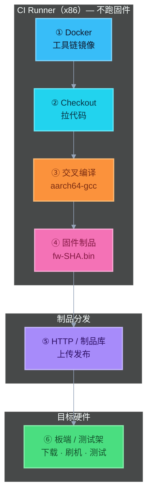

# Demo：固件交叉编译链路（Docker → 出包 → HTTP）

对应笔记：[01-交叉编译.md](../../01-交叉编译.md)

## 真实链路（记这个）

```
Docker 工具链镜像
  → checkout 代码
  → 交叉编译（产出板端固件）
  → 上传 / 发布到 HTTP（或制品库）
  → 板端 / 测试架 下载安装并做固件测试
```

**固件一般不在 PC / CI Runner 上跑。**  
PC 只负责编得对、传得出；能不能起来，是目标板的事。

### 彩色流水线图



> 颜色记忆：蓝 = Docker｜青 = Checkout｜橙 = 交叉编译｜粉 = 固件包｜紫 = HTTP｜绿 = 板端测试  
> 本 Demo 跑通 ①–⑤；⑥ 只打印说明，不连真板。

## 前置

- Docker（WSL / Docker Desktop）
- Python 3（跑迷你 HTTP 制品库）

## 一键跑

**WSL / Linux（推荐）：**

```bash
cd 10-CICD/04-ci-features/demos/cross-compile
chmod +x run_demo.sh scripts/build_in_container.sh
./run_demo.sh
```

**PowerShell：**

```powershell
cd 10-CICD\04-ci-features\demos\cross-compile
.\run_demo.ps1
```

分步（便于对照 Job）：

```bash
docker build -t ci-cross-demo:local .
docker run --rm -v "$PWD:/src" -w /src ci-cross-demo:local bash scripts/build_in_container.sh

# 终端 A
python3 scripts/http_repo_server.py --port 8765

# 终端 B
python3 scripts/upload_firmware.py
curl -I http://127.0.0.1:8765/fw-*.bin   # 或具体文件名
```

## 你会看到

| 步骤 | 产物 / 现象 |
|------|-------------|
| checkout 元数据 | `out/firmware/build-meta.json` |
| 交叉编译 | `out/firmware/fw-<sha>.bin`（`file` 显示 ARM aarch64） |
| 上传 | `http_repo/` 里同名文件；HTTP `201` |
| 板端测试 | 脚本提示 curl 下载 + 刷机（Demo 不停在真板） |

`file` 只用来确认「编的是目标架构」，**不是**要在 PC 上执行它。

## 面试口述

> 「固件 CI 一般是：Runner 用带交叉工具链的 Docker 拉代码交叉编译，把固件按 Commit SHA 上传到 HTTP 或制品库；测试架从地址拉包刷机做安装/冒烟。编译机是 x86，固件跑在板子上，业务上不会在 PC 里跑固件。」

## 和 GitLab CI 的对应

```yaml
stages: [build, publish]   # 板端测试常在另一套门禁 / 硬件队列

build_firmware:
  image: your-toolchain:1.2.3
  script:
    - aarch64-linux-gnu-gcc -O2 -o fw-${CI_COMMIT_SHORT_SHA}.bin hello.c
    - file fw-${CI_COMMIT_SHORT_SHA}.bin
  artifacts:
    paths: ["fw-*.bin"]

publish_firmware:
  script:
    - curl -T fw-${CI_COMMIT_SHORT_SHA}.bin "$FW_HTTP_REPO/"
  # 之后：硬件测试 Job / 外部系统消费同一 URL
```

## 文件

| 路径 | 作用 |
|------|------|
| `hello.c` | 假装固件里的最小程序 |
| `Dockerfile` | 只装交叉工具链 |
| `scripts/build_in_container.sh` | checkout 元数据 + 交叉编译 |
| `scripts/http_repo_server.py` | 迷你 HTTP 制品库（GET/PUT） |
| `scripts/upload_firmware.py` | 上传 + 打印板端下一步 |
| `run_demo.*` | 串起整条学习链路 |
