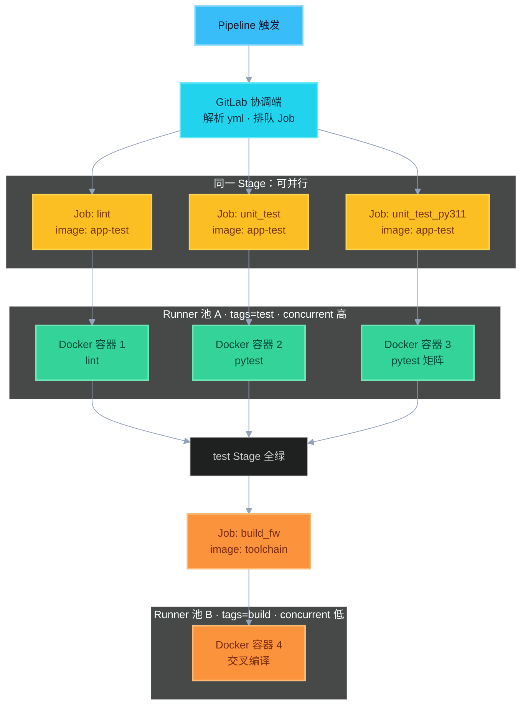

# 1. 优化方向（熟记四条）

大纲原文，面试直接背：

1. **Cache** 缓存加速构建  
2. **Job 并行**执行  
3. **Docker** 构建环境统一，避免环境污染  
4. 设置流水线 **超时**、失败 **重试**  

| 条 | 落地 |
|----|------|
| Cache | pip / npm / ccache；key 别乱导致脏缓存 |
| 并行 | 同 Stage 多 Job；矩阵拆 Job |
| Docker | **固定版本镜像**反复给 Job 用（含 pytest），不是每天新建 |
| 超时 / 重试 | 防挂死占 Runner；有限重试只对瞬时失败，不吞断言错误 |

口述：

> 「优化用 cache 和并行缩短时长；Job（含 pytest）在固定版本 Docker 里跑并复用——小项目编测同镜像，工具链重就分镜像但仍钉版本。负载靠 Runner 的 tags / concurrent 分流，不是给镜像做均衡。再配超时和有限重试。」

---

## Docker 要点

### 1）复用镜像，不是每天换

| 做法 | |
|------|--|
| 固定 `app-ci:1.2.3` / digest，工具链变了再升 tag | ✅ |
| 每天 `docker build` 新镜像，或乱用 `latest` | ❌ |

- **镜像**：编译器 / 工具链（重、少变）→ 复用  
- **cache**：依赖与编译中间结果（常变）→ 按 key 复用  

### 2）pytest 也在 Docker 里；编测可同可分

Job 写了 `image:`，`pytest` 就在该容器里跑。

| 场景 | 做法 |
|------|------|
| 小项目 | 编、测共用一个业务镜像 |
| 固件 / 重工具链 | test 瘦镜像 + build 工具链镜像，各自钉版本复用 |

### 3）「负载均衡」靠 Runner，不靠镜像

```
Job（image + tags）→ GitLab 排队 → 空闲 Runner 接单 → 起容器执行
```

| 手段 | 作用 |
|------|------|
| 多 Runner | 谁闲谁接 |
| `tags: [test]` / `[build]` | 测试池高并发；构建池机器强、并发小 |
| `concurrent` | 控制每台同时跑几个 Job |
| 同 Stage 并行 | 多个测试容器同时起 |

```yaml
unit_test:
  image: app-test:1.2.3
  tags: [test]
  script: [pytest -q]

build_firmware:
  image: toolchain-aarch64:3.1
  tags: [build]
  script: [make firmware]
```

| 别混 | |
|------|--|
| 镜像复用 | 同一 tag 被很多 Job 反复用 |
| 负载均衡 | Job 分到多台 Runner / 控制 concurrent |

> GitLab 真实调度**不是**业务里的 Python。教学模拟（最少连接选 Runner）：  
> [demos/runner_lb/schedule_demo.py](./demos/runner_lb/schedule_demo.py) → `python schedule_demo.py`

---

## 彩色图：多 Docker 并行

同 Stage 互不依赖的 Job → 同时派发 → 多个容器并行；全绿后再进构建池。



> 蓝 = 触发｜青 = 调度｜琥珀 = Job｜绿 = 并行测试容器｜橙 = 构建容器  
> 并行的是 **容器实例**；`app-test` 镜像仍是同一份在复用。
