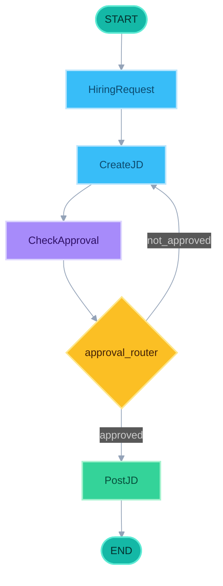

# Langchain vs LangGraph

---

## LangChain 与 LangGraph 各自做什么

两者同属 LangChain 生态，分工不同，常一起用，而不是二选一。

### LangChain：搭「能力积木」

**作用：** 把调用大模型做成可组合的应用层组件，让你快速拼出「能用 LLM 做事」的程序。

它主要解决这些事：

| 能力 | 说明 |
|------|------|
| **Model I/O** | 统一接入 OpenAI / Gemini 等模型，管理 Prompt、输出解析 |
| **Chains** | 把 Prompt → LLM → Parser 串成管道（`prompt \| llm \| parser`） |
| **Tools** | 给模型挂搜索、天气、数据库等外部能力 |
| **Agents** | ReAct 等单 Agent：模型自己决定何时调哪个 Tool |
| **RAG 组件** | Document Loader、Splitter、Embedding、VectorStore 等检索链路 |
| **Memory（基础）** | 简单对话历史拼接，适合短会话 |

**适合：** 线性流水线、单 Agent + 若干 Tool、原型验证、把「一次问答 / 一次工具调用」跑通。

**局限：** 复杂控制流（多分支、回环、长时间等待、人工审批）通常要你在 Python 里手写 `if` / `while`；跨多步的共享状态、断点恢复、HITL 也缺少一等公民支持。

### LangGraph：管「流程与状态」

**作用：** 用**显式状态图**编排多步 Agent / 工作流——节点是步骤，边是流转规则，State 是全程共享的黑板。

它主要解决这些事：

| 能力 | 说明 |
|------|------|
| **StateGraph** | 声明节点与边，控制流画在图上，而不是埋在脚本里 |
| **Shared State** | `TypedDict` 等 Schema，每步读写同一份状态 |
| **条件边 / 循环** | `add_conditional_edges`：审批失败回环、业务分支一目了然 |
| **Checkpoint** | 按 thread 持久化，支持多轮恢复、崩溃续跑 |
| **HITL** | `interrupt` / 人工确认后再 `Command` 继续 |
| **Subgraphs** | 大流程拆成可嵌套的子图 |
| **可观测性** | 节点级轨迹，便于调试与审计 |

**适合：** 多 Agent 协作、长流程业务（招聘、审批、客服工单）、需要人工介入或持久化会话的生产系统。

**和 LangChain 的关系：** Graph 里的节点内部仍然用 LangChain 的 LLM、Tool、Retriever；LangGraph 负责**何时走到哪一步、状态怎么带着走**。

```text
LangChain  →  提供模型、工具、链、检索等「零件」
LangGraph  →  用图把零件编排成可控、可恢复的「整机流程」
```

---

## LangGraph Implementation（显式图 + 条件边）

节点即函数，边声明流转；审批失败用 **conditional edge** 回环到 `CreateJD`：



| 对比维度 | LangChain | LangGraph |
|----------|-----------|-----------|
| 核心作用 | 模型调用、Tool、Chain、单 Agent | 多步编排、状态、分支/循环、HITL |
| 控制流 | Python `while` / `if` | Graph edges + `add_conditional_edges` |
| 状态 | 局部变量 / 手工 dict | 一等 State，节点读写同一状态 |
| 循环 / 分支 | 代码里写死 | 图上可见、可组合 |
| 扩展 HITL / 持久化 | 自己搭 | Checkpoint / interrupt 原生支持 |

---

## 一句话结论

- **LangChain**：提供 LLM 应用的能力积木（模型、Prompt、Tool、Chain、RAG）；擅长快速拼出单 Agent / 线性链路。
- **LangGraph**：在积木之上做图编排；擅长多分支、可回环、要共享状态与可恢复执行的长流程。

下一步：`02-Langchain-Single-Agent` 先跑通单 Agent，再在 `04-LangGraph-Code` 用图把上述模式落地。
