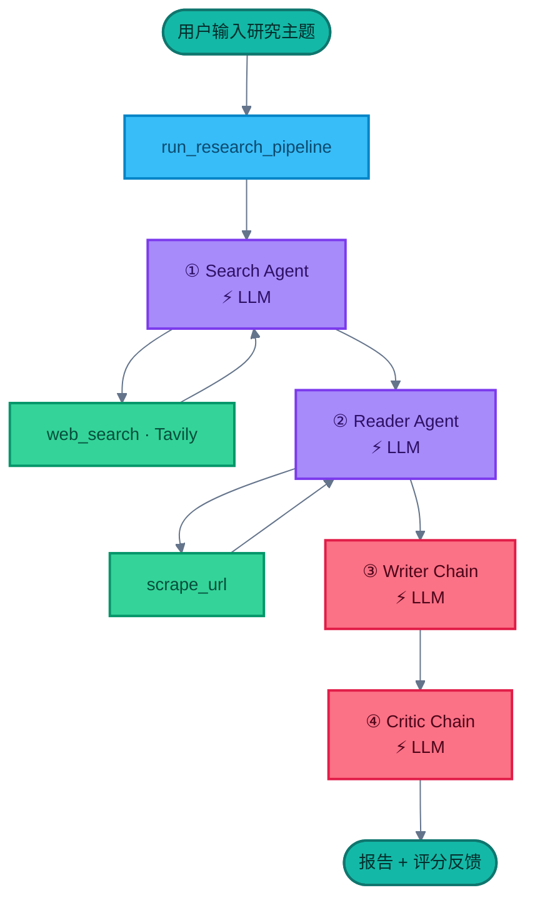
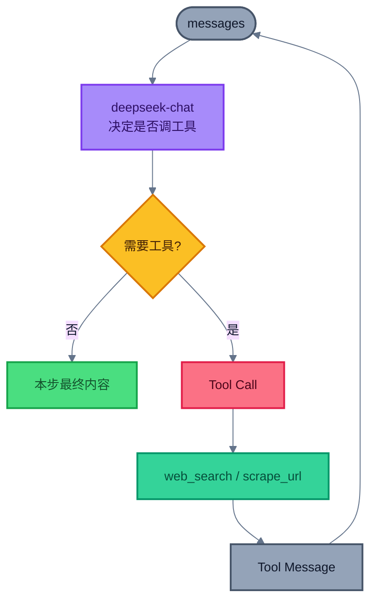
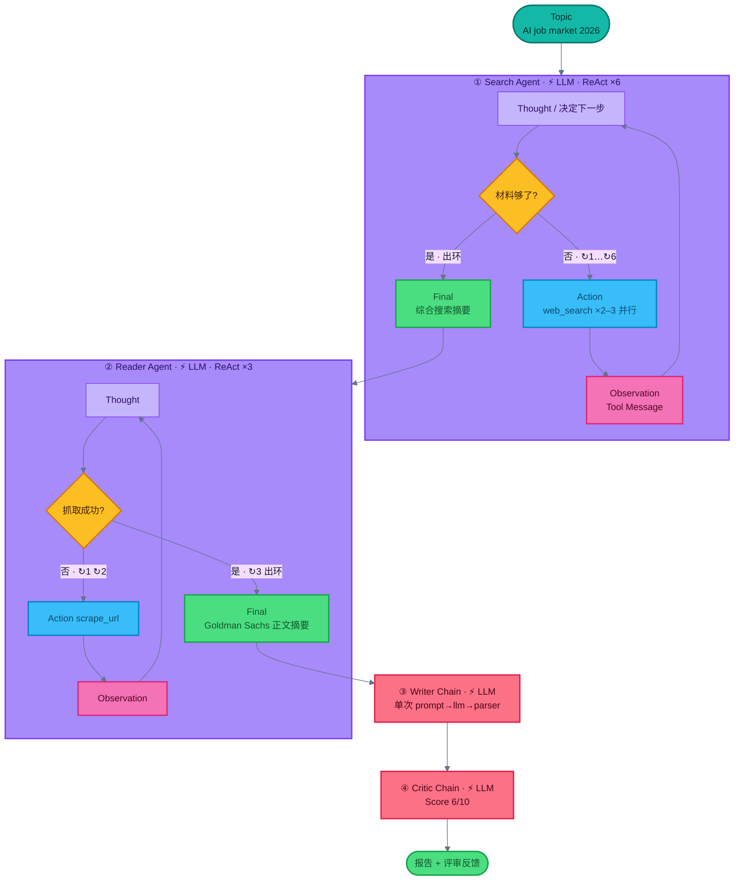

# LangChain 多智能体研究系统

在 `02-Langchain-Single-Agent` 单 Agent 基础上，把「搜索 → 阅读 → 写作 → 评审」拆成多个角色，由 `run_research_pipeline` 串成流水线，自动产出研究报告并打分。

使用 **DeepSeek**（`deepseek-chat`）+ **Tavily** 搜索 + 网页抓取工具；适配 **LangChain 1.x**（`create_agent`）。

`.env` 需要：`DEEPSEEK_API_KEY`、`TAVILY_API_KEY`。

---

## 逻辑总览（彩色 Mermaid）

下图展示整条研究流水线：用户输入主题后，Search / Reader 两个 **Agent**（可调工具）采集材料，Writer / Critic 两条 **Chain**（纯 Prompt → LLM）写报告并评审。带 **⚡ LLM** 标注的节点会调用 `deepseek-chat`；绿色工具节点不调 LLM。



| 节点 | 是否 call LLM | 说明 |
|------|---------------|------|
| Search Agent | ✅ | `create_agent` 内循环：LLM 决策是否调 `web_search` |
| Reader Agent | ✅ | `create_agent` 内循环：LLM 决策是否调 `scrape_url` |
| Writer Chain | ✅ | `prompt \| llm \| parser`，一次生成报告 |
| Critic Chain | ✅ | `prompt \| llm \| parser`，一次打分反馈 |
| `web_search` / `scrape_url` | ❌ | 纯工具调用，不经过 LLM |

**本例路径：** 输入主题 → Search Agent 调 `web_search` → Reader Agent 调 `scrape_url` 抓正文 → Writer Chain 按主题语言写报告 → Critic Chain 打分并给改进建议。

---

## 与 02 单 Agent 的差异

| | 02 单 Agent | 03 多智能体流水线 |
|--|-------------|-------------------|
| 角色 | 一个 Agent 决定调哪些工具 | Search / Reader / Writer / Critic 分工 |
| 控制流 | `create_agent` 内部工具循环 | `pipeline.py` 显式四步串联 |
| 输出 | 对话式最终回答 | 结构化报告 + Critic 评分 |
| UI | Notebook | Streamlit（`app.py`）+ CLI（`main.py`） |

Search / Reader 内部仍是 02 同款闭环（LLM 决策 → 调工具 → 写回 messages → 再决策）：



---

## 组件职责

| 组件 | 类型 | 职责 |
|------|------|------|
| **Search Agent** | `create_agent` + `web_search` | Tavily 检索标题 / URL / 摘要 |
| **Reader Agent** | `create_agent` + `scrape_url` | 选相关 URL，多策略抽取正文 |
| **Writer Chain** | `prompt \| llm \| parser` | 合成引言 / 发现 / 结论 / 来源；**按用户主题语言输出** |
| **Critic Chain** | `prompt \| llm \| parser` | 打分（X/10）、优点、改进点、一句话评价 |

---

## 技术栈

| 技术 | 用途 |
|------|------|
| LangChain 1.x | `create_agent`、Chain |
| DeepSeek（`deepseek-chat`） | 智能体与 Chain 所用模型 |
| Streamlit | Web UI |
| Tavily | 网页搜索 |
| BeautifulSoup / Trafilatura / Readability | 网页正文抽取 |
| python-dotenv | 环境变量 |
| Rich | 终端输出 |

---

## 安装与配置

```bash
pip install -r requirements.txt
```

在项目或仓库根目录 `.env` 中配置：

```bash
DEEPSEEK_API_KEY=your_deepseek_api_key
TAVILY_API_KEY=your_tavily_api_key
```

- [DeepSeek 开放平台](https://platform.deepseek.com/api_keys)
- [Tavily API](https://tavily.com)

> DeepSeek 提供 OpenAI 兼容接口；代码通过 `base_url=https://api.deepseek.com` 调用。

---

## 使用方式

### Streamlit UI（推荐）

```bash
python -m streamlit run app.py
```

或（若 `streamlit` 已在 PATH）：

```bash
streamlit run app.py
```

浏览器打开 `http://localhost:8501`。

> 不要写成 `python streamlit run app.py`——那会把 `streamlit` 当成脚本文件名。

### 命令行

```bash
python main.py
```

在 `main.py` 中修改 `topic` 即可换主题。

---

## 项目结构

```
.
├── app.py                 # Streamlit Web 界面
├── main.py                # CLI 入口
├── requirements.txt
├── README.md
├── log.txt                # 本次 CLI 运行 pretty log（画 workflow 用）
└── src/
    ├── agents/
    │   └── agents.py      # Search / Reader Agent + Writer / Critic Chain
    ├── tools/
    │   └── tools.py       # web_search、scrape_url
    └── pipelines/
        └── pipeline.py    # 四步研究流水线
```

---

## 工作流程


1. **输入主题**：UI 或 `main.py` 传入 `topic`
2. **Search**：`web_search` 拉近期可靠网页摘要
3. **Reader**：从搜索结果选 URL，`scrape_url` 抽正文（trafilatura → readability → 全文回退）
4. **Writer**：合并搜索 + 抓取内容，生成结构化报告（跟随主题语言）
5. **Critic**：按固定格式输出 Score / Strengths / Areas to Improve / verdict
6. **输出**：返回 `state`：`search_results`、`scraped_content`、`report`、`feedback`

---

## 示例输出

报告通常包含：

- 引言与背景
- 至少 3 条有说明的关键发现
- 结论与来源 URL
- Critic：`Score: X/10` + 优缺点 + 一句话评价

---

## 本次运行实际 Workflow（根据 `log.txt`）

主题：`The impact of AI on the job market in 2026`  
完整 pretty log：[`log.txt`](./log.txt)

| 步骤 | 类型 | ⚡ LLM | 实际轨迹 |
|------|------|--------|----------|
| Search Agent | ReAct Agent | ✅ | **6** 圈 · 共 **17** 次 `web_search`（多圈并行 2–3 查询）· 25 messages |
| Reader Agent | ReAct Agent | ✅ | **3** 圈 · 共 **5** 次 `scrape_url`（前两圈 404，第三圈成功）· 10 messages |
| Writer Chain | Chain | ✅ | 单次 `prompt → llm → parser` |
| Critic Chain | Chain | ✅ | 单次调用 · **Score: 6/10** |

### 流水线总图（本例）



### Reader 环上每一圈（对照 log）

| 圈 | Thought | Action | Observation | 决策 |
|---|---|---|---|---|
| ↻1 | 抓 Goldman Sachs 原文 | `scrape_url(.../ai-and-the-future-of-work)` | ❌ 404 | 不够 → 继续 |
| ↻2 | 换两个候选 URL | `scrape_url` ×2 | ❌ 404 ×2 | 不够 → 继续 |
| ↻3 | 改抓 GDP/就业长文 | `scrape_url` ×2（含 generative-ai GDP 文） | ✅ 正文（300M jobs / 2/3 occupations） | **够了 → 出环** |

**对照日志：** `AIMessage(tool_calls=...)` = Action，`ToolMessage` = Observation；Writer / Critic 无工具，各一次 ⚡ LLM。
