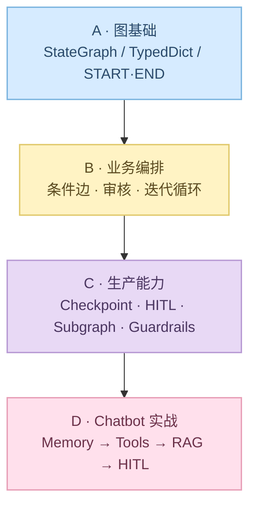

# LangGraph 核心 + Agentic Chatbot

本目录是课程主线：用 **StateGraph** 把控制流画成图，掌握状态、条件边、循环、持久化、HITL、子图与护栏；再用 Streamlit 实战把能力落到可对话的生产级 Chatbot。

> 前置：已完成 `01` 概念对比、`02` 单 Agent、`03` 多 Agent 流水线；理解「顺序硬编码」的局限后，再学本章收益最大。

---

## 学习目标

学完本章应能：

1. 手写最小 `StateGraph`（`State` / Node / Edge / `START` / `END`）
2. 用条件边与循环实现业务分支与迭代
3. 用 Checkpoint + Thread ID 做多轮恢复
4. 用 `interrupt` / `Command` 做人机协同（HITL）
5. 用 Subgraph 拆分复杂流程；用 Guardrails 做确定性 / 模型式护栏
6. 把上述能力串进 Agentic Chatbot（Memory → DB → Tools → RAG → HITL）

---

## 环境准备

```bash
conda create -n langgraph-test python=3.11 -y
conda activate langgraph-test
pip install -r requirements.txt
```

Chatbot 子项目另有依赖：

```bash
cd Agentic-Chatbot-using-LangGraph
pip install -r requirements.txt
```

在对应目录配置 `.env`（勿提交）。**Notebook 1–13 统一使用 DeepSeek V4 Pro**（`deepseek-v4-pro`，OpenAI 兼容接口）：

```bash
DEEPSEEK_API_KEY=sk-...
# 可选，默认 https://api.deepseek.com
DEEPSEEK_BASE_URL=https://api.deepseek.com
```

Chatbot 子项目若仍用其他提供商，按其后端文件填写对应密钥；RAG / 工具场景可能还需要 Tavily 等。

对照图：`demo.excalidraw`、`Persistence.excalidraw`、`HITL.excalidraw`、`Subgraphs.excalidraw`

---

## 学习框架总览

```text
阶段 A  图基础          Notebook 1–3     State + 无/有 LLM 的最小图
阶段 B  业务编排        Notebook 4–8     条件边、审核、迭代循环
阶段 C  生产能力        Notebook 9–13    持久化 / HITL / 子图 / 护栏
阶段 D  Chatbot 实战    Agentic-Chatbot  simple → thread → db → tool → rag → hitl
```



建议时长：**3–5 天**（Notebook 约 2–3 天，Chatbot 约 1–2 天）。

---

## 阶段 A：图基础（Notebook 1–3）

| 序号 | Notebook | 主题 | 要抓住的点 |
|------|----------|------|------------|
| 1 | `1_Temperature_Conversion_workflow.ipynb` | 无 LLM：State + 多 Node | 图可以先不碰模型；专心 State 传递 |
| 2 | `2_Simple_QA_LLM_Workflow.ipynb` | 接入 LLM 的简单问答图 | Node 内调用 LLM，读写同一 State |
| 3 | `3_Prompt_Chaining_Workflow.ipynb` | Prompt 链式多节点 | 多步 Prompt 在图上显式串起来 |

**学习路径**

1. 对照 `demo.excalidraw`，建立「节点 = 函数、边 = 流转」心智模型
2. 自己改一个 State 字段，看上下游 Node 如何读到
3. 验收：能默写最小图骨架（`StateGraph` → `add_node` → `add_edge` → `compile` → `invoke`）

---

## 阶段 B：业务编排（Notebook 4–8）

| 序号 | Notebook | 主题 | 要抓住的点 |
|------|----------|------|------------|
| 4 | `4_Employee_analytics_Workflow.ipynb` | 业务分析型工作流 | 多步分析如何用 State 串联 |
| 5 | `5_Essay_workflow.ipynb` | 作文 / 长文生成流 | 长内容分阶段生成 |
| 6 | `6_Content_Moderation_Workflow.ipynb` | 内容审核与分支 | **条件边**按审核结果分流 |
| 7 | `7_Review_workflow.ipynb` | 评审类工作流 | 评审 → 通过 / 打回 |
| 8 | `8_Iterative_Workflows.ipynb` | 迭代 / 循环工作流 | 图上的 **循环** 替代 Python `while` |

**学习路径**

1. 重点啃 6、8：`add_conditional_edges` 与回环
2. 把第 3 章「搜索–阅读–写作–评审」想象成图：哪步该条件边、哪步该循环
3. 验收：能画出「审核失败回环」的 Mermaid，并指出路由函数读的是哪个 State 字段

---

## 阶段 C：生产能力（Notebook 9–13）

| 序号 | Notebook | 主题 | 配套图 |
|------|----------|------|--------|
| 9 | `9_Persistence.ipynb` | Checkpoint / 线程持久化 | `Persistence.excalidraw` |
| 10 | `10_HITL.ipynb` | Human-in-the-Loop | `HITL.excalidraw` |
| 11 | `11_subgraphs.ipynb` | 子图拆分 | `Subgraphs.excalidraw` |
| 12 | `12_subgraph_shared.ipynb` | 共享状态的子图 | — |
| 13 | `13_guardrails_crash_course.ipynb` | Guardrails | — |

**学习路径**

1. **9**：搞清 `thread_id`、MemorySaver / 持久化后端——没有它就没有「多轮会话」
2. **10**：`interrupt` 暂停 → 人工输入 → `Command` 恢复；对照前后差异
3. **11–12**：大图拆子图；注意共享 State vs 隔离 State
4. **13**：确定性规则护栏 vs 模型审核护栏，各自适用场景
5. 验收：能解释「为何 HITL 必须配 Checkpoint」；能说明子图何时共享父图 State

---

## 阶段 D：Agentic Chatbot 实战

**路径：** `Agentic-Chatbot-using-LangGraph/`

把 Notebook 里的能力落到可点可聊的 Streamlit 应用。

### 后端能力递进

| 文件 | 能力 |
|------|------|
| `agentic_chatbot_backend.py` | 基础对话 + MemorySaver |
| `agentic_chatbot_db_backend.py` | SQLite Checkpoint |
| `agentic_chatbot_tool_backend.py` | ToolNode / `tools_condition` |
| `agentic_chatbot_rag_backend.py` | PDF → FAISS + RAG + Tools |
| `agentic_chatbot_hitl_backend.py` | HITL + RAG 等综合 |
| `chatbot_without_hitl.py` / `chatbot_with_hitl.py` | HITL 前后对照脚本 |

### 前端打通顺序（严格按序）

```text
app_simple → app_thread → app_db → app_tool → app_rag → app_hitl
```

| 前端 | 对应能力 |
|------|----------|
| `app_simple.py` | 单会话最小对话 |
| `app_thread.py` | 多 Thread / 会话切换 |
| `app_db.py` | 持久化 Checkpoint |
| `app_tool.py` | 工具调用边 |
| `app_rag.py` | 文档检索增强 |
| `app_hitl.py` | 人机协同综合版 |

辅助 Notebook：`notebooks/Chatbot_workflow.ipynb`、`tools_demo.ipynb`、`rag_demo.ipynb`、`HITL_demo.ipynb`

**学习路径**

1. 先跑通 `app_simple`，确认密钥与依赖无误
2. 每升一级，对照后端文件看「多了哪条边 / 哪个 Checkpointer」
3. `app_hitl` 对照 `HITL.excalidraw` 与 `chatbot_with_hitl.py`
4. 验收：能口述 State、Checkpoint、Thread ID、Tool 边、RAG 检索、`interrupt` / `Command` 如何协作

运行示例：

```bash
cd Agentic-Chatbot-using-LangGraph
streamlit run app_simple.py
# 再逐步换成 app_thread / app_db / app_tool / app_rag / app_hitl
```

---

## 推荐节奏（示例）

| 天 | 内容 |
|----|------|
| Day 1 | 阶段 A（1–3）+ 默写最小图 |
| Day 2 | 阶段 B（4–8），重点条件边与循环 |
| Day 3 | 阶段 C（9–13）+ 三张 Excalidraw |
| Day 4 | Chatbot：`app_simple` → `app_rag` |
| Day 5 | `app_hitl` + 自画一张「自己的」Chatbot 架构图 |

---

## 能力清单（本章验收）

- [ ] 能默写最小 `StateGraph` 并 `invoke`
- [ ] 能用 `add_conditional_edges` 实现审核失败回环
- [ ] 能说明 Checkpoint / `thread_id` 如何恢复多轮对话
- [ ] 能演示 HITL：中断 → 人工确认 → 继续
- [ ] 能用 Subgraph 拆出一个子流程
- [ ] 能区分确定性 Guardrails 与模型式审核
- [ ] 能跑通 `app_simple` → `app_hitl` 全链路并解释每级新增点

---

## 目录结构

```text
04-LangGraph-Code/
├── README.md                          # 本学习框架
├── requirements.txt
├── demo.excalidraw                    # 总览示意
├── Persistence.excalidraw
├── HITL.excalidraw
├── Subgraphs.excalidraw
├── 1_Temperature_Conversion_workflow.ipynb
├── 2_Simple_QA_LLM_Workflow.ipynb
├── …                                  # 3–12
├── 13_guardrails_crash_course.ipynb
└── Agentic-Chatbot-using-LangGraph/   # 阶段 D 实战
    ├── app_*.py
    ├── agentic_chatbot_*_backend.py
    ├── notebooks/
    └── requirements.txt
```

---

## 学习建议

1. **先图后码**：每阶段先看对应 `.excalidraw`，再开 Notebook。
2. **先跑通再改**：改 State 字段、加一个条件分支、换一条 HITL 规则，比只读代码记得牢。
3. **Chatbot 不要跳级**：跳过 `app_db` 直接上 HITL，很难理解中断为何依赖 Checkpoint。
4. **卡点回看**：并发 / 结构化输出可穿插 `05-Asynchronous Programming`、`06-Pydantic-Validation`。

下一步：按阶段 A 打开 `1_Temperature_Conversion_workflow.ipynb`，跑通第一个无 LLM 的图。
