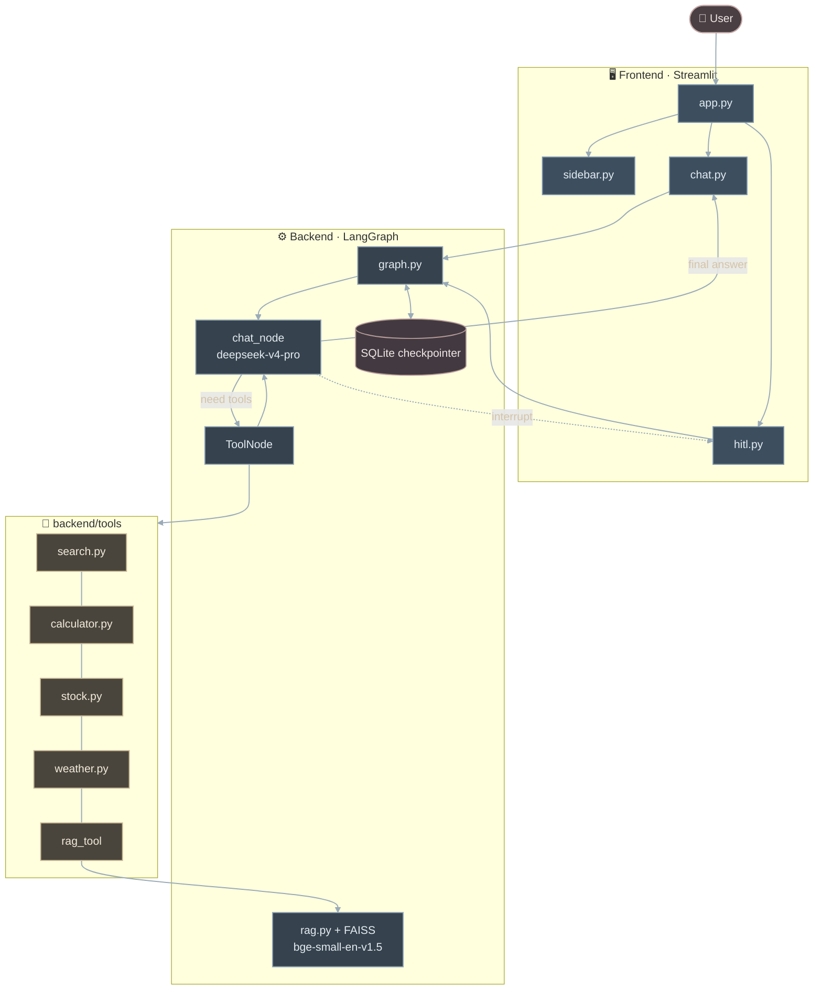
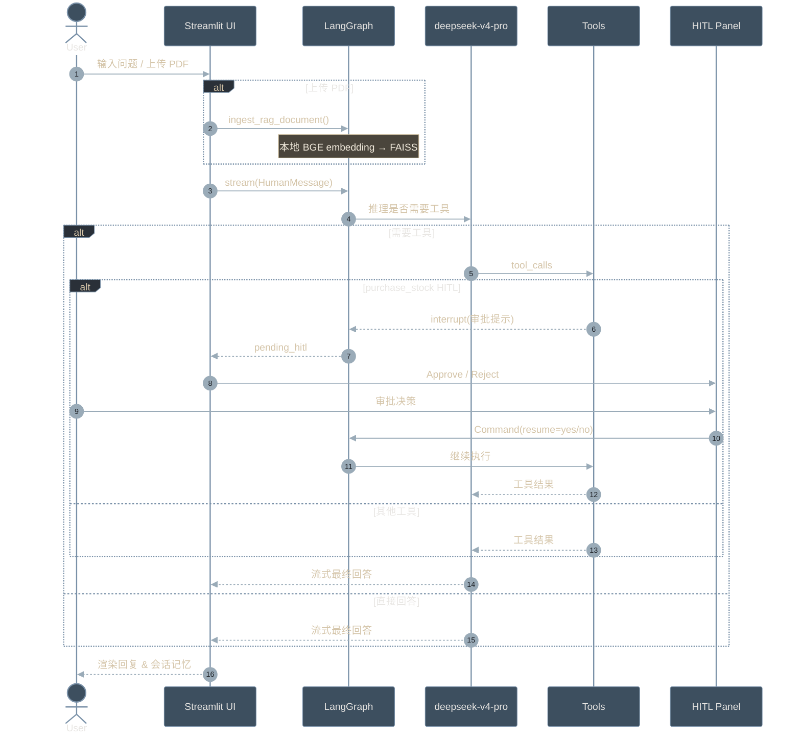
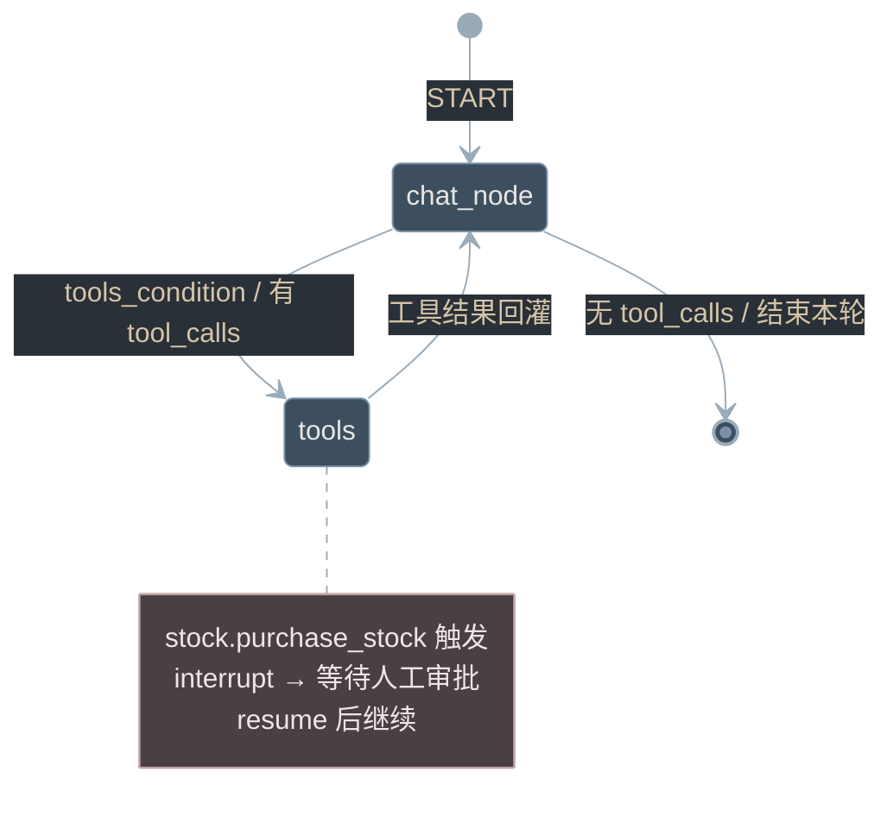

# Agentic Chatbot with LangGraph （包含完整的框架和 human in the loop）

基于 **LangGraph + Streamlit** 的 Agentic 聊天机器人。

- **LLM**：`deepseek-v4-pro`（DeepSeek OpenAI 兼容 API）
- **Embedding**：`sentence-transformers` 加载 `BAAI/bge-small-en-v1.5`（首次下载到 `models/`，之后本地加载）
- **能力**：网页搜索 · 天气 · 股票行情 · PDF RAG · 计算器 · 股票购买 HITL 审批
- **记忆**：SQLite Checkpointer，多会话线程可切换恢复

---

## Quick Start

### 1. 环境准备（推荐 Windows 原生）

```bash
cd 02-Agentic-Chatbot-using-LangGraph

# 若目录里还有 WSL 建的 .venv，先删掉或改名后再建 Windows venv
python -m venv .venv
.venv\Scripts\activate

pip install -r requirements.txt
```

### 2. 配置环境变量

在项目根目录创建 `.env`：

```env
DEEPSEEK_API_KEY=your-deepseek-api-key
TAVILY_API_KEY=your-tavily-api-key

# optional
# DEEPSEEK_BASE_URL=https://api.deepseek.com
# EMBEDDING_MODEL_NAME=BAAI/bge-small-en-v1.5
# LOCAL_EMBEDDING_MODEL_DIR=models/bge-small-en-v1.5
# LOG_LEVEL=INFO                                 # DEBUG / INFO / WARNING / ERROR
# LOG_DIR=logs
```

> 天气工具复用 `TAVILY_API_KEY`，通过 Tavily 搜索获取实时天气。

> Embedding **懒加载**：普通聊天不加载 `torch`；首次上传 PDF / 调用 RAG 时才会加载。  
> 权重目录：`models/bge-small-en-v1.5/`（可提前：`python scripts/download_embedding_model.py`）。  
> 若更换过 embedding 模型，请删除本地 `data/faiss_db/` 后重新上传 PDF。  
> 运行日志：`logs/agentic-chatbot.log`；启动分段计时：`logs/startup.log`。

### 3. 启动应用

```bash
python -m streamlit run app.py
```

浏览器打开 **`http://127.0.0.1:8501`**。  
终端出现 URL 后，第一次打开页面仍会花几秒导入 LangGraph（正常）；同一进程内刷新会快很多。  
若白屏：清掉该站点 Cookie / 站点数据后硬刷新。

---

## 目录结构

```text
02-Agentic-Chatbot-using-LangGraph/
├── app.py                         # Streamlit 入口
├── requirements.txt
├── README.md
├── data/                          # 运行时数据（gitignore）
│   ├── chatbot.db                 # LangGraph SQLite checkpointer
│   └── faiss_db/                  # PDF RAG 向量库
├── backend/                       # LangGraph 后端
│   ├── __init__.py                # 导出 chatbot / get_all_threads / ingest_rag_document
│   ├── logger.py                  # 统一日志（控制台 + 滚动文件）
│   ├── llm.py                     # DeepSeek LLM + SentenceTransformer Embeddings
│   ├── rag.py                     # PDF 入库、检索、rag_tool
│   ├── graph.py                   # StateGraph / nodes / checkpointer
│   ├── threads.py                 # 会话线程列表
│   └── tools/                     # 工具包（按能力拆分）
│       ├── __init__.py            # 汇总 tools / llm_with_tools
│       ├── search.py              # Tavily 搜索
│       ├── calculator.py          # 数学计算
│       ├── stock.py               # 股价查询 + HITL 购买
│       └── weather.py             # Tavily 天气检索
└── frontend/                      # Streamlit 前端
    ├── __init__.py
    ├── session.py                 # session / thread 管理
    ├── hitl.py                    # interrupt 同步与 resume
    ├── sidebar.py                 # 侧边栏会话列表
    └── chat.py                    # 消息流、审批 UI、PDF 上传
```

---

## 系统逻辑

### 整体架构



### Agent 运行时序



### Function Call Flow（文本）

前后端同进程：Streamlit `frontend/*` 直接 `import` 并调用 `backend` 导出函数，无 HTTP。

**1. 启动渲染**

```text
app.py
├── init_session_state()                    # frontend/session.py
│   ├── generate_thread_id()
│   ├── get_all_threads()                   # backend/threads.py → checkpointer
│   └── add_thread(thread_id)
├── sync_pending_interrupt(thread_id)       # frontend/hitl.py
│   └── get_pending_interrupt(thread_id)
│       └── chatbot.get_state(config)       # backend.graph 编译图
├── render_sidebar()                        # frontend/sidebar.py
├── render_message_history()                # frontend/chat.py
├── render_hitl_approval()                  # frontend/chat.py
└── handle_chat_input()                     # frontend/chat.py
```

**2. 用户发消息（主路径）**

```text
handle_chat_input()
└── _stream_assistant_response(user_input)
    └── chatbot.stream(
            {"messages": [HumanMessage(...)]},
            config={"configurable": {"thread_id": ...}},
            stream_mode="messages",
        )                                   # backend/graph.py → compiled graph
        ├── chat_node(state)
        │   └── llm_with_tools.invoke(messages)
        │       ├── 无 tool_calls → 流式 AIMessage → st.write_stream
        │       └── 有 tool_calls → tools_condition → tools
        └── tools (ToolNode)
            ├── search_tool / calculator / get_stock_price /
            │   get_current_weather / rag_tool / purchase_stock
            ├── purchase_stock → interrupt(...)   # HITL 暂停
            └── 工具结果回灌 chat_node → 最终 AIMessage
    └── get_pending_interrupt(thread_id)    # 若有 interrupt
        └── save_pending_interrupt(...)     # 写入 st.session_state["pending_hitl"]
```

**3. 上传 PDF**

```text
handle_chat_input()
└── _process_uploaded_pdf(uploaded_pdf)
    └── ingest_rag_document(temp_path)      # backend/rag.py
        ├── 解析 PDF → chunks
        ├── get_embeddings()                # backend/llm.py · BGE 本地
        └── FAISS 写入 data/faiss_db/
```

**4. HITL 审批恢复**

```text
render_hitl_approval()
└── resume_hitl_execution("yes" | "no")     # frontend/hitl.py
    └── chatbot.stream(
            Command(resume=decision),
            config=...,
            stream_mode="messages",
        )
        └── 从 interrupt 处继续 ToolNode
            → purchase_stock 返回结果
            → chat_node 生成最终回答
            → st.write_stream / st.rerun()
```

**5. 切换 / 新建会话**

```text
# New Chat
render_sidebar() → reset_chat() → generate_thread_id() + 清空 history/HITL

# 点击已有 thread
render_sidebar()
├── load_conversation(thread_id)            # chatbot.get_state → messages
├── messages_to_ui_history(messages)
└── sync_pending_interrupt(thread_id)       # 恢复该线程未完成审批
```

### LangGraph 状态机


