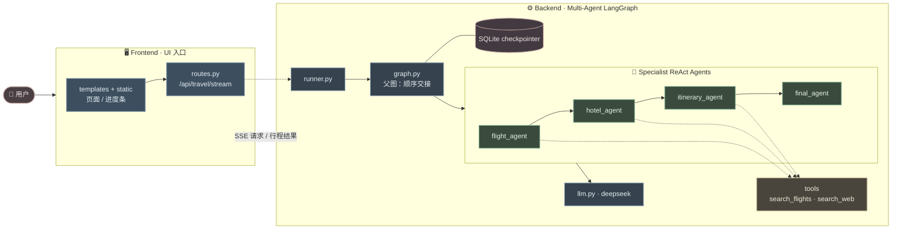
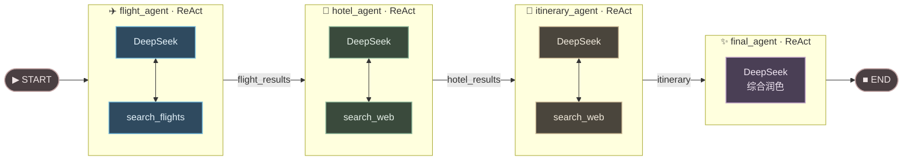
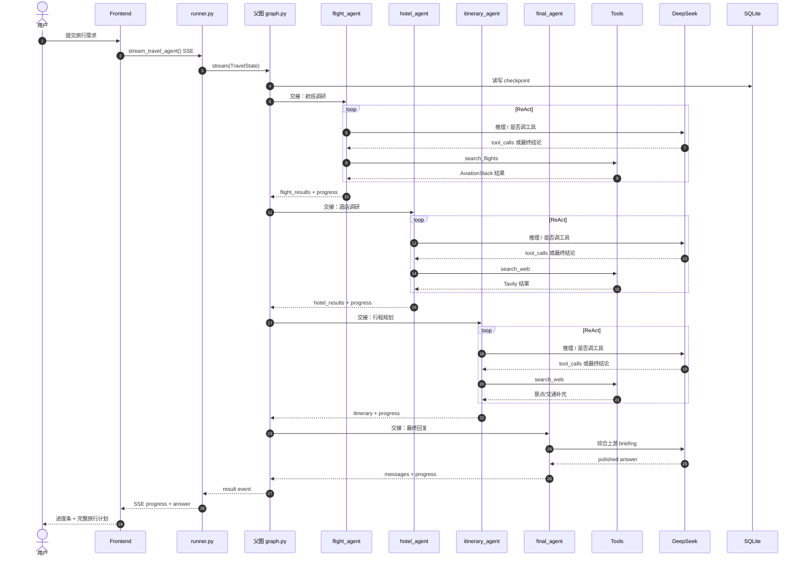

# ✈️ TripMate AI — 基于 LangGraph 的多智能体旅行规划助手

开源 AI 旅行规划器：把自然语言出行需求转成可落地的行程，包含航班建议、酒店推荐和逐日行程。项目基于 LangGraph、LangChain 与 FastAPI，采用多智能体工作流。

## 为什么做这个项目？

订旅行通常要在多个网站、工具和表格之间来回切换。本项目把这些流程收拢到同一体验里，由以下智能体协作完成：

- 航班搜索智能体
- 酒店调研智能体
- 行程规划智能体
- 最终回复智能体

全部通过 LangGraph 工作流统一编排。

## 功能特性

- ✈️ 基于 AviationStack 的航班调研
- 🏨 基于 Tavily 搜索的酒店建议
- 🧠 基于 LangGraph 的多智能体编排
- 📝 结构化旅行行程生成
- 🌐 FastAPI 后端 + 简易 Web 界面
- 💾 基于本地 SQLite 的对话状态持久化
- ⚡ 基于 DeepSeek 大模型的智能回复

## 技术栈

- Python 3.10+
- FastAPI
- Jinja2 + HTML/CSS/JavaScript 前端
- LangGraph
- LangChain
- DeepSeek LLM（OpenAI 兼容 API）
- SQLite（本地 checkpointer）
- Tavily API
- AviationStack API

## 项目结构

```text
.
├── app.py                          # FastAPI 应用入口
├── frontend/                       # Web 前端
│   ├── routes.py                   # 页面与 API 路由
│   ├── schemas.py                  # 请求模型
│   ├── static/                     # CSS / JS
│   └── templates/                  # HTML 模板
├── backend/                        # LangGraph 后端
│   ├── agents/                     # 四个 ReAct specialist agents
│   │   ├── base.py                 # create_react_agent 封装
│   │   ├── flight.py / hotel.py
│   │   ├── itinerary.py / final.py
│   ├── tools/                      # 原始 API + LangChain @tool 包装
│   ├── config.py                   # .env 与 SSL 初始化
│   ├── database.py                 # SQLite checkpointer
│   ├── graph.py                    # 多智能体顺序交接父图
│   ├── llm.py                      # DeepSeek LLM
│   ├── runner.py                   # run / stream 入口
│   └── state.py                    # TravelState
└── requirements.txt
```

## 运行前提

本地运行前请确认：

- 已安装 Python 3.10 或更高版本
- 已准备以下 API Key：
  - DeepSeek
  - Tavily
  - AviationStack

## 环境变量

在项目根目录创建 `.env` 文件，并配置如下变量：

```env
DEEPSEEK_API_KEY=your_deepseek_api_key
# 可选，默认 https://api.deepseek.com
# DEEPSEEK_BASE_URL=https://api.deepseek.com
AVIATIONSTACK_API_KEY=your_aviationstack_api_key
TAVILY_API_KEY=your_tavily_api_key
DEFAULT_ORIGIN_IATA=DAC
```

## 安装

```bash
python -m venv .venv
source .venv/bin/activate   # Windows: .venv\Scripts\activate
pip install -r requirements.txt
```

## 启动应用

启动 FastAPI 服务：

```bash
python app.py
```

然后在浏览器打开：

```text
http://127.0.0.1:8000/
```

## API 接口

- `GET /health` — 健康检查
- `POST /api/travel` — 提交旅行请求

请求示例：

```bash
curl -X POST http://127.0.0.1:8000/api/travel \
  -H "Content-Type: application/json" \
  -d '{"message":"规划一趟为期 3 天、预算 10000的东京之旅"}'
```

## 系统逻辑

### 整体架构



### Function Flow

一次「生成行程」的函数调用链（浏览器 → 路由 → LangGraph）：

```text
[Browser]
  index.html
    └─ script.js
         ├─ sendMessage()
         └─ consumeTravelStream(message)
              └─ fetch POST /api/travel/stream          ← HTTP / SSE

[Frontend · FastAPI routes]
  routes.py
    └─ travel_planner_stream(request_data)
         └─ stream_travel_agent(user_input, thread_id)  ← 同进程 Python 直调

[Backend · runner / graph]
  runner.py
    └─ stream_travel_agent(...)
         ├─ yield {type: start | progress}              ← 前端进度条
         ├─ travel_graph.stream(..., stream_mode="updates")
         │    └─ graph.py  (顺序交接的 multi-agent 父图)
         │         ├─ flight_agent
         │         │    └─ ReAct agent + tool: search_flights   (AviationStack)
         │         ├─ hotel_agent
         │         │    └─ ReAct agent + tool: search_web       (Tavily)
         │         ├─ itinerary_agent
         │         │    └─ ReAct agent + tool: search_web       (景点/交通补充)
         │         └─ final_agent
         │              └─ ReAct agent（无工具，综合上游 briefing）
         ├─ travel_graph.get_state(config)              ← SQLite checkpointer
         └─ yield {type: result, answer, ...}

[Browser]
  script.js
    ├─ updateProgress(...)   ← 底部进度条
    └─ showResult(answer)    ← 渲染最终行程
```

说明：

- 浏览器到服务端：HTTP（`fetch` + SSE）
- `routes.py` 到 `runner.py`：同进程直接调用 Python 函数
- 每个 `*_agent` 节点内部是 `create_react_agent`：LLM 自己决定是否调用工具、何时给出结论
- 非流式备用接口：`POST /api/travel` → `run_travel_agent()` → `travel_graph.invoke()`

### 多智能体流水线

父图按角色顺序交接；每个 specialist 内部是独立的 ReAct 子图（LLM 决定是否调工具）。



### 请求时序



工作流步骤：

1. 用户提交旅行请求，前端通过 SSE 订阅进度
2. `flight_agent`（ReAct）自行决定调用 `search_flights`
3. `hotel_agent`（ReAct）结合航班 briefing，调用 `search_web` 查酒店
4. `itinerary_agent`（ReAct）综合上游结果，必要时再搜索补充景点/交通
5. `final_agent`（ReAct，无工具）把各 specialist briefing 润色成最终回复

## 参与贡献

欢迎贡献。如果你想改进应用、增加旅行能力或修复问题：

1. Fork 本仓库
2. 创建功能分支
3. 提交你的改动
4. 发起 Pull Request

## 致谢

本项目结合了现代大模型工具链与旅行相关 API，适合作为「LangGraph 多智能体 + 真实业务场景」的实践示例。
