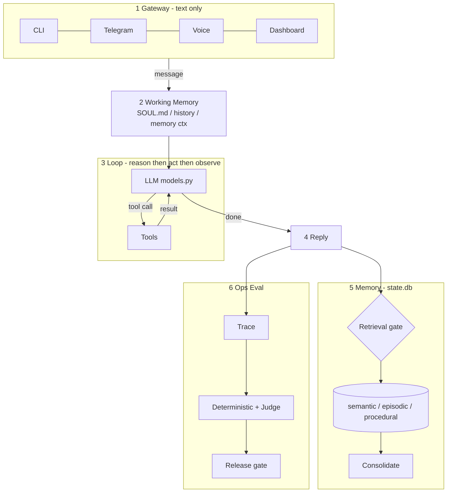
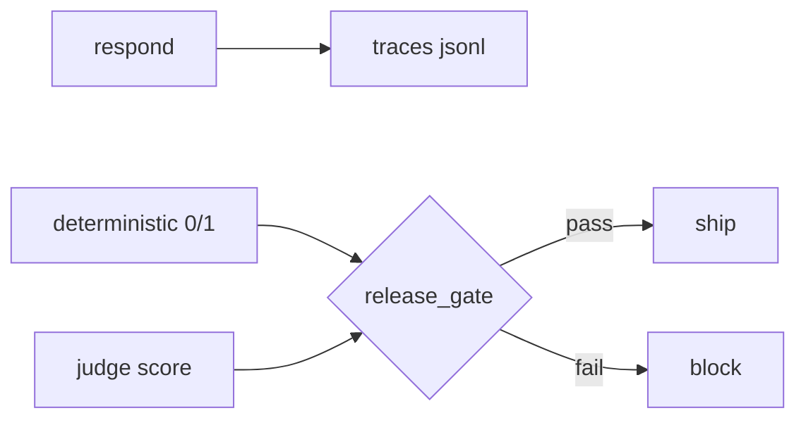

# waku-agent

**你自己的 AI 助手。跑在笔记本上。代码一个下午能读完。**

本地优先的个人助手，把严肃 Agent 的四大支柱摊开：**Harness · Loop · Memory · Eval/LLM-Ops**。没有框架把关键藏起来。

| 支柱 | 要点 |
|------|------|
| Harness | 网关只传文本；工作记忆每轮现拼 |
| Loop | ~95 行 Python：reason → act → observe |
| Memory | 语义 / 情景 / 程序性；先问「要不要检索」，再批量巩固 |
| Ops | JSONL trace + 确定性评测 + LLM-as-judge + 发布门禁 |

对比 ChatGPT / Claude Desktop：那些是产品；这是可读蓝图。对比 OpenClaw / Hermes：同样架构，代码量约 1/100。

---

## 快速开始

**macOS / Linux / Git Bash：**

```bash
git clone https://github.com/ShenSeanChen/waku-agent && cd waku-agent
uv venv
uv pip install -e .
cp .env.example .env          # 设 WAKU_PROVIDER + 对应一把密钥
uv run waku                   # 终端对话
uv run waku dashboard         # 浏览器 → http://localhost:7777
```

**Windows PowerShell（分行执行，不要用 `&&`）：**

```powershell
git clone https://github.com/ShenSeanChen/waku-agent
cd waku-agent
uv venv
uv pip install -e .
Copy-Item .env.example .env   # 编辑 .env：WAKU_PROVIDER + 对应密钥
uv run waku
uv run waku dashboard         # 浏览器 → http://localhost:7777
```

改完 `.env` 后重跑即可。本机若没有 `make`（常见于 Windows），一律用下面的 `uv run` / `python -m` 命令。

试一句：*"记住 Alex 更喜欢早上开会。"* 退出再进 → *"周五和 Alex 约个 catch-up。"* 记忆在 `.waku/state.db`。

| 命令 | 何时用 |
|------|--------|
| `uv run waku …` | 不用 activate（推荐） |
| 激活 `.venv` 后 `waku …` | 长会话 |
| `uv tool install .` 后 `waku …` | 全局安装 |

---

## 架构

详情与设计取舍见 [`docs/architecture.md`](docs/architecture.md)。可编辑白板在 [`docs/whiteboards/`](docs/whiteboards/)。



主链路：`Gateway → Working Memory → Loop → Reply → Memory / Eval`。  
反馈（图中省略）：gate 命中时注入 WM；Ops 改进 prompt/config 后回灌 WM。

| 模块 | 路径 |
|------|------|
| 装配入口 | [`waku/app.py`](waku/app.py) |
| Gateway | [`waku/gateway/`](waku/gateway/) |
| Working memory | [`waku/runtime/session.py`](waku/runtime/session.py) |
| Loop | [`waku/loop/agent.py`](waku/loop/agent.py) · [`models.py`](waku/loop/models.py) |
| Tools | [`waku/tools/`](waku/tools/) |
| Memory + gate + consolidate | [`waku/memory/`](waku/memory/) |
| Ops / dashboard | [`waku/ops/`](waku/ops/) |
| Evals | [`evals/deterministic/`](evals/deterministic/) · [`evals/judge/`](evals/judge/) |

---

## Harness · Gateway

网关只搬文本；同一大脑，多入口。

| 入口 | 命令 | 依赖 |
|------|------|------|
| CLI | `uv run waku` | 默认 |
| Dashboard | `uv run waku dashboard` | 默认 · `127.0.0.1:7777` |
| Voice | `uv run waku voice` | `uv pip install -e ".[voice]"` |
| Telegram | `uv run waku telegram` | `.[telegram]` + `TELEGRAM_BOT_TOKEN` |
| Brief | `uv run waku brief` | macOS · `WAKU_APPLE_TOOLS=1` |

**Dashboard** 是同一进程里的本地 Web UI（无构建）。标签对应支柱：Overview / Gateway / Loop / Memory / Tools / Data / Ops。聊天坞可打字或说话，看 harness 亮灯。

**Voice：** 默认监听唤醒词 `waku waku`；`WAKU_WAKE_WORD=""` 改为按键说话。神经音色可选 `.[voice-neural]`（Kokoro）。

**Telegram：** 长轮询，无需公网 URL；`TELEGRAM_ALLOWED_USER` 可锁本人。

**Brief：** 读 Calendar.app + Mail + 记忆，写晨间简报（可挂系统 cron）。

---

## Loop · Tools

[`waku/loop/agent.py`](waku/loop/agent.py) —— 无 LangGraph：

```text
while not done:
    response = llm(messages, tools)   # reason
    if tool calls:
        messages += run(tools)        # act → observe
    else:
        done                          # reply
```

退出：模型不再要工具，或 `max_iterations`。Provider 用 `WAKU_PROVIDER`（anthropic / openai / gemini / deepseek / …）；适配在 [`loop/models.py`](waku/loop/models.py)。

| 试试 | 看什么 |
|------|--------|
| *"周六上午 8 点和 Raj 约网球"* | Loop · `create_event` · `iter 2` |
| *"我今天日历上有什么？"* | `list_events`，不编造 |
| *"搜索未打完的世界杯并加入日历"* | 多工具循环（需 `TAVILY_API_KEY` 更稳） |
| CLI + 浏览器同时聊 | Gateway 打标 `cli` / `dashboard` |

**记忆自管理工具：** `manage_memory` · `update_soul` · `create_skill`（也可在 Dashboard Memory / Settings 手改；密钥只写本地 `.env`）。

**MCP：** `pip install -e '.[mcp]'`，配置 `.waku/mcp.json`。无 Node 演示：

```bash
cp examples/mcp.demo.json .waku/mcp.json   # PowerShell: Copy-Item ...
uv run waku dashboard                      # Tools ▸ MCP 出现 demo_* 工具
```

**实验工具**（`WAKU_EXPERIMENTAL=1`）：`delegate_task` → [pi](https://github.com/earendil-works/pi) 已上线；`run_command` / `browse_web` / `schedule_task` 仍为骨架。

---

## Memory

三支柱 + 两道工序。可查询源在 `.waku/state.db`（FTS5）；每轮后镜像人类可读的 `.waku/MEMORY.md`。

| 层 | 作用 | 路径 |
|----|------|------|
| Semantic | 持久事实 | `memory/semantic/` |
| Episodic | 带日期情节 | `memory/episodic/` |
| Procedural | SKILL.md 怎么做事 | `memory/procedural/` · [`skills/`](skills/) |
| Retrieval gate | 这轮要不要记？ | `retrieval_gate.py` |
| Consolidation | 每 N 轮蒸馏 | `consolidation.py` |

```text
you > what's 2+2?           → gate · skip
you > when am I meeting Alex? → gate · retrieve
```

安装 skill：

```bash
python -m waku skill install https://github.com/<org>/<repo>/blob/main/skills/<name>/SKILL.md
```

贡献：复制 [`skills/TEMPLATE.md`](skills/TEMPLATE.md) → PR 到 [`skills/community/`](skills/community/)。见 [CONTRIBUTING.md](CONTRIBUTING.md)。

---

## Ops · Eval



两类评测**永不混用**。线上 bug：修好并加一条 `evals/deterministic/` 回归。

**先装评测依赖：**

```bash
uv pip install -e ".[eval]"
```

| 作用 | 推荐命令（全平台） | 有 `make` 时 |
|------|-------------------|--------------|
| 确定性 0/1（含 live） | `uv run python -m pytest -q evals/deterministic` | `make eval` |
| 确定性仅离线 | `uv run python -m pytest -q evals/deterministic -m "not live"` | — |
| LLM-as-judge | `uv run python -m pytest -q evals/judge` | `make eval-judge` |
| 发布门禁 | `uv run python -m waku.ops.release_gate` | `make gate` |
| Phoenix 瀑布 | `uv run python -m phoenix.server.main serve`（需 `.[tracing]`） | `make trace` |

Windows PowerShell 示例：

```powershell
uv pip install -e ".[eval]"
uv run python -m pytest -q evals/deterministic -m "not live"   # 离线脚手架，应全绿
uv run python -m pytest -q evals/deterministic                 # 含 live：测当前模型是否听话
uv run python -m pytest -q evals/judge                         # 需 API key
uv run python -m waku.ops.release_gate
```

- Trace：每轮追加 `.waku/traces/<date>.jsonl`（零配置）
- 花费：追加 `.waku/usage.jsonl`（演示重置也保留）
- 结果：终端 + Dashboard **Ops**

干净演示（会重置 `.waku`，每次须确认）：

```bash
uv run python scripts/demo_seed.py --yes
```

---

## 命令速查

| 命令 | 作用 |
|------|------|
| `uv run waku` | 终端聊天 |
| `uv run waku dashboard` | 驾驶舱 :7777 |
| `uv run waku voice` | 语音 |
| `uv run waku telegram` | 手机 → 笔记本 |
| `uv run waku brief` | 晨间简报 |
| `uv run python -m pytest -q evals/deterministic` | 确定性评测 |
| `uv run python -m pytest -q evals/judge` | LLM judge |
| `uv run python -m waku.ops.release_gate` | 发布门禁 |
| `uv run python -m phoenix.server.main serve` | Phoenix :6006 |
| `uv run ruff check waku evals` | lint |

有 Make 的环境可用 `make eval` / `gate` / `trace` 等别名（见 `Makefile`）；Windows 通常没有 `make`，直接用上表。

---

## 升级路径

| 默认 | 升级 |
|------|------|
| SQLite FTS5 | `WAKU_SEMANTIC_STORE=supabase` + [`sql/init_supabase.sql`](sql/init_supabase.sql) |
| Mock 日历（ICS） | `WAKU_APPLE_CALENDAR=1`，或换 `calendar.py`（schema 不变） |
| 手写记忆支柱 | mem0 / Letta / Zep 等生产框架 |

更多：[`docs/`](docs/) · [`learn_guide.md`](learn_guide.md) · [`CLAUDE.md`](CLAUDE.md)
