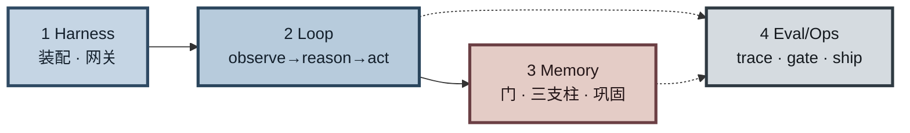
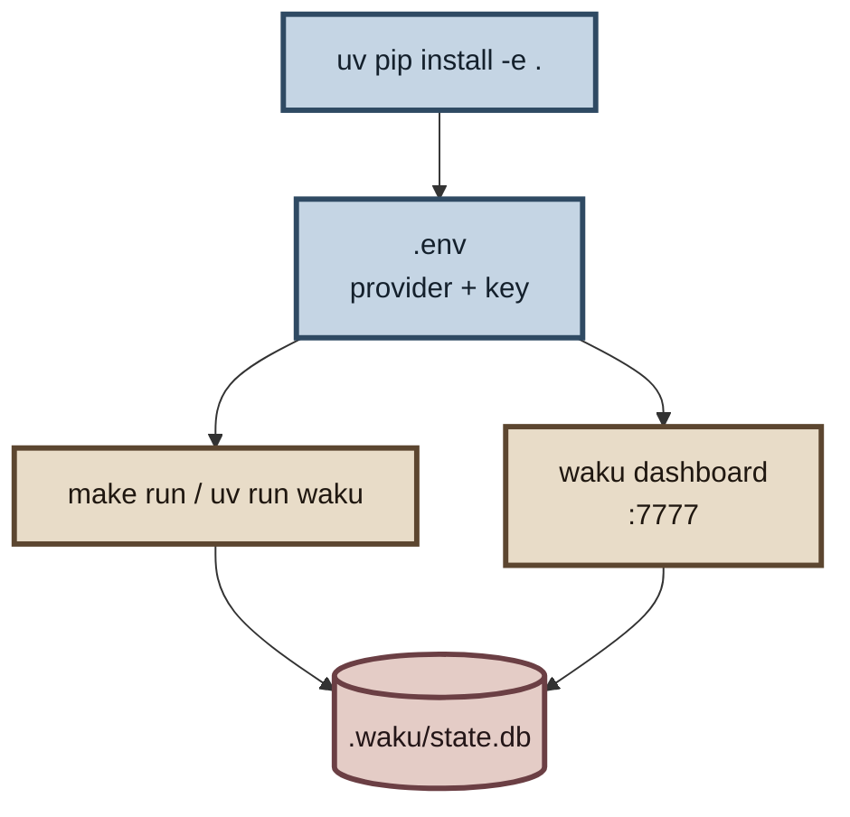
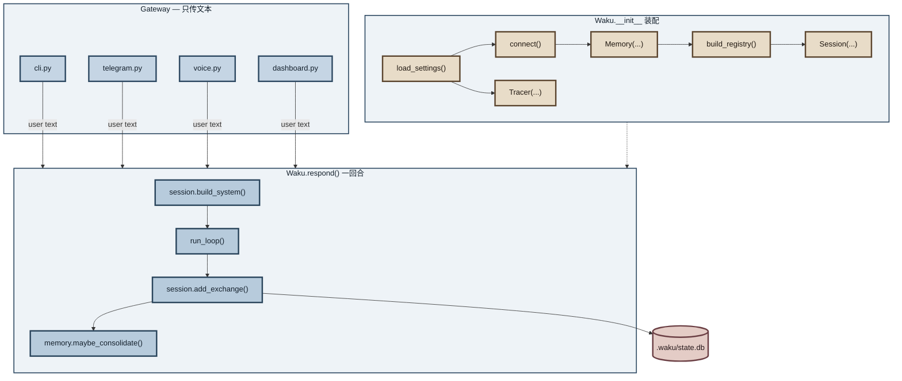
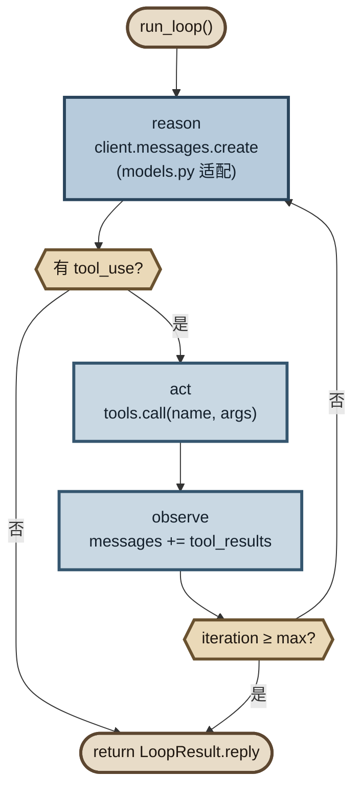
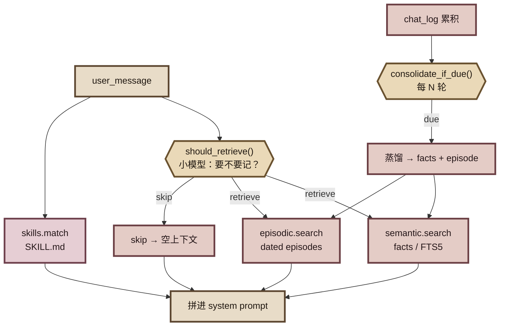
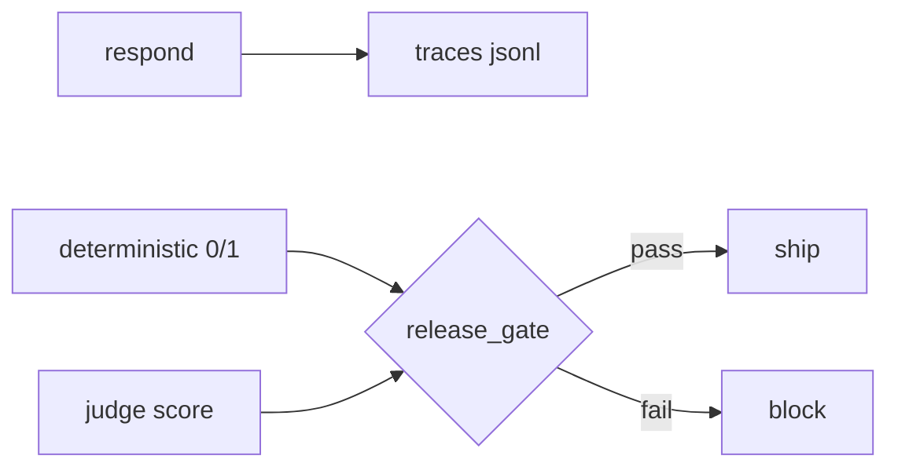
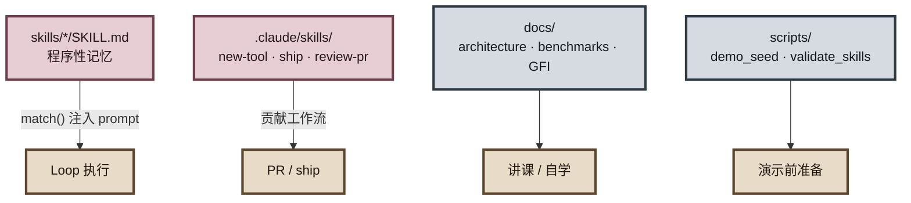

# Hermes Agent small 源码 学习大纲

本地优先的个人助手教学仓库。目标：一个下午读懂严肃 Agent 的四大支柱 —— **Harness · Loop · Memory · Eval/LLM-Ops**。

推荐入口：`README.md` → `docs/architecture.md` → `waku/app.py`（装配图）→ 按支柱深入。



```text
四支柱心智模型（讲课口令）
  Harness  = 请求从哪进、怎么拼成一回合
  Loop     = while 里的 reason / act / observe
  Memory   = 何时检索、记什么、何时蒸馏
  Eval/Ops = 看见了什么、测过没、能不能 ship
```

---

## 0. 环境与跑通（30 min）

| 步骤 | 做什么 | 文件 / 命令 |
|------|--------|-------------|
| 安装 | 创建环境、装包 | `uv venv && uv pip install -e .` |
| 配置 | 选一个 provider，填一把密钥 | `.env.example` → `.env` |
| CLI 对话 | 终端里聊一轮 | `uv run waku` / `make run` |
| 仪表盘 | 浏览器看 harness 流动 | `uv run waku dashboard` → `localhost:7777` |
| 约定 | 项目规则与常用命令 | `CLAUDE.md`、`Makefile` |

**建议试一句：**「记住 Alex 更喜欢早上开会。」退出再进，问「周五和 Alex 约个 catch-up。」—— 验证记忆落在 `.waku/state.db`。



```text
function flow（跑通）
  1. uv venv && uv pip install -e .
  2. copy .env.example → .env   # 填 PROVIDER / API_KEY
  3. make run                   # CLI 入口 → Waku.respond()
  4. make dashboard             # 同进程，浏览器看 gate/loop
  5. 试记忆句 → 查 .waku/state.db
```

---

## 1. Harness：装配与网关（1–2 h）

先搞清楚「请求从哪进来、怎么拼成一回合」。

| 顺序 | 主题 | 读哪里 |
|------|------|--------|
| 1.1 | 总装配：config → db → tools → memory → session → loop | `waku/app.py` |
| 1.2 | 配置与运行时目录 | `waku/config.py`、`.waku/`（gitignored） |
| 1.3 | SQLite 连接 | `waku/db.py`、`sql/init_supabase.sql`（可选升级） |
| 1.4 | 工作记忆拼装（SOUL + memory + history 窗口） | `waku/runtime/session.py` |
| 1.5 | 网关只传文本：CLI / Telegram / Voice | `waku/gateway/` |
| 1.6 | 仪表盘（同一进程执行每一轮） | `waku/ops/dashboard.py`、`waku/ops/static/` |

**检查点：** 能画出 `Gateway → Session.build_system → run_loop → persist` 的数据流。



```text
function flow（Harness）
  # 装配（启动一次）
  Waku.__init__
    load_settings() → ensure_home()
    connect(.waku/) → SQLite
    Memory(conn, settings, client)
    build_registry(...) → tools
    Session(settings, memory)
    Tracer(settings)

  # 一回合（每条用户消息）
  Gateway.read_text()
    → Waku.respond(user_message, source=...)
        system  = session.build_system(msg)     # SOUL + gated memory + skills
        msgs    = history[-N:] + [user]
        result  = run_loop(client, system, msgs, tools)
        session.add_exchange(user, reply, tools, meta)
        memory.maybe_consolidate()
        tracer.end_turn(...)
    ← LoopResult.reply → Gateway.show()
```

---

## 2. Loop：Agent 循环（1–2 h）

核心技巧：约 95 行的 `while` —— observe → reason → act → repeat。

| 顺序 | 主题 | 读哪里 |
|------|------|--------|
| 2.1 | 主循环与退出条件（无 tool / max_iterations） | `waku/loop/agent.py` |
| 2.2 | 多 provider 适配（一种循环方言） | `waku/loop/models.py` |
| 2.3 | 工具注册与调用 | `waku/tools/registry.py`、`waku/tools/__init__.py` |
| 2.4 | 旗舰工具：日历 / 笔记 / 搜索 / 工作区 | `calendar.py`、`notes.py`、`search.py`、`workspace.py` … |
| 2.5 | MCP 扩展 | `waku/tools/mcp_client.py`、`examples/mcp_demo_server.py` |

**检查点：** 用仪表盘 **Loop** 标签跟一轮多 tool 迭代（例如搜网 + 写日历）。



```text
function flow（Loop）
  run_loop(client, model, system, messages, tools, max_iterations):
    for i in 1..max_iterations:
      # reason
      response = client.messages.create(
          model, system, messages, tools.schemas())
      messages.append(assistant_content)

      tool_uses = [blocks where type == tool_use]
      if not tool_uses:                    # 退出条件 1：模型对人说话
        return LoopResult(reply=text, iterations=i)

      # act + observe
      for each tool_use:
        output = tools.call(name, input)
        tool_results.append(result_block)
        notify("tool", ...)
      messages.append(user_role=tool_results)

    return LoopResult(reply=last_or_partial)  # 退出条件 2：撞 max_iterations

  # 周边
  get_client(settings)     # models.py：统一成一种循环方言
  build_registry(...)      # tools/：name → schema + callable
  mcp_client               # 可选：外部 MCP 工具并入 registry
```

---

## 3. Memory：三支柱 + 门 + 巩固（2–3 h）

记忆是主角：不是每轮都检索，也不是每轮都总结。

| 顺序 | 主题 | 读哪里 |
|------|------|--------|
| 3.1 | Memory 门面 | `waku/memory/__init__.py` |
| 3.2 | 检索门：这轮要不要记忆？ | `waku/memory/retrieval_gate.py` |
| 3.3 | Semantic（事实，FTS5 / 可选 pgvector） | `waku/memory/semantic/` |
| 3.4 | Episodic（带日期的情节） | `waku/memory/episodic/` |
| 3.5 | Procedural（SKILL.md 怎么做事） | `waku/memory/procedural/`、`skills/` |
| 3.6 | 批量巩固：每 N 轮蒸馏 | `waku/memory/consolidation.py` |

**检查点：** 对比「需要记忆的问题」vs「纯算术」在 Overview gate 条上的 retrieve / skip。



```text
function flow（Memory）
  # 读路径（每轮，在 build_system 里）
  Memory.gated_retrieve(message):
    retrieve, query, reason = should_retrieve(client, small_model, message)
    notify("gate", decision=retrieve|skip, reason)
    if not retrieve: return ""
    facts    = semantic.search(query, top_k)
    episodes = episodic.search(query, top_k=3)
    return join(facts + episodes)

  Memory.matching_skills(message):
    return SkillLoader.match(message)   # 关键词命中 SKILL.md

  Session.build_system =
      SOUL.md + clock + model_id
    + gated_retrieve(...)               # 可选
    + matching_skills(...)              # 可选

  # 写路径（回合结束后）
  session.add_exchange → memory.log_chat(...)
  memory.maybe_consolidate():
    consolidate_if_due(conn, client, N):
      if new_chats < N: return
      distill → INSERT facts / episodes
      mark chats consolidated
```

---

## 4. Eval / LLM-Ops（1–2 h）

可观测 + 可发布：trace → 确定性评测 → LLM judge → release gate。

| 顺序 | 主题 | 读哪里 |
|------|------|--------|
| 4.1 | 每轮 trace（JSONL；可选 OTel） | `waku/ops/tracing.py` |
| 4.2 | 确定性评测（0/1，pytest） | `evals/deterministic/` |
| 4.3 | LLM-as-judge（打分，不与确定性混用） | `evals/judge/` |
| 4.4 | 发布门禁 | `waku/ops/release_gate.py`、`make gate` |
| 4.5 | 评分 / 对比 / 展示 | `scoring.py`、`compare_history.py`、`show_trace.py` |

**检查点：** 先 `uv pip install -e ".[eval]"`，再跑确定性评测；理解「确定性全过 + judge 过阈值」才 ship。

```powershell
uv pip install -e ".[eval]"
uv run python -m pytest -q evals/deterministic
uv run python -m waku.ops.release_gate
```



```text
function flow（Eval / LLM-Ops）
  # 可观测
  Tracer.turn(user_message)
    compose(observer, tracer.event)   # dashboard 亮灯 + JSONL
    ... run_loop 里 notify("llm"|"tool"|"gate"|...)
  Tracer.end_turn(reply, iterations)

  # 评测（永不混用）— Windows 无 make 时用下面
  uv run python -m pytest -q evals/deterministic/   # 工具有没有对？0/1
  uv run python -m pytest -q evals/judge/           # 回答好不好？打分

  # 发布门
  uv run python -m waku.ops.release_gate
    rc_det, counts = run("deterministic")
    rc_jud, counts = run("judge")       # 有 key 才跑
    report(...) → .waku/eval_report.json
    exit 0 only if det 全过（+ judge 过阈值）
```

---

## 5. 技能、贡献与进阶

| 主题 | 读哪里 |
|------|--------|
| Skill 模板与示例 | `skills/TEMPLATE.md`、`schedule-meeting/`、`weekly-brief/` |
| 仓库内 Claude skills | `.claude/skills/`（new-tool / ship / review-pr …） |
| 贡献与 demo | `CONTRIBUTING.md`、`docs/DEMO-CHECKLIST.md`、`scripts/` |
| 白板与对标 | `docs/whiteboards/`、`docs/benchmarks.md`、`docs/stack-report.md` |
| 适合上手的 issue | `docs/good-first-issues.md` |



```text
function flow（技能与贡献）
  # 运行时技能（给 Agent）
  SkillLoader([repo/skills, .waku/skills]).match(msg)
    → 命中的 SKILL.md body 拼进 system

  # 仓库技能（给贡献者 / Claude）
  .claude/skills/new-tool  → 加工具 + schema + deterministic eval
  .claude/skills/ship      → lint → make gate → commit → push
  .claude/skills/review-pr → 双语三节审 PR

  # 演示
  读 docs/DEMO-CHECKLIST.md
  （慎用）scripts/demo_seed.py --yes   # 会清 .waku，须当场确认
```

---

## 建议学习路径（半天版）

```text
上午
  README + architecture.md          # 建立四支柱心智模型
  app.py → session.py → agent.py    # 跟完一条 turn
  dashboard 实操 3–5 句             # 看 gate / loop / memory 亮灯

下午
  memory/ 三支柱 + retrieval_gate   # 理解「何时记、记什么」
  tools/ + 一轮多 tool 任务         # 循环工程
  evals/deterministic 挑 2–3 个测   # 知道如何锁行为
  （可选）release_gate + judge      # 发布闭环
```


---

## Directory Tree

```text
12-hermes-agent-small/
├── .env.example
├── .gitignore
├── CLAUDE.md                 # 工作约定与架构地图
├── CONTRIBUTING.md
├── LICENSE
├── Makefile
├── README.md                 # 上手与四支柱总览
├── learn_guide.md            # 本学习大纲
├── pyproject.toml
│
├── .claude/
│   ├── launch.json
│   └── skills/               # 仓库内 agent skills
│       ├── new-tool/
│       ├── pr-worktree/
│       ├── review-pr/
│       └── ship/
│
├── .github/
│   └── workflows/
│       └── validate-skills.yml
│
├── docs/
│   ├── architecture.md       # 带文件路径的架构图
│   ├── architecture-whiteboard-plain.png
│   ├── benchmarks.md
│   ├── DEMO-CHECKLIST.md
│   ├── filming-prompts.md
│   ├── good-first-issues.md
│   ├── stack-report.md
│   └── whiteboards/
│       ├── k3-architecture.excalidraw
│       ├── pi-architecture.excalidraw
│       └── waku-architecture.excalidraw
│
├── evals/                    # 评测（不是 tests/）
│   ├── coding.jsonl
│   ├── dataset.jsonl
│   ├── conftest.py
│   ├── helpers.py
│   ├── deterministic/        # 0/1 确定性
│   │   ├── test_*.py
│   │   └── ...
│   └── judge/                # LLM-as-judge（prompt 打分）
│       └── test_response_quality.py
│
├── examples/
│   ├── mcp.demo.json
│   └── mcp_demo_server.py
│
├── scripts/
│   ├── demo_seed.py          # 慎用：会清 .waku，需 --yes
│   ├── shootout.py
│   └── validate_skills.py
│
├── skills/                   # 程序性记忆（SKILL.md）
│   ├── TEMPLATE.md
│   ├── community/
│   ├── schedule-meeting/
│   └── weekly-brief/
│
├── sql/
│   └── init_supabase.sql     # 语义记忆升级路径
│
└── waku/                     # 核心包
    ├── __init__.py
    ├── __main__.py
    ├── app.py                # ★ 装配入口：从这里开始读
    ├── config.py
    ├── db.py
    │
    ├── gateway/              # Harness：入口通道
    │   ├── cli.py
    │   ├── telegram.py
    │   └── voice.py
    │
    ├── runtime/
    │   └── session.py        # 工作记忆拼装
    │
    ├── loop/                 # Loop
    │   ├── agent.py          # ★ THE LOOP
    │   └── models.py         # provider 适配
    │
    ├── tools/                # 工具层
    │   ├── registry.py
    │   ├── calendar.py
    │   ├── notes.py
    │   ├── search.py
    │   ├── workspace.py
    │   ├── mcp_client.py
    │   ├── apple.py
    │   ├── experimental.py
    │   ├── memory_admin.py
    │   └── messages.py
    │
    ├── memory/               # Memory
    │   ├── retrieval_gate.py # ★ 检索门
    │   ├── consolidation.py  # ★ 批量巩固
    │   ├── semantic/
    │   │   ├── store.py
    │   │   └── supabase_store.py
    │   ├── episodic/
    │   │   ├── store.py
    │   │   └── notion_store.py
    │   └── procedural/
    │       ├── loader.py
    │       └── installer.py
    │
    └── ops/                  # LLM-Ops
        ├── tracing.py
        ├── dashboard.py
        ├── release_gate.py
        ├── judge.py
        ├── scoring.py
        ├── brief.py
        ├── coding_eval.py
        ├── compare_history.py
        ├── show_trace.py
        └── static/           # 仪表盘前端（无构建）
            ├── index.html
            ├── style.css
            └── js/
```

运行时数据（默认 gitignore，不在上树中）：

```text
.waku/
├── state.db          # 记忆 + 聊天
├── calendar.ics
├── outbox/
└── traces/           # JSONL
```

---

## 文件 ↔ 架构方框速查

| 方框 | 路径 |
|------|------|
| Gateway | `waku/gateway/` |
| Working Memory | `waku/runtime/session.py` |
| The Loop | `waku/loop/agent.py` |
| LLM adapters | `waku/loop/models.py` |
| Tools | `waku/tools/` |
| Retrieval gate | `waku/memory/retrieval_gate.py` |
| Semantic / Episodic / Procedural | `waku/memory/{semantic,episodic,procedural}/` |
| Consolidation | `waku/memory/consolidation.py` |
| Tracing / Dashboard / Release | `waku/ops/` |
| Deterministic vs Judge evals | `evals/deterministic/` · `evals/judge/` |

```text
一回合端到端（背诵版）
  Gateway.text
    → Waku.respond
      → Session.build_system          # SOUL + gate? + skills?
      → run_loop                      # reason ↔ act until done
      → Session.add_exchange          # history + chat_log
      → Memory.maybe_consolidate      # 每 N 轮蒸馏
      → Tracer.end_turn               # JSONL
    ← reply
```
