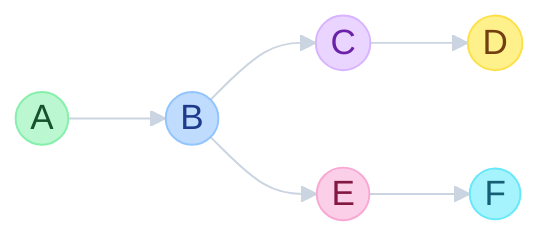
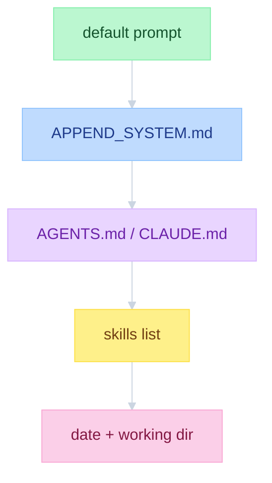
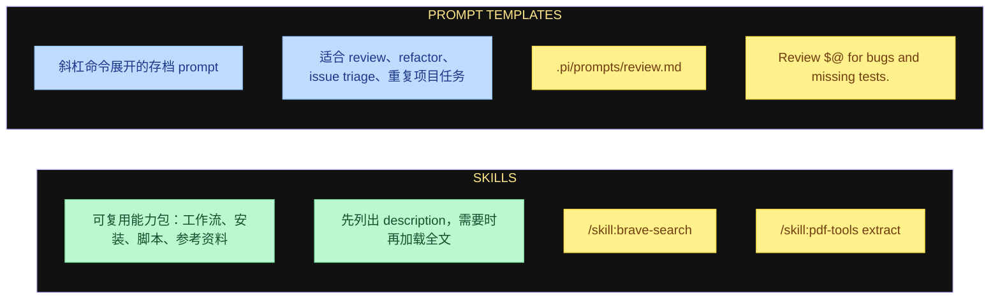
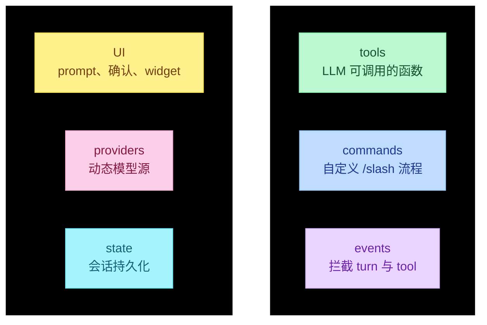
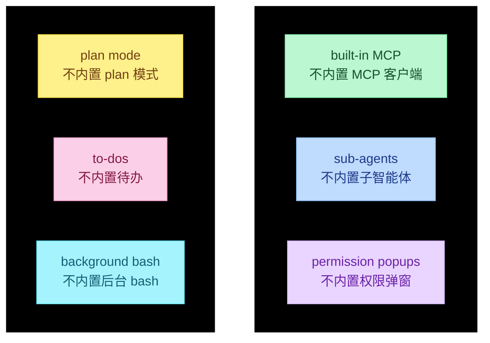

# Pi 上手指南

源码根目录：`D:\workspace\doc\面试狂魔\人工智能面试题\pi`。下文路径相对该根目录。Interactive 层在 `packages/coding-agent/`，Core 层在 `packages/agent/`。

## 会话是树：返回会创建分支

会话不是一条直线。走到 D 之后若回到 B、改问一句再提交，Pi 会从 B **分出一条新枝**，原路径 `B → C → D` 仍保留在 **同一个 session 文件** 里。

读图：主链是 `A → B → C → D`。在 D 处决定 **回到 B**，另开一条 `B → E → F`。B 是分叉点。

### `/tree`

跳到更早的消息，编辑后重新提交。备选路径写在 **同一个 session 文件** 里，不另开文件。

### 相关命令

| 命令 | 作用 |
|------|------|
| `pi -c` | continue：继续最近一次会话 |
| `pi -r` | resume picker：打开会话选择器 |
| `/fork` | 从旧的某条 prompt **新建**一个 session 文件 |
| `/clone` | 复制 **当前分支** 为新 session |

### 要学的代码

同文件切枝 vs 新开文件：`navigateTree()` 改当前 JSONL 的 leaf；`fork()` / `createBranchedSession()` 另写一份 session。

| 路径 | 看什么 |
|------|--------|
| `packages/coding-agent/src/core/session-manager.ts` | `id` / `parentId` 树；`branch()`、`getTree()`、`createBranchedSession()`、`continueRecent()` |
| `packages/coding-agent/src/core/agent-session.ts` | `navigateTree()`：同文件内切枝（`/tree`） |
| `packages/coding-agent/src/core/agent-session-runtime.ts` | `fork()`：新建 session 文件（`/fork`、`/clone`） |
| `packages/coding-agent/src/modes/interactive/interactive-mode.ts` | `/fork`、`/clone`、`/tree` 入口；`handleCloneCommand()` |
| `packages/coding-agent/src/modes/interactive/components/tree-selector.ts` | `/tree` 选择器 UI |
| `packages/coding-agent/src/modes/interactive/components/session-selector.ts` | `pi -r` 会话选择器 |
| `packages/coding-agent/src/cli/args.ts` | `-c` / `--continue`、`-r` / `--resume` |
| `packages/coding-agent/src/main.ts` | `continueRecent()`、`selectSession()` |
| `packages/agent/src/harness/session/types.ts` | Core 侧 `parentId`、`ForkOptions` |
| `packages/agent/src/harness/session/jsonl/repo.ts` | Core 侧 JSONL `fork()` |

---

## Prompt 是一层一层叠起来的

Pi 把系统提示当成 **栈**：自上而下拼接，不是单文件覆盖。

各层来源：

| 路径 | 作用 |
|------|------|
| `~/.pi/agent/AGENTS.md` | 全局规则 |
| `./AGENTS.md` 或 `CLAUDE.md` | 当前项目树 |
| `.pi/SYSTEM.md` | **替换** 默认 prompt |
| `.pi/APPEND_SYSTEM.md` | **追加** 到默认 prompt 之后 |

### 要学的代码

拼接发生在 `buildSystemPrompt()`；文件发现发生在 `resource-loader.ts`（项目 `.pi/` 优先于 `~/.pi/agent/`）。

| 路径 | 看什么 |
|------|--------|
| `packages/coding-agent/src/core/system-prompt.ts` | `buildSystemPrompt()`：default / `SYSTEM.md` 替换 / `APPEND_SYSTEM.md` 追加 / AGENTS / skills / cwd |
| `packages/coding-agent/src/core/resource-loader.ts` | `loadContextFileFromDir()`（`AGENTS.md` / `CLAUDE.md`）；`discoverSystemPromptFile()`、`discoverAppendSystemPromptFile()` |
| `packages/coding-agent/src/core/skills.ts` | `formatSkillsForPrompt()`：系统提示里只放 description |
| `packages/agent/src/harness/system-prompt.ts` | Core 侧 skills XML 块 |
| `packages/coding-agent/test/system-prompt.test.ts` | 拼接顺序的契约测试 |
| `packages/coding-agent/test/resource-loader.test.ts` | `SYSTEM.md` / `APPEND_SYSTEM.md` / 多层 `AGENTS.md` 发现 |

---

## Skills 与 Prompt Templates 解决不同问题

可复用工作流分两类：**Skills** 是能力包；**Prompt Templates** 是斜杠命令展开的存档提示。

| | Skills | Prompt Templates |
|--|--------|------------------|
| 用途 | 可复用能力包：工作流、安装、脚本、参考资料 | 存档 prompt，由斜杠命令展开 |
| 加载 | 系统提示里先放 description，按需 `read` 全文 | Interactive 层直接展开，Core 看不到原始 `/命令` |
| 例子 | `/skill:brave-search`、`/skill:pdf-tools extract` | `.pi/prompts/review.md` → `Review $@ for bugs and missing tests.` |

### 要学的代码

Skills：系统提示里只挂 description，全文靠 `read`。Templates：Interactive 在进 Core 之前把 `/命令` 展开成普通 prompt。

| 路径 | 看什么 |
|------|--------|
| `packages/coding-agent/src/core/skills.ts` | `loadSkills()` / `loadSkillsFromDir()`：扫 `SKILL.md`；`formatSkillsForPrompt()` |
| `packages/coding-agent/src/core/prompt-templates.ts` | `loadPromptTemplates()`（`prompts/`）；`expandPromptTemplate()`、`substituteArgs()`（`$1` / `$@`） |
| `packages/coding-agent/src/core/slash-commands.ts` | `SlashCommandSource = "extension" \| "prompt" \| "skill"`；内置 `/fork` `/clone` `/tree` |
| `packages/coding-agent/src/core/resource-loader.ts` | 同时发现 skills、prompts、extensions |
| `packages/agent/src/harness/skills.ts` | Core 侧 skills 列表格式 |
| `packages/agent/src/harness/prompt-templates.ts` | Core 侧 template 展开 |
| `packages/coding-agent/test/skills.test.ts` | skill 加载与碰撞优先级 |
| `packages/coding-agent/test/prompt-templates.test.ts` | 斜杠展开与参数替换 |

---

## Extensions 是把 Pi 变成你自己的智能体的地方

扩展改行为，不改 Core。六类钩子：

### 要学的代码

契约在 `ExtensionAPI`。六类钩子对应同一接口上的不同方法，不是六套子系统。

| 路径 | 看什么 |
|------|--------|
| `packages/coding-agent/src/core/extensions/types.ts` | `ExtensionAPI`：`registerTool` / `registerCommand` / `on(...)` / `ui` / `registerProvider` / session（`fork`、`navigateTree`） |
| `packages/coding-agent/src/core/extensions/loader.ts` | 用 jiti 加载 `extensions/*.ts` |
| `packages/coding-agent/src/core/extensions/runner.ts` | 事件分发；把 API 接到当前 session |
| `packages/coding-agent/docs/extensions.md` | 六类钩子的用法说明 |
| `packages/coding-agent/examples/extensions/tools.ts` | tools |
| `packages/coding-agent/examples/extensions/commands.ts` | commands |
| `packages/coding-agent/examples/extensions/event-bus.ts` | events |
| `packages/coding-agent/examples/extensions/question.ts` | UI（prompt / confirm） |
| `packages/coding-agent/examples/extensions/custom-provider-anthropic/` | providers |
| `packages/coding-agent/examples/extensions/session-name.ts` | state / session |

---

## 故意不做的事，也是设计的一部分

Pi 开箱不内置下列能力。缺的不是疏漏，而是把日常工作流交给 template / skill / extension / package。

规则：每天都要用的 workflow，做成 **template / skill / extension / package**，而不是等 Core 变重。

### 要学的代码

Core 不实现这些能力。对照 README 的 Philosophy，再看 examples 里用 extension 补上的同一套功能。

| 路径 | 看什么 |
|------|--------|
| `packages/coding-agent/README.md` | Philosophy：明确列出不做 MCP / sub-agents / permission / plan / todos / background bash |
| `packages/coding-agent/docs/usage.md` | 同一立场的用户文档 |
| `packages/coding-agent/examples/extensions/subagent/` | 用 extension 做子智能体 |
| `packages/coding-agent/examples/extensions/plan-mode/` | 用 extension 做 plan mode |
| `packages/coding-agent/examples/extensions/todo.ts` | 用 extension 做 to-dos |
| `packages/coding-agent/examples/extensions/permission-gate.ts` | 用 extension 做权限确认 |
| `packages/coding-agent/examples/extensions/interactive-shell.ts` | 交互式 shell（对照「不内置后台 bash」） |
| `packages/coding-agent/examples/extensions/bash-spawn-hook.ts` | bash 启动钩子 |

MCP 没有官方内置客户端，也没有 bundled example；需要时自己写 extension 或装 package。

---

## 决策图：用能解决问题的最小一层

从上到下，层越来越大。能用上面的，就不要跳到下面。

<table>
  <thead>
    <tr>
      <th style="background:#1a1a1a;color:#FDE68A;padding:10px 16px;text-align:left;border:1px solid #334155;">要做的事</th>
      <th style="background:#1a1a1a;color:#FDE68A;padding:10px 16px;text-align:left;border:1px solid #334155;">用哪一层</th>
    </tr>
  </thead>
  <tbody>
    <tr>
      <td style="background:#BBF7D0;color:#14532D;padding:10px 16px;border:1px solid #86EFAC;font-weight:600;">CHANGE DEFAULTS 改默认配置</td>
      <td style="background:#BBF7D0;color:#14532D;padding:10px 16px;border:1px solid #86EFAC;"><code>settings.json</code></td>
    </tr>
    <tr>
      <td style="background:#BFDBFE;color:#1E3A8A;padding:10px 16px;border:1px solid #93C5FD;font-weight:600;">TEACH PROJECT RULES 教项目规则</td>
      <td style="background:#BFDBFE;color:#1E3A8A;padding:10px 16px;border:1px solid #93C5FD;"><code>AGENTS.md</code></td>
    </tr>
    <tr>
      <td style="background:#E9D5FF;color:#6B21A8;padding:10px 16px;border:1px solid #D8B4FE;font-weight:600;">REPLACE AGENT IDENTITY 替换智能体身份</td>
      <td style="background:#E9D5FF;color:#6B21A8;padding:10px 16px;border:1px solid #D8B4FE;"><code>SYSTEM.md</code></td>
    </tr>
    <tr>
      <td style="background:#FEF08A;color:#713F12;padding:10px 16px;border:1px solid #FDE047;font-weight:600;">REPEAT A PROMPT 重复同一条 prompt</td>
      <td style="background:#FEF08A;color:#713F12;padding:10px 16px;border:1px solid #FDE047;">prompt template</td>
    </tr>
    <tr>
      <td style="background:#A5F3FC;color:#155E75;padding:10px 16px;border:1px solid #67E8F9;font-weight:600;">ADD A CAPABILITY 增加一项能力</td>
      <td style="background:#A5F3FC;color:#155E75;padding:10px 16px;border:1px solid #67E8F9;">skill</td>
    </tr>
    <tr>
      <td style="background:#FBCFE8;color:#831843;padding:10px 16px;border:1px solid #F9A8D4;font-weight:600;">CHANGE BEHAVIOR 改运行时行为</td>
      <td style="background:#FBCFE8;color:#831843;padding:10px 16px;border:1px solid #F9A8D4;">extension</td>
    </tr>
    <tr>
      <td style="background:#DDD6FE;color:#5B21B6;padding:10px 16px;border:1px solid #C4B5FD;font-weight:600;">SHARE A BUNDLE 分享一整包</td>
      <td style="background:#DDD6FE;color:#5B21B6;padding:10px 16px;border:1px solid #C4B5FD;">package</td>
    </tr>
  </tbody>
</table>

### 要学的代码

一层一个入口。能改 settings 就不要写 extension。

| 层 | 路径 | 看什么 |
|----|------|--------|
| settings.json | `packages/coding-agent/src/core/settings-manager.ts` | `Settings`、全局/项目 scope |
| AGENTS.md | `packages/coding-agent/src/core/resource-loader.ts` | `loadContextFileFromDir()`：`AGENTS.md` / `CLAUDE.md` |
| SYSTEM.md | `packages/coding-agent/src/core/system-prompt.ts` | `customPrompt` 整段替换默认 prompt |
| prompt template | `packages/coding-agent/src/core/prompt-templates.ts` | `expandPromptTemplate()` |
| skill | `packages/coding-agent/src/core/skills.ts` | `loadSkills()` + `formatSkillsForPrompt()` |
| extension | `packages/coding-agent/src/core/extensions/types.ts` | `ExtensionAPI` |
| package | `packages/coding-agent/src/core/package-manager.ts`、`packages/coding-agent/src/core/pi-manifest.ts` | 安装与 `package.json#pi`（extensions / skills / prompts / themes） |
