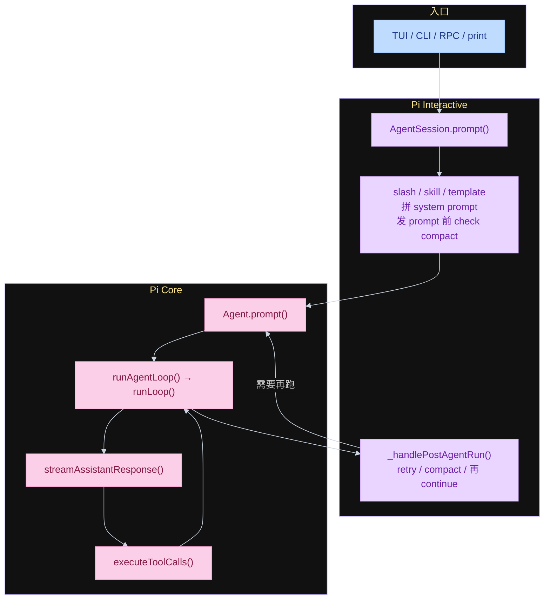
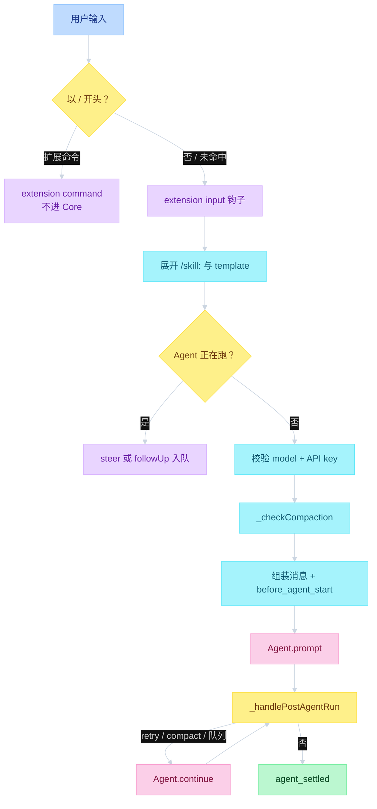
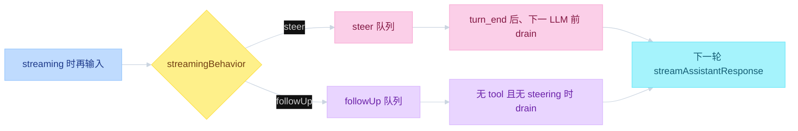
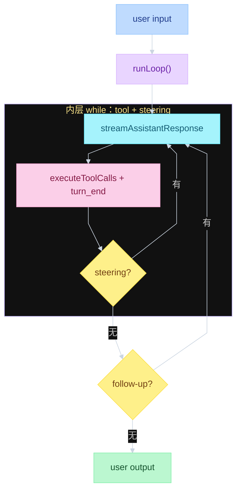
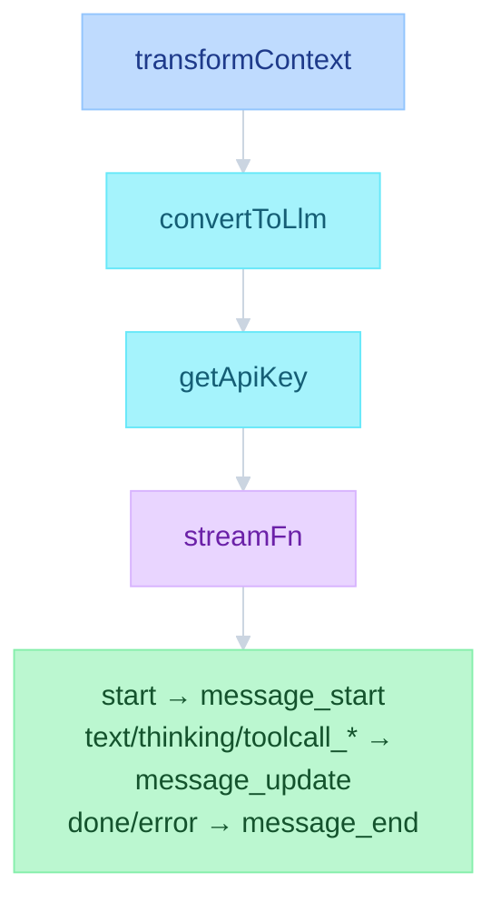
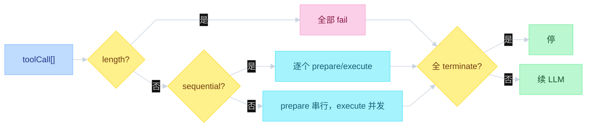
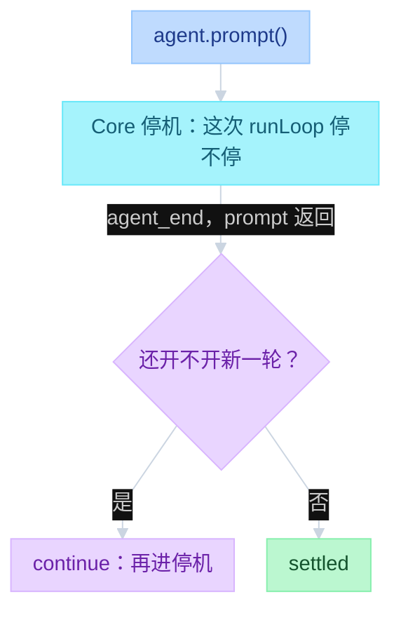
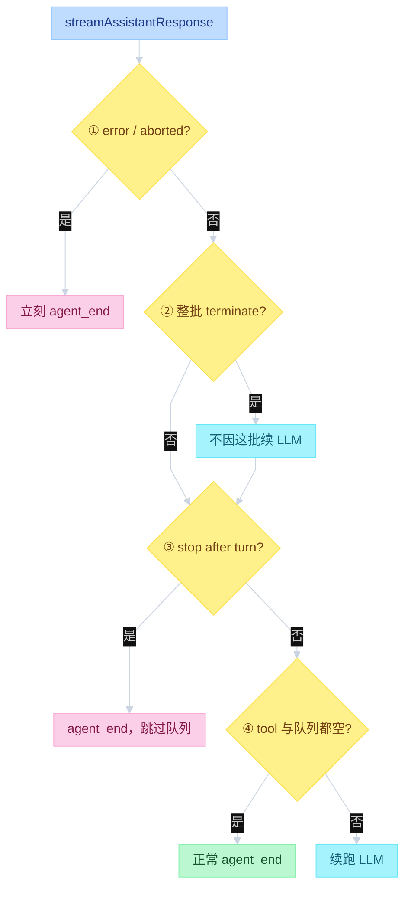
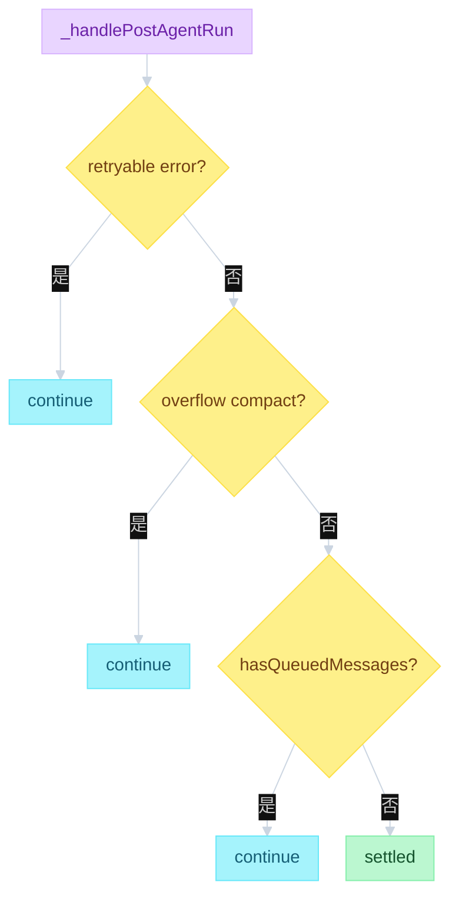

# Pi Agent Loop


---

## 目录

- [一、三层调用栈](#一三层调用栈)
- [二、消息怎么进循环](#二消息怎么进循环)
- [三、Core 循环](#三core-循环)
  - [队列](#队列)
  - [runLoop](#runloop)
  - [调用一次大模型](#调用一次大模型)
  - [工具](#工具)
  - [停机与兜底](#停机与兜底)
- [四、事件与落盘](#四事件与落盘)
- [五、Compaction](#五compaction)
- [对照](#对照)

事件总线和 JSONL 落盘见 [`03-events.md`](03-events.md)。compact 见 [`05-compaction.md`](05-compaction.md)。HITL 见 [`06-HITL.md`](06-HITL.md)。

---

## 一、三层调用栈

这里的三层是调用栈上的三个对象，不是大纲的「初始化 / 变换 / LLM」：

1. **`runLoop`**（`agent-loop.ts`）：无状态循环，只做 LLM ↔ tool，发事件。
2. **`Agent`**（`agent.ts`）：有状态封装，持有 transcript、steering / follow-up 队列、abort。
3. **`AgentSession`**（`agent-session.ts`）：Interactive 产品层，进循环前翻译输入，结束后 compact / retry。

TUI、RPC、SDK 都从 `Agent.prompt` 进同一套 Core。`AgentSession` 是 Core 外面的包装，不是第四套循环。

```text
function flow（调用栈）
  TUI / CLI / RPC / print
    → AgentSession.prompt(text)
        slash / skill / template
        _checkCompaction(lastAssistant)          # 循环外
        → Agent.prompt(messages)
            → runAgentLoop(prompts, context, config)
                → runLoop()                      # 双层 while
                    streamAssistantResponse()
                    executeToolCalls()
        → while _handlePostAgentRun():
            Agent.continue()                     # retry / compact / 队列
```



| 层 | 文件 | 函数 |
|----|------|------|
| 无状态循环 | `packages/agent/src/agent-loop.ts` | `agentLoop` / `runLoop` |
| 有状态封装 | `packages/agent/src/agent.ts` | `Agent.prompt` / `steer` / `followUp` |
| 产品 session | `packages/coding-agent/src/core/agent-session.ts` | `prompt` / `_handlePostAgentRun` |
| 组装 | `packages/coding-agent/src/core/sdk.ts` | `new Agent({ streamFn, transformContext })` |

同一时刻一个 `activeRun`。再发消息走 `steer()` / `followUp()`。`continue()` 要求最后一条能转成 `user` 或 `toolResult`。

---

## 二、消息怎么进循环

用户回车后先在 Interactive 处理：扩展命令、skill / template、鉴权、发消息前 compact。命中 `/` 扩展命令则不进 Core。正在跑时不能再 `prompt`，只能入队。Core 停了还不等于结束，`_handlePostAgentRun` 还可能 `continue()`。

```text
function flow（prompt）
  AgentSession.prompt(text, options):
    if text starts with "/" and extension command:
      handler(args) → return                    # 不进 Core
    emitInput() → handled | transform
    expand /skill: and prompt template
    if agent.isStreaming:
      steer() or followUp() → return
    check model + API key
    _checkCompaction(lastAssistant, skipAborted=false)
    messages = [user, ...pendingNextTurn, ...before_agent_start]
    maybe override systemPrompt
    _runAgentPrompt(messages)

  _runAgentPrompt(messages):
    agent.prompt(messages)
    while _handlePostAgentRun():
      agent.continue()
    emit agent_settled

  _handlePostAgentRun():
    if retryable error → prepareRetry → continue
    if _checkCompaction(lastAssistant) → continue
    if agent.hasQueuedMessages() → continue     # agent_end 钩子新入队
    return false
```



`/skill:name` 只注入 name / description / location。自定义 `/template` 在 Interactive 展开成全文。

进循环前还要拼 `AgentContext`。system prompt 按固定顺序叠；tools schema 走 `context.tools`，不写进 prompt 正文。循环内变换见第三节「调用一次大模型」；compact 见第五节。

```text
function flow（buildSystemPrompt）
  default | SYSTEM.md | --system-prompt
    + APPEND_SYSTEM.md
    + AGENTS.md / CLAUDE.md
    + skills descriptions          # 有 read 才挂
    + cwd
  AgentContext = { systemPrompt, messages, tools }
```

---

## 三、Core 循环

Core 从 `Agent.prompt` 进 `runLoop`。先讲两条队列（steering / follow-up），再讲循环怎么消化它们：双层 while、调用一次大模型、跑工具、何时停、产品层兜底。

### 队列

`Agent` 同时只跑一个 prompt。正在 streaming 时再打字不能新开一轮，只能入队。**steering** 是中途纠偏：当前 turn 的工具照跑，结束后立刻把新话塞进 transcript，再打下一轮 LLM。**follow-up** 是做完再加：没有 tool、也没有 steering、本来要停了才注入。`shouldStopAfterTurn` 为 true 时两队列都不 drain。

例子：智能体正在搜文件，你打「别搜了，只看 `foo.ts`」。走 steering 则手头这批工具跑完就改方向；走 follow-up 会先把搜索做完再听你的。

`streamingBehavior` 由调用方决定，不是 `runLoop`，也不是模型。`AgentSession.prompt` 只读 `options.streamingBehavior`。正在跑时没带会抛错；空闲时该字段无用，一律新开 `Agent.prompt`。Core 的 `Agent` 只提供 `steer()` / `followUp()`。

```text
function flow（队列）
  用户在 streaming 时再输入
    streamingBehavior == "steer"
      → agent.steer(msg)
      → 内层：turn_end 后、下一轮 LLM 前 drain
      → 当前这批 tool 不跳过
    streamingBehavior == "followUp"
      → agent.followUp(msg)
      → 外层：无 tool 且无 steering、本要停时 drain

  谁定 streamingBehavior（调用方，不是 Core）
    TUI 回车              → "steer"
    TUI Alt+Enter         → "followUp"
    RPC prompt            → 客户端自带
    RPC steer / follow_up → 直接走对应 API
    正在跑且没带          → throw

  QueueMode:
    "one-at-a-time"   # 默认，一次一条
    "all"             # drain 点倒空

  Agent.continue() 且 last.role == assistant:
    drain steering / followUp → 当新 prompt 跑
    否则 throw
```



| | Steering | Follow-up |
|--|----------|-----------|
| API | `steer()` | `followUp()` |
| 循环位置 | 内层，每个 turn 结束后 | 外层，本要 `agent_end` 时 |
| 当前工具 | 不跳过 | 等全部做完 |
| 语义 | 中途改方向 | 做完再加一句 |

| 入口 | 谁定 `streamingBehavior` |
|------|--------------------------|
| TUI 回车 | 写死 `"steer"` |
| TUI Alt+Enter | 写死 `"followUp"` |
| RPC `prompt` | 客户端自己带 |
| RPC `steer` / `follow_up` | 直接走对应 API，不经过这个字段 |

---

### runLoop

不是「调一次 LLM」。内层消化 tool call 和 steering（中途纠偏，当前工具不跳过）。外层消化 follow-up（本要停了才加一句）。`error` / `aborted` 立刻整 run 退出。`prepareNextTurn` 在 `turn_end` 之后刷新 system prompt / tools，扩展中途改工具集不必重建 Agent。

```text
function flow（runLoop）
  runAgentLoop(prompts, context, config):
    emit agent_start, turn_start
    emit message_start/end for each prompt
    runLoop(...)

  runLoop(context, newMessages, config):
    pending = getSteeringMessages()
    while true:                                   # 外层：follow-up
      while hasMoreToolCalls or pending:          # 内层：tool + steering
        emit turn_start                           # firstTurn 跳过重复
        inject pending into context
        msg = streamAssistantResponse(...)
        if msg.stopReason in (error, aborted):
          emit turn_end, agent_end → return
        if toolCalls:
          if stopReason == length:
            fail all calls                        # 参数可能截断，不执行
          else:
            batch = executeToolCalls(...)
          append toolResults
          hasMoreToolCalls = not batch.terminate
        emit turn_end
        prepareNextTurn()                         # 可换 systemPrompt / tools / model
        if shouldStopAfterTurn():
          emit agent_end → return                 # 不再 poll 队列
        pending = getSteeringMessages()
      followUp = getFollowUpMessages()
      if followUp: pending = followUp; continue
      break
    emit agent_end
```



---

### 调用一次大模型

循环内部一直拿 `AgentMessage`（可含 custom / 摘要 / bash）。只有调用大模型前才收成 `pi-ai` 的 `Message[]`。流式事件原地替换最后一条 assistant，UI 边生成边画。`getApiKey` 每次调用都解析，方便短命 OAuth。

```text
function flow（streamAssistantResponse）
  streamAssistantResponse(context, config, signal, emit, streamFn):
    messages = transformContext(context.messages) or context.messages
    llmMessages = convertToLlm(messages)
    apiKey = getApiKey(provider) or config.apiKey   # 每次调用都解析
    stream = streamFn(model, { systemPrompt, llmMessages, tools }, options)

    for event in stream:
      start        → push partial, emit message_start
      text/thinking/toolcall_* → replace last, emit message_update
      done / error → replace with result(), emit message_end, return
```



`streamFn` 失败不能 throw，必须给出 `stopReason: "error" | "aborted"`。Interactive 在 `sdk.ts` 灌入 `modelRuntime.streamSimple`。

---

### 工具

一条 assistant 可以带多个 tool call。默认并行，但预检（查工具、校验、`beforeToolCall`）必须串行；任一工具声明 `sequential` 则整批改串行。`length` 截断时参数可能不完整，整批 fail 不执行。`terminate` 必须这批每个 result 都为 true 才提前停。

```text
function flow（executeToolCalls）
  executeToolCalls(context, assistant, config):
    calls = assistant.content where type == toolCall
    if any tool.executionMode == sequential or config.toolExecution == sequential:
      sequential: for each call: prepare → execute → finalize → emit result
    else:
      parallel:
        for each call: prepare                         # 串行预检
        Promise.all(execute + finalize)                # 并发执行
        emit tool_execution_end in completion order
        emit toolResult messages in assistant order    # 与 call 顺序一致
    terminate = every result.terminate == true

  prepareToolCall(call):
    find tool | error "not found"
    prepareArguments → validateToolArguments
    beforeToolCall → { block: true } → error result
    return prepared

  executePreparedToolCall(prepared):
    tool.execute(id, args, signal, onUpdate)
      onUpdate → tool_execution_update                 # settle 后丢掉
    catch → error result

  finalizeExecutedToolCall:
    afterToolCall → field-level override               # 不深合并
```



`length` 截断：`failToolCallsFromTruncatedMessage`，全部 error，让模型重发。  
`terminate` 必须整批同意。  
Interactive：`beforeToolCall` → 扩展 `tool_call`；`afterToolCall` → `tool_result` + 图片规范化。

---

### 停机与兜底

先分清两层。它们问的不是同一个问题。

| | 停机 | 兜底 |
|--|------|------|
| 谁 | Core `runLoop`（`agent-loop.ts`） | Interactive `_handlePostAgentRun`（`agent-session.ts`） |
| 问 | **这次循环停不停** | **停完了，还开不开新一轮** |
| 何时 | `agent.prompt()` 还在阻塞 | `prompt()` 已经返回 |
| 结果 | 发 `agent_end` | `continue()` 或 `settled` |

`agent_end` 是这次循环的**结束通知**，不是在问要不要停。后面若再跑，是新的一次 `runLoop`。一个 Agent 不能并行两个 prompt。

讲的时候按时间走：Core 四道门 → `prompt()` 返回 → Interactive 才进兜底。

```text
function flow（两层关系）
  _runAgentPrompt(messages):
    agent.prompt(messages)                 # 阻塞；内部跑完停机四道门才返回
    while _handlePostAgentRun():           # 兜底：再开一轮？
      agent.continue()                     # 新的一次 runLoop
    emit agent_settled
```



**停机（Core）** — 按执行顺序走四道门。只有 1、3、4 发 `agent_end`。第 2 道只挡住「因这批 tool 再调 LLM」，循环可能还去 poll steering / follow-up。

```text
function flow（停机）
  msg = streamAssistantResponse()

  1. stopReason in (error, aborted)
       emit turn_end, agent_end → return     # 立刻整 run 退出

  2. 有 tool 且整批 result.terminate == true
       hasMoreToolCalls = false              # 不因这批续 LLM；还不发 agent_end

  emit turn_end
  prepareNextTurn()

  3. shouldStopAfterTurn() == true
       emit agent_end → return               # 跳过两队列

  pending = getSteeringMessages()            # 有 → 内层再转
  followUp = getFollowUpMessages()           # 有 → 外层再转

  4. 无 tool 且两队列空
       emit agent_end                        # 大纲那条「模型决定停」
```



第 2 道必须**整批** `result.terminate == true`。同批有一个没 terminate，还会续 LLM。`Agent.abort()` 打当前 `AbortController`，正在流的那次变成 `aborted`，走第 1 道。

**兜底（Interactive）** — 不实现上面四道门，只订 `agent_end` 做副作用（落盘、扩展、`willRetry`）。`prompt()` 返回后再问要不要 `continue()`。

```text
function flow（兜底）
  _handlePostAgentRun():                     # 再开一轮？
    if retryable error → prepareRetry → true
    if overflow compact → true
    if hasQueuedMessages → true              # agent_end 钩子新入队
    return false                             # settled
```



`hasQueuedMessages` **不是**停机第 4 条。第 4 条排空的是这次 loop 里的 steering / follow-up。这里查的是 `agent_end` 钩子之后新塞进来的消息。

---

## 四、事件与落盘

循环对外只发 `AgentEvent`。UI 和 JSONL 订同一条总线。JSONL 在 `message_end` 追加，不等整轮结束。展开见 [`03-events.md`](03-events.md)。

## 五、Compaction

`runLoop` 不 compact。检查在 Interactive 的 `_checkCompaction`。展开见 [`05-compaction.md`](05-compaction.md)。

---

## 对照

大纲是教学抽象。读源码时按这张表对齐，避免把 compact 画进 `runLoop`。

| 大纲 | 源码 |
|------|------|
| 初始化上下文 | `buildSystemPrompt` + `AgentContext`，在 `runLoop` 外 |
| 变换 = compact | 循环内 `transformContext` + `convertToLlm`；compact 在 `_checkCompaction` |
| LLM ↔ tool | `runLoop` 内层；外层是 follow-up |
| 模型决定停 | Core 停机四道门：error/aborted、整批 terminate、`shouldStopAfterTurn`、两队列空 |
| （大纲没有这一层） | Interactive 兜底：`prompt()` 返回后 `_handlePostAgentRun`，可能 `continue()` |

读：`types.ts` → `agent-loop.ts` → `agent.ts` → `sdk.ts` → `agent-session.ts` → `test/agent-loop.test.ts`。
