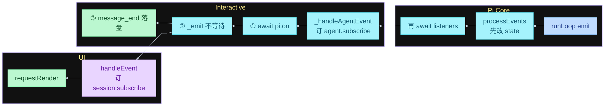
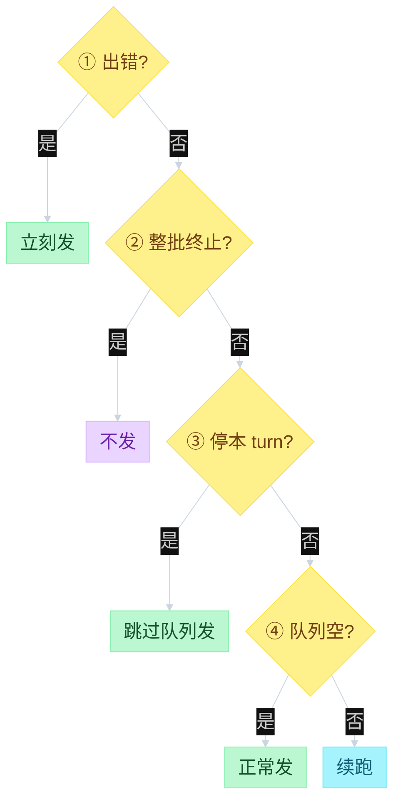
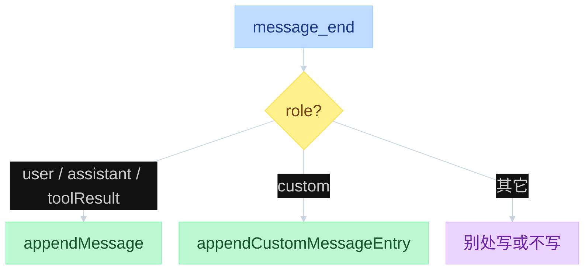

# Pi Events and Persistence


---

## 目录

- [一、总图](#一总图)
- [二、emit 是什么](#二emit-是什么)
- [三、何时发送](#三何时发送)
- [四、谁在听](#四谁在听)
- [五、processEvents](#五processevents)
- [六、落盘](#六落盘)

---

## 一、总图

图从左到右是 UI | Interactive | Core。事件从右往左：Core 发，Interactive 处理，UI 画。`await emit` 等到 Interactive 做完；UI 被 `_emit` 踢出去，不挡循环。后面各节按这条线展开。

```text
function flow（三层）
  Pi Core  发送
    runLoop await emit(event)
      → Agent.processEvents
          先改 state
          再 await 已 subscribe 的 listeners   # 含 _handleAgentEvent

  Pi Interactive  处理
    AgentSession._handleAgentEvent
      ① await pi.on 订的扩展
      ② _emit → session.subscribe 名单  # 不 await，不挡循环
      ③ message_end → append JSONL
    另发 SessionEvent（不经 runLoop，第四节）

  UI  处理
    handleEvent                        # 只订 Session，不订 Core
      改 Component → TUI.requestRender
```




---

## 二、emit 是什么

循环对外只发 `AgentEvent`。`runLoop` 不画 UI、不写盘，只调用传入的回调 `emit`。类型在 `packages/agent/src/types.ts`。

```text
AgentEventSink = (event: AgentEvent) => Promise<void>

Agent 把 emit 接到自己身上:
  runAgentLoop(..., (event) => this.processEvents(event), ...)
```

`await emit(...)` 等的是 `processEvents` + 已订 listener 做完，不是等模型。TUI 的 `handleEvent` 被 Interactive 的 `_emit` 踢出去，不挡循环。

| 层 | 文件 | 函数 |
|----|------|------|
| 发出 | `packages/agent/src/agent-loop.ts` | `runLoop` 的 `emit` |
| 接到 | `packages/agent/src/agent.ts` | `processEvents` |

---

## 三、何时发送

`AgentEvent` 只在 Core 发。Interactive 另发的 `SessionEvent` 见第四节。`continue()` 没有初始 prompt 那对 `message_start/end`。`turn_start` 之后可以再进下一 turn，不回到 `agent_start`。

```text
function flow（何时发送 · agent-loop.ts）
  agent_start
    turn_start
      message_start / message_end              # 初始 prompt（continue 没有）
      message_start → message_update* → message_end   # assistant 流
      tool_execution_start
        tool_execution_update*
      tool_execution_end
      message_start / message_end              # 每条 toolResult
    turn_end
  agent_end                                    # 不是只有 turn_end 后一条
    ① error / aborted                    → emit → 立刻 return
    ② 整批 terminate                      → 不发
    ③ shouldStopAfterTurn                 → emit → return，跳过两队列
    ④ 无 tool、steering/follow-up 都空    → emit → 正常退出
```

`message_update` 只给正在流的 assistant。UI 边生成边画，靠这条，不是循环回头问人。

```mermaid
%%{init: {"theme": "dark", "flowchart": {"curve": "linear", "rankSpacing": 32, "nodeSpacing": 28, "padding": 12, "useMaxWidth": false, "htmlLabels": true}, "themeVariables": {"fontSize": "22px", "background": "#000000", "lineColor": "#CBD5E1", "edgeLabelBackground": "#111111"}, "themeCSS": ".nodeLabel,.label,span{font-size:22px!important}"}}%%
flowchart LR
    AS["agent_start"] --> TS["turn_start"]
    TS --> PR["prompt/steer start+end"]
    PR --> AM["assistant start → update* → end"]
    AM --> TX["tool start → update* → end"]
    TX --> TR["toolResult start+end"]
    TR --> TE["turn_end"]
    TE --> AE["agent_end"]

    classDef start fill:#BFDBFE,stroke:#93C5FD,color:#1E3A8A,font-size:22px
    classDef step fill:#A5F3FC,stroke:#67E8F9,color:#155E75,font-size:22px
    classDef prod fill:#E9D5FF,stroke:#D8B4FE,color:#6B21A8,font-size:22px
    classDef ok fill:#BBF7D0,stroke:#86EFAC,color:#14532D,font-size:22px

    class AS start
    class TS,PR,AM,TX,TR step
    class TE prod
    class AE ok
```



上图是嵌套顺序。`agent_end` 不是只有 `turn_end` 后面那一条：同一文件三处，对应停机第 1、3、4 道门。第 2 道 terminate **不发**，只挡住「因这批 tool 再调 LLM」，循环可能还去 poll 队列，最后仍可能走第 4 道才发。停机四道门见 `02-agent-loop.md`。

`agent_end` 是这次 `runLoop` 的结束通知，不是在问要不要停。payload 的 `messages` 是这次 run **新产生**的消息，不含进循环前已有的 transcript。后面 Interactive 若 `continue()`，那是新的一次 `runLoop`，会再发 `agent_start`。



`agent_end` 钩子里新入队的消息，本轮 loop 已经停了，由 `_handlePostAgentRun` 的 `hasQueuedMessages` 再 `continue()`。那是兜底，不是停机第 4 条。

`agent_settled` 在 `_handlePostAgentRun` 不再 `continue()` 之后，是 Interactive 的结束，不是 Core 的 `agent_end`。它不经 `processEvents`，走 `session.subscribe`（第四节）。`Agent.waitForIdle` 等的是 `agent_end` 的 listener（第五节）；`AgentSession.waitForIdle` 等的是这条 `agent_settled`。

---

## 四、谁在听

订听众是 `subscribe` / `pi.on`，发生在**构造时**，不在 `emit` 路径上。

```text
function flow（订）
  AgentSession 构造:
    agent.subscribe(_handleAgentEvent)     # 订到 Core
  扩展加载:
    pi.on("message_end", handler)          # 订到 Interactive
  InteractiveMode / RPC / print:
    session.subscribe(handleEvent)         # 订到 Interactive
```

TUI 不订 Core，只订 Session。

| 谁订 | 订到哪 | 调用 |
|------|--------|------|
| AgentSession | Core `Agent.listeners` | 构造时 `agent.subscribe(_handleAgentEvent)` |
| 扩展 | Interactive `handlers` | 加载时 `pi.on("message_end", ...)` |
| TUI / RPC / print | Interactive `_eventListeners` | `session.subscribe(handleEvent)` |

| 层 | 文件 | 函数 |
|----|------|------|
| 订到 Core | `packages/agent/src/agent.ts` | `subscribe` → `listeners.add` |
| 订到 Session | `packages/coding-agent/src/core/agent-session.ts` | `subscribe` → `_eventListeners` |
| 订扩展 | `packages/coding-agent/src/core/extensions/types.ts` | `pi.on(...)` |
| UI | `packages/coding-agent/src/modes/interactive/interactive-mode.ts` | `subscribeToAgent` → `handleEvent` |

Interactive 还另发 `SessionEvent`（不经 `runLoop`）：`queue_update` / `agent_settled` / `compaction_*` / `auto_retry_*`，同样走 `session.subscribe`。

---

## 五、processEvents

先改内部 state，再按订阅顺序 `await` 每个 listener。`Agent.waitForIdle` 等的是这些 listener 做完，不是 `agent_end` 刚发出。`AgentSession.waitForIdle` 等的是 `agent_settled`，见第三节。

```text
function flow（processEvents）
  Agent.processEvents(event):
    message_start / message_update → streamingMessage = event.message
    message_end → 清 streamingMessage；state.messages.push
    tool_execution_start → pendingToolCalls.add
    tool_execution_end → pendingToolCalls.delete
    turn_end → 若 assistant 带 errorMessage，记下
    agent_end → 清 streamingMessage

    for listener in subscribe() 顺序:
      await listener(event, signal)

  Agent.waitForIdle():
    return activeRun.promise     # agent_end 的 listener 也算进去
                                 # 不是 AgentSession.waitForIdle（那条等 agent_settled）
```

`AgentSession` 构造时 `agent.subscribe(this._handleAgentEvent)`。处理顺序：扩展 → TUI 监听者 → 落盘。

扩展在 `message_end` 可以替换消息（`emitMessageEnd`）。替换发生在 `appendMessage` 之前，所以盘上的是改过的版本。

| 层 | 文件 | 函数 |
|----|------|------|
| 处理 state | `packages/agent/src/agent.ts` | `processEvents` |
| 产品订阅 | `packages/coding-agent/src/core/agent-session.ts` | `_handleAgentEvent` |
| 扩展 | 同上 | `_emitExtensionEvent` |

---

## 六、落盘

落盘 = 把已经定稿的消息追加到 session JSONL。触发点是 `message_end`，不是整轮 `agent_end`。崩溃或关掉 TUI 后能接着聊：消息已经按事件写盘。

```text
function flow（落盘）
  _handleAgentEvent:
    if message_end:
      role == custom        → appendCustomMessageEntry
      role in (user, assistant, toolResult) → sessionManager.appendMessage
      bash / compactionSummary / branchSummary → 别处写

  appendMessage(msg):
    entry = { type: message, id, parentId: leafId, timestamp, message }
    appendFileSync 一行 JSON
    leafId = entry.id
```



`message_update` 不落盘。流式过程只改 `streamingMessage`；定稿才追加一行。文件只 append，不改已有行。路径与树结构见 `04-sessions.md`。

| 层 | 文件 | 函数 |
|----|------|------|
| 何时写 | `packages/coding-agent/src/core/agent-session.ts` | `_handleAgentEvent` 的 `message_end` 分支 |
| 写哪一行 | `packages/coding-agent/src/core/session-manager.ts` | `appendMessage` / `_appendEntry` |

---
