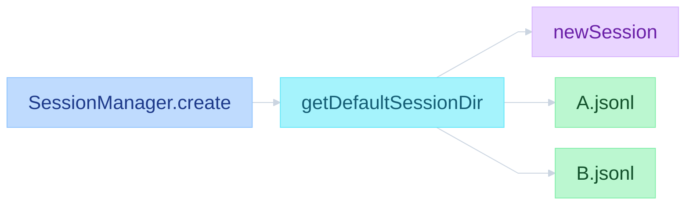
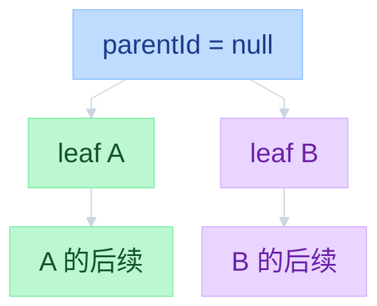
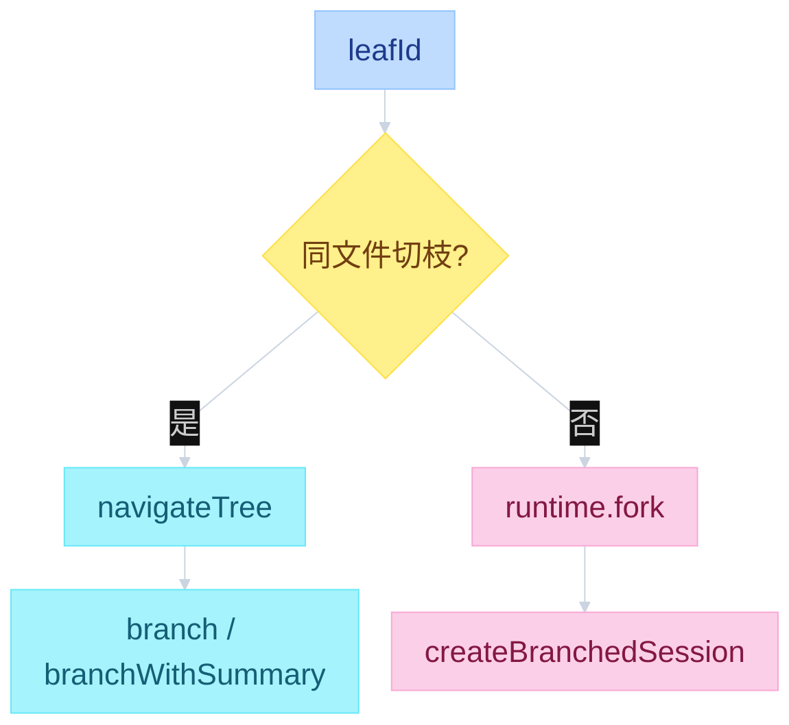

# Pi Sessions


---

## 目录

- [一、按工作目录落盘](#一按工作目录落盘)
- [二、JSONL 是树](#二jsonl-是树)
- [三、拼给 LLM 的不是全文件](#三拼给-llm-的不是全文件)
- [四、同文件切枝 vs 新开文件](#四同文件切枝-vs-新开文件)

循环怎么把消息写进 JSONL，见 [`03-events.md`](03-events.md)。compact 条目怎么裁 context，见 [`05-compaction.md`](05-compaction.md)。

---

## 一、按工作目录落盘

Session 不是全局一条。cwd 被编码成目录名，同一项目的多次对话都在这个目录下。文件只 append，不改已有行。

```text
function flow（路径）
  createSessionManager / createAgentSession
    SessionManager.create(cwd)
      getDefaultSessionDir(cwd)
        getDefaultSessionDirPath(cwd)
          safePath = "--" + cwd.replace(/^[/\\]/, "").replace(/[/\\:]/g, "-") + "--"
          mkdir join(~/.pi/agent, "sessions", safePath)
      newSession()
        sessionFile = join(dir, `${timestamp}_${id}.jsonl`)
        header { type: session, version: 3, id, cwd, parentSession }
        第一轮 assistant 才 _persist 写盘
```



| 层 | 文件 | 函数 |
|----|------|------|
| Interactive 树 | `packages/coding-agent/src/core/session-manager.ts` | `appendMessage` / `branch` / `getTree` / `createBranchedSession` |
| 切枝 | `packages/coding-agent/src/core/agent-session.ts` | `navigateTree` |
| 新开文件 | `packages/coding-agent/src/core/agent-session-runtime.ts` | `fork` |
| Core 存储 | `packages/agent/src/harness/session/` | `Session` / JSONL repo / `parentId` |

第一行是 header：`type=session`、`id`、`cwd`、`parentSession`。之后每一行一个 entry。版本现在是 3。

为什么是 JSONL：新消息 `appendFileSync` 最后一行。若是一个大 JSON 数组，每次都要改整份文件。

---

## 二、JSONL 是树

文件在磁盘上是行列表，语义是树。每条 entry 有 `id` 和 `parentId`。当前对话位置是 `leafId`。下一句挂在 leaf 下面，然后 leaf 前进。类型：`message` / `thinking_level_change` / `model_change` / `compaction` / `branch_summary` / `custom` / `custom_message` / `label`。

```text
function flow（树）
  _handleAgentEvent(message_end)
    sessionManager.appendMessage(msg)
      _appendEntry({ type: "message", id, parentId: leafId, timestamp, message })
        fileEntries.push / byId.set
        leafId = entry.id
        _persist(entry)
          无 assistant → 不写盘
          第一条 assistant → openSync wx 写全文件
          之后 → appendFileSync 一行
```



`getTree()` 用 `parentId` 把浅拷贝拼成树。断掉的 parent 当根。子节点按 timestamp 排。`/tree` 看到的就是这个结构。

循环里 `message_end` 时 `sessionManager.appendMessage`，不等整轮 `agent_end`。UI 和 JSONL 订同一条事件总线。何时写、写哪些 role，见 `03-events.md`。

---

## 三、拼给 LLM 的不是全文件

磁盘上整棵树都在。送给模型的是 **当前 leaf 回溯到根的那条 path**，再按最近一次 compaction 裁。

```text
function flow（拼 context）
  sessionManager.buildSessionContext()
    path = buildSessionPath(entries, leafId)
    { thinkingLevel, model } = getSessionContextSettings(path)
    messages = buildContextEntries(entries, leafId)
                 .flatMap(sessionEntryToContextMessages)
      有 compaction → [compaction] + firstKeptEntryId 起到 compaction 前
                      + compaction 之后；旧消息不进
      compaction → createCompactionSummaryMessage
      custom 不进；custom_message / branch_summary 才进
```



```mermaid
%%{init: {"theme": "dark", "flowchart": {"curve": "linear", "rankSpacing": 32, "nodeSpacing": 24, "padding": 12, "useMaxWidth": false, "htmlLabels": true}, "themeVariables": {"fontSize": "22px", "background": "#000000", "lineColor": "#CBD5E1", "edgeLabelBackground": "#111111"}, "themeCSS": ".nodeLabel,.label,span{font-size:22px!important}"}}%%
flowchart LR
    CTX["buildSessionContext"] --> PATH["buildSessionPath"]
    PATH --> CUT["buildContextEntries"]
    CUT --> MSG["sessionEntryToContextMessages"]

    classDef start fill:#BFDBFE,stroke:#93C5FD,color:#1E3A8A,font-size:22px
    classDef step fill:#A5F3FC,stroke:#67E8F9,color:#155E75,font-size:22px
    classDef prod fill:#E9D5FF,stroke:#D8B4FE,color:#6B21A8,font-size:22px
    classDef ok fill:#BBF7D0,stroke:#86EFAC,color:#14532D,font-size:22px

    class CTX start
    class PATH step
    class CUT prod
    class MSG ok
```

旁支还在同一个文件里，只是当前 leaf 走不到。这就是「返回会创建分支、旧路还在」的原因。

---

## 四、同文件切枝 vs 新开文件

`/tree` 改当前文件的 leaf。`/fork` `/clone` 另写一份 session。正在 streaming 时不能切枝。

```text
function flow（切枝）
  /tree → session.navigateTree(targetId)
    collectEntriesForBranchSummary(oldLeaf, target)
    可选 generateBranchSummary
    sessionManager.branch(newLeafId) | branchWithSummary | resetLeaf
    buildSessionContext() → agent.state.messages
  /fork /clone → runtime.fork(entryId)
    SessionManager.open(currentFile)
    createBranchedSession(leafId)
      getBranch(leafId)
      header.parentSession = 旧文件
      换成新 SessionManager
```



| | `/tree` | `/fork` `/clone` |
|--|---------|------------------|
| API | `navigateTree` | `runtime.fork` → `createBranchedSession` |
| 文件 | 同一个 JSONL | 新 JSONL |
| 旧分支 | 仍在原文件 | 不复制到新文件 |
| 摘要 | 可选 `branch_summary` | 无（整条 path 拷走） |

`/clone` 复制当前分支为新 session；`/fork` 可从树上某条 prompt 开新文件。未写出第一轮 assistant 前，文件可能还不存在，fork 会失败。

---

