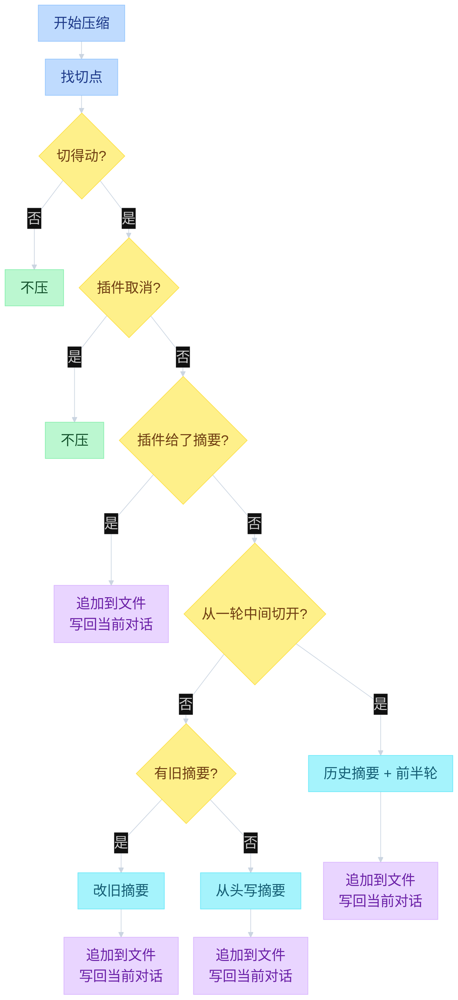
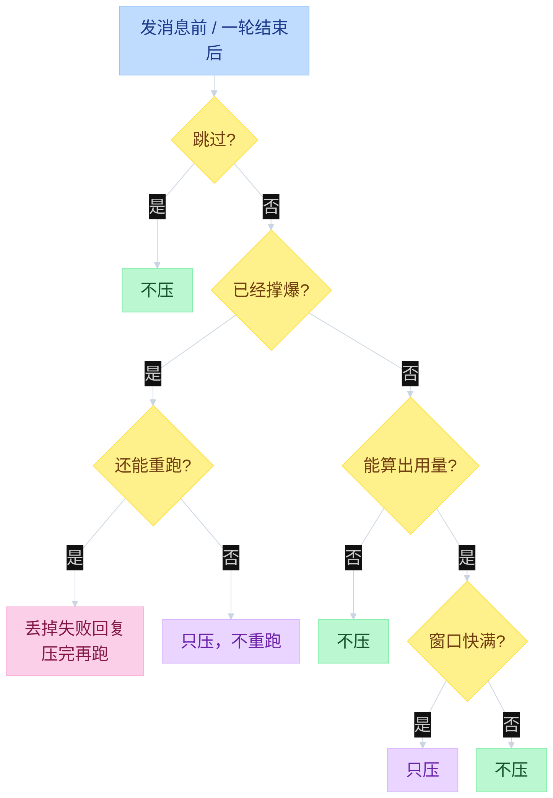
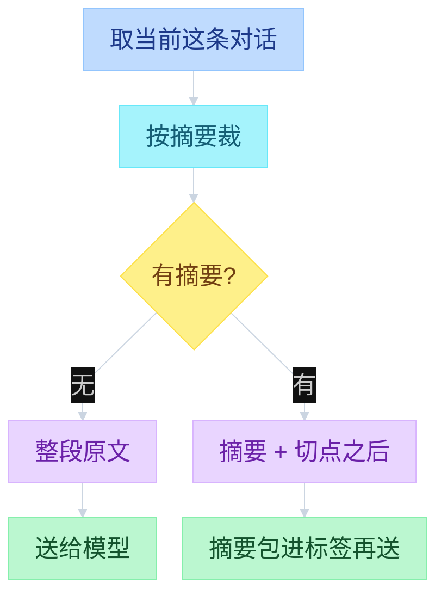

# Pi Compaction


---

## 目录

- [一、怎么压](#一怎么压)
- [二、何时压](#二何时压)
- [三、怎么拼 context](#三怎么拼-context)

对话太长时，要把旧内容压成摘要再继续聊。这件事不在模型循环里做。循环怎么停见 [`03-events.md`](03-events.md)，会话文件怎么长成树见 [`04-sessions.md`](04-sessions.md)。

---

## 一、怎么压

窗口装不下全部历史。做法是：**最近的话原文保留，更早的压成一份短摘要**。历史文件里旧消息还在，只在末尾多写一条摘要记录。下次发给模型时，旧消息换成这条摘要。

怎么选「最近」：从最新一条往回加，大约留 2 万 token。尽量切在一轮说完的地方（用户或助手消息之后），不要切在工具结果中间。如果不得不从一轮中间切开，前半轮单独做一份短摘要，后半轮原文留下。

如果之前已经压过，新摘要是在旧摘要上改，不是从头再写。插件可以拦住这次压缩，或自己交一份摘要。

```text
function flow（怎么压）
  _runAutoCompaction(reason, willRetry)
    emit compaction_start
    session_before_compact → 可 cancel 或交自定义摘要
    pathEntries = sessionManager.getBranch()
    preparation = prepareCompaction(pathEntries, settings)
      findCutPoint(..., keepRecentTokens)
      messagesToSummarize = 切点之前
      turnPrefixMessages = 若切在 turn 中间
      previousSummary = 上一次 compaction.summary
    compact(preparation)
      有 previousSummary → UPDATE_SUMMARIZATION_PROMPT
      否则 → SUMMARIZATION_PROMPT
      切在 turn 中间 → TURN_PREFIX_SUMMARIZATION_PROMPT
      摘要 maxTokens = min(0.8 * reserveTokens, model.maxTokens)
    sessionManager.appendCompaction(...)
    agent.state.messages = buildSessionContext().messages
    emit session_compact / compaction_end
```



摘要是给下一轮模型当备忘录的，不是给人读的长文：

| 段落 | 写什么 |
|------|--------|
| Goal | 用户要完成什么 |
| Constraints & Preferences | 约束；没有就写 `(none)` |
| Progress | 做完了 / 做到哪 / 卡住了 |
| Key Decisions | 决策和理由 |
| Next Steps | 下一步 |
| Critical Context | 路径、函数名、错误原文 |

每段保持短。路径、函数名、错误信息原样抄，不要改写。

| 层 | 文件 | 函数 |
|----|------|------|
| 产品层触发 | `packages/coding-agent/src/core/agent-session.ts` | `_checkCompaction` / `_runAutoCompaction` |
| 切点与摘要 | `packages/coding-agent/src/core/compaction/compaction.ts` | `shouldCompact` / `prepareCompaction` / `compact` |
| 落盘 | `packages/coding-agent/src/core/session-manager.ts` | `appendCompaction` / `buildContextEntries` |
| Core 副本 | `packages/agent/src/harness/compaction/compaction.ts` | 同一套算法，给 harness 用 |

---

## 二、何时压

压缩不在模型循环里。两处会检查：你点发送、下一句进循环之前；以及这一轮跑完之后。模型正在说话时不会压。界面上手动压缩走同一套步骤。

两种原因不要混：

1. **已经撑爆**：上一句回复失败了，或写到一半被截断。先压，然后可能把这一轮再跑一次。
2. **快满了**：还没爆，但窗口里留给下一句的空位不够。只压，不重跑上一句助手回复。

重跑要求最后一条能变成用户消息或工具结果。助手回复本身没法接着续。同一轮撑爆只救一次。

怎么判断快满了：看模型返回的 token 用量，不要用「字数除以 4」。上一句如果是用户取消、报错、或用量全是 0，就往前找最近一次靠谱的用量，再把后面几条消息估算进去。从来没有任何用量，就先不压。默认给下一句留出 16384 token。

用户取消的那句，轮次结束后不当成触发；发下一条之前会把它也算进去。从小窗口模型换成大窗口模型时，旧模型的撑爆不该立刻让新模型跟着压。

```text
function flow（何时压）
  AgentSession.prompt()
    _checkCompaction(lastAssistant, skipAborted=false)
    → Agent.prompt() → runLoop()
    → while _handlePostAgentRun():
        _checkCompaction(lastAssistant)
        maybe Agent.continue()

  _checkCompaction(lastAssistant)
    settings.enabled == false → return
    skipAborted && stopReason == aborted → return
    assistant.timestamp 早于最近 compaction → return
    换过模型：旧模型 overflow 不触发新模型 compact
    overflow / recoverable length（同一模型）:
      stopReason != stop → 摘掉失败 assistant，_runAutoCompaction("overflow", willRetry=true)
      stopReason == stop → 只 compact，不 continue
      同一 overflow 只允许恢复一次
    threshold:
      tokens = calculateContextTokens(usage)
        usage.totalTokens || (input + output + cacheRead + cacheWrite)
      本条 usage 无效 → estimateContextTokens：有效 usage + 尾巴
      没有有效 usage → 不压
      tokens > contextWindow - reserveTokens
      _runAutoCompaction("threshold", willRetry=false)
      若 steering / follow-up 还在队列里，返回 true 让 continue 把队列送出去
```



| | 已经撑爆 | 快满了 |
|--|----------|--------|
| 含义 | 这一句已经失败或被截断 | 还没爆，但空位不够下一句 |
| 失败的助手回复 | 从当前状态拿掉 | 留着 |
| 压完后重跑 | 只有被截断 / 失败时 | 不重跑（队列里还有话除外） |

循环里每次打模型前，只是把已有摘要包进标签，不是再压一次。

---

## 三、怎么拼 context

文件里整棵对话树都在。发给模型的只有 **你正走的这一条线**：从当前这句话一路回到开头。如果有摘要，更早的原文不发，改发摘要 + 切点之后的消息。

你没走的旁支还在同一个文件里，只是当前这条线走不到。被摘要掉的旧消息也还在文件里，只是不再进模型。

真正打 API 时，摘要会被包进 `<summary>`，当成一条用户消息。这是换格式，不是再压一次。

```text
function flow（拼 context）
  sessionManager.appendCompaction(...)
  agent.state.messages = sessionManager.buildSessionContext().messages
    path = buildSessionPath(entries, leafId)
    { thinkingLevel, model } = getSessionContextSettings(path)
    messages = buildContextEntries(entries, leafId)
                 .flatMap(sessionEntryToContextMessages)
      有 compaction → [compaction] + firstKeptEntryId 起到 compaction 前
                      + compaction 之后；旧消息不进
      compaction → createCompactionSummaryMessage    # role = compactionSummary
      custom 不进；custom_message / branch_summary 才进
  下次 runLoop 打模型:
    transformContext(context.messages)
    convertToLlm(messages)
      compactionSummary → role=user
        COMPACTION_SUMMARY_PREFIX + summary + COMPACTION_SUMMARY_SUFFIX
        即包进 <summary>，不是再压一次
```



读源码：`compaction.ts` → `agent-session.ts` `_checkCompaction` → `session-manager.ts` `appendCompaction` / `buildContextEntries` → `messages.ts` `<summary>` → `test/compaction.test.ts`。
