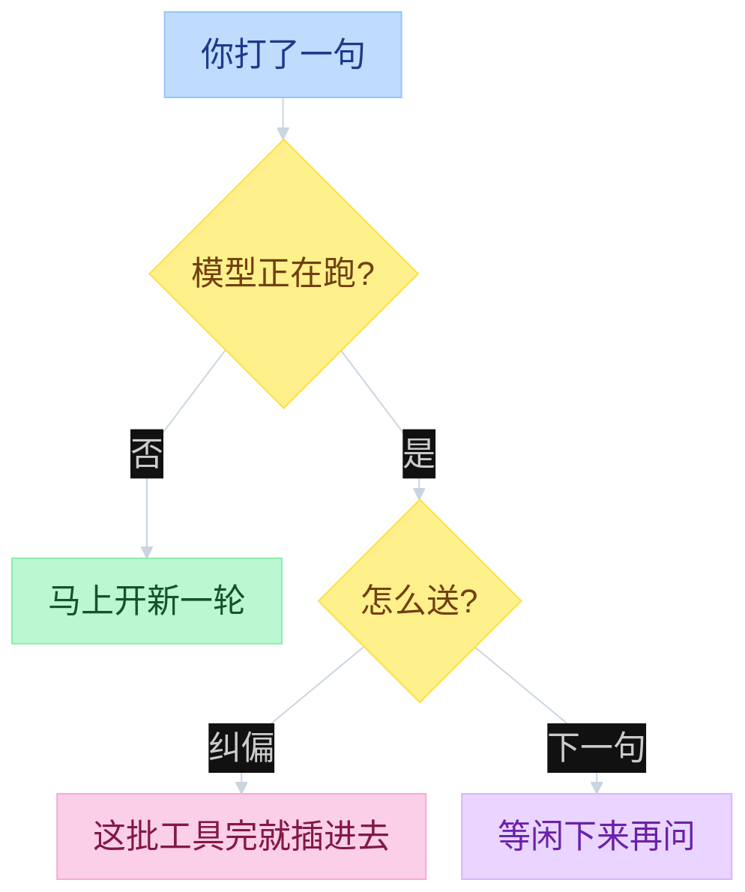
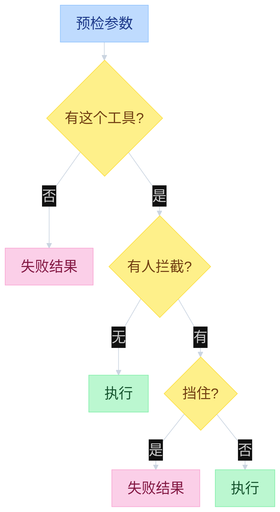

# Pi HITL


---

## 目录

- [一、总图](#一总图)
- [二、怎么插话](#二怎么插话)
- [三、何时进循环](#三何时进循环)
- [四、怎么拦工具](#四怎么拦工具)

人插手循环有两种办法：插一句话，或挡住一次工具。订事件只会看到发生了什么，插不进去。循环怎么跑见 [`02-agent-loop.md`](02-agent-loop.md)，事件总线见 [`03-events.md`](03-events.md)。

Core **没有**权限弹窗。开箱只有队列纠偏，加上可选的工具前拦截。弹窗要自己写扩展。

`prompt` 的 await 只占住这一轮 loop。正在跑时再打字，第二次 `session.prompt` 不进 `Agent.prompt`，只往队列里塞；loop 自己 drain。能卡住等人的只有扩展里 `await ui.select`。

---

## 一、总图

左 UI，中 Interactive，右 Core。人往右塞；拦工具时 Core 往左卡住等人。

```text
function flow（HITL 三层）

┌────────── UI ──────────┐  ┌──────── Interactive ────────┐  ┌──────── Pi Core ────────┐
│                        │  │                             │  │                         │
│  空闲回车               │  │                             │  │                         │
│  Editor.submitValue    │  │  defaultEditor.onSubmit     │  │                         │
│    onSubmit ───────────┼─>│    session.prompt           │  │                         │
│                        │  │      / 命令到此结束          │  │                         │
│                        │  │      emitInput / expand     │  │                         │
│                        │  │      _runAgentPrompt ───────┼─>│  Agent.prompt           │
│                        │  │                             │  │    runLoop              │
│                        │  │                             │  │    # await 占住这一轮    │
│                        │  │                             │  │                         │
│  正在跑再回车           │  │                             │  │                         │
│  Editor.submitValue    │  │  session.prompt({steer})    │  │                         │
│    onSubmit ───────────┼─>│    _queueSteer ─────────────┼─>│  Agent.steer            │
│                        │  │                             │  │    enqueue  # 立刻返回  │
│  onAction(followUp) ───┼─>│  handleFollowUp             │  │                         │
│                        │  │    _queueFollowUp ──────────┼─>│  Agent.followUp         │
│                        │  │                             │  │                         │
│                        │  │                             │  │  turn_end drain steer   │
│                        │  │                             │  │  闲时 drain followUp    │
│                        │  │                             │  │                         │
│  拦工具                 │  │                             │  │  prepareToolCall        │
│                        │  │  emitToolCall <─────────────┼──│    beforeToolCall       │
│                        │  │    permission-gate          │  │                         │
│  showExtensionSelector │<─┼──  ctx.ui.select            │  │                         │
│    人选 Yes/No         │  │                             │  │                         │
│                        │  │  {block} | undefined ───────┼─>│  block → error          │
│                        │  │                             │  │  否 → execute           │
└────────────────────────┘  └─────────────────────────────┘  └─────────────────────────┘
```

---

## 二、怎么插话

空闲时你回车，就是开新一轮。模型正在跑时再打字，这句话进队列，等循环自己来取：

- **纠偏（steer）**：这批工具跑完就插进去，让模型改方向。
- **下一句（followUp）**：等没有工具在跑了再问，不打断手头的活。

TUI 把回车写死成纠偏，Alt+Enter 是下一句。RPC 客户端自己带参数，或直接调 `steer` / `followUp`。队列何时取出、当前这批工具不跳过，见 [`02-agent-loop.md`](02-agent-loop.md) 第三节。

```text
function flow（人怎么进循环）
  InteractiveMode.editor.onSubmit(text)
    session.prompt(text)
      _tryExecuteExtensionCommand                 # / 命中扩展命令 → return，不进 Core
      emitInput → handled | transform
      expanded = _expandSkillCommand
               → expandPromptTemplate
      _runAgentPrompt(messages)
        Agent.prompt → runLoop

  isStreaming:
    Enter     → session.prompt(text, { streamingBehavior: "steer" })
                  _queueSteer → Agent.steer → steeringQueue.enqueue
    Alt+Enter → session.prompt(text, { streamingBehavior: "followUp" })
                  _queueFollowUp → Agent.followUp → followUpQueue.enqueue
    未带 streamingBehavior → throw

  这批 tool 跑完 → getSteeringMessages() = steeringQueue.drain()
  无 tool 且无 steer → getFollowUpMessages() = followUpQueue.drain()
```



走哪条由调用方决定，不是循环自己猜。空闲时带 `streamingBehavior` 没用，一律新开一轮。正在跑却没带参数会报错。

---

## 三、何时进循环

斜杠命中扩展命令，当场执行，**不进**模型循环。其余句子才到上一节那张图。

人插手是 **人 → 循环**。事件是 **循环 → 外界**（刷新界面、写文件）。订 `AgentEvent` 不会变成插话。

| | 插话 / 拦工具 | 事件 / 落盘 |
|--|----------------|-------------|
| 方向 | 人 → 循环 | 循环 → 外界 |
| 挡住模型 / 工具？ | 可以 | 否 |
| Core 开箱 | 纠偏、下一句、工具前拦截 | 必有 |

`pi -ne` 跳过扩展，权限弹窗没了。队列纠偏还在。

---

## 四、怎么拦工具

工具真正执行前，可以拦一把。预检通过之后、动手之前：返回挡住，这次调用不跑，模型会收到一条失败结果和原因。

挡住不等于整轮结束。只有这批工具的每个结果都同意停，循环才因这批停。

```text
function flow（beforeToolCall）
  executeToolCalls:
    prepareToolCall(toolCall):
      tool = context.tools.find(name)
      if not tool: return error result
      prepared = prepareToolCallArguments(tool)
      args = validateToolArguments(tool, prepared)
      beforeResult = config.beforeToolCall(...)
        AgentSession.agent.beforeToolCall:
          if not runner.hasHandlers("tool_call"): return undefined
          return runner.emitToolCall({ toolName, input })
            # permission-gate: ui.select Yes/No → { block } | undefined
      if beforeResult.block:
        return error toolResult(reason)           # 可带 terminate
      return prepared → executePreparedToolCall
```



扩展 `on("tool_call")` 就是这道拦截；`on("tool_result")` 是跑完之后。官方例子：`packages/coding-agent/examples/extensions/permission-gate.ts`。

读源码：[`02-agent-loop.md`](02-agent-loop.md) 队列 → `types.ts` `BeforeToolCallResult` → `agent-loop.ts` `prepareToolCall` → `extensions/types.ts` `ui.confirm` → `examples/extensions/permission-gate.ts`。
