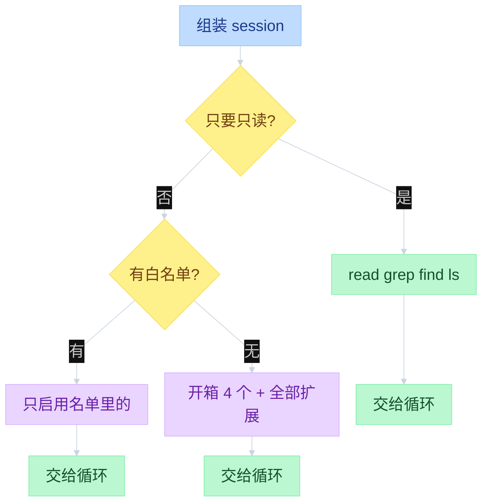
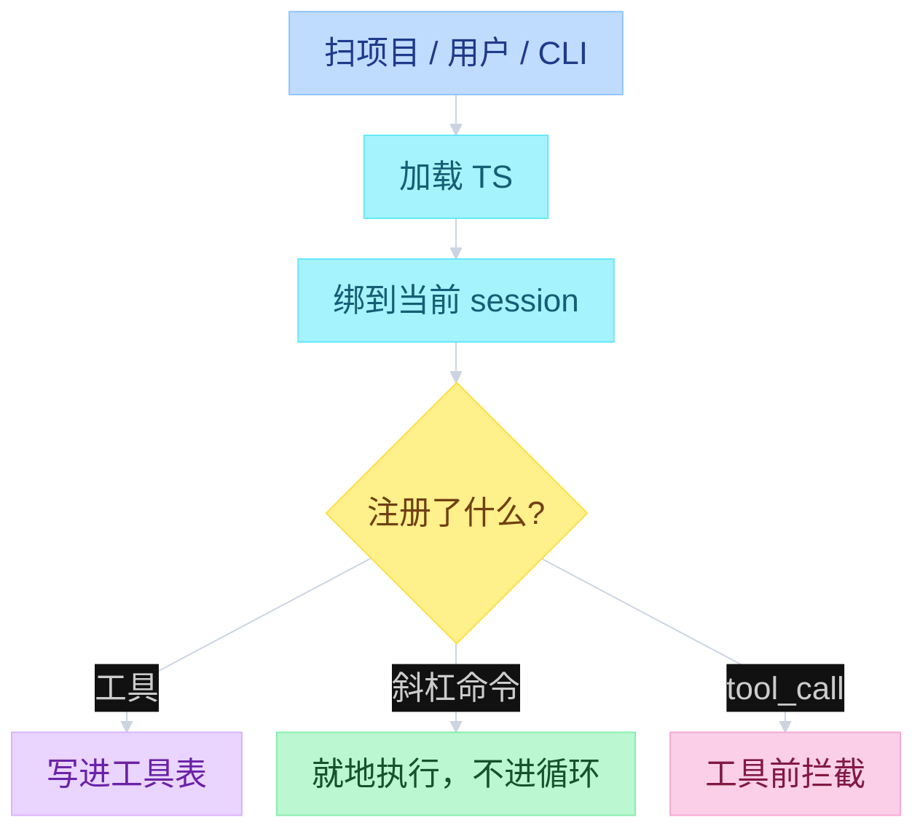

# Pi Capability at the Edges


---

## 目录

- [一、总图](#一总图)
- [二、工具怎么进循环](#二工具怎么进循环)
- [三、开哪些工具](#三开哪些工具)
- [四、扩展怎么接上](#四扩展怎么接上)

循环只认眼前这份工具表。默认四个，没有联网搜索，没有 MCP。要加能力：改开哪些工具、写 skill、装扩展、装 package。扩展改行为，不改循环本身。循环怎么跑工具见 [`02-agent-loop.md`](02-agent-loop.md) 第三节。

缺的不是疏漏。日常流程做成模板 / skill / 扩展 / package，不把 Core 变重。开箱不做：MCP 客户端、子智能体、权限弹窗、plan mode、todos、后台 bash。对照 examples 里用扩展补上的同一套：`subagent/`、`plan-mode/`、`todo.ts`、`permission-gate.ts`。

---

## 一、总图

左 UI，中 Interactive，右 Core。名单在 Interactive 凑好再交给 Core；循环只复印眼前这份表。斜杠命令停在 Interactive，不进 Core。

```text
function flow（Capability 三层）

┌────────── UI ──────────┐  ┌──────── Interactive ────────┐  ┌──────── Pi Core ────────┐
│                        │  │                             │  │                         │
│  启动选工具             │  │                             │  │                         │
│  --tools / settings    │─>│  createAgentSession         │  │                         │
│  --no-tools / -ne      │  │    createCodingTools        │  │                         │
│                        │  │    或 createReadOnlyTools   │  │                         │
│                        │  │    _refreshToolRegistry     │  │                         │
│                        │  │      builtin+ext+custom ────┼─>│  Agent.state.tools      │
│                        │  │                             │  │                         │
│  装扩展                 │  │                             │  │                         │
│  --extension / 目录    │─>│  discoverAndLoadExtensions  │  │                         │
│                        │  │    registerTool ────────────┼─>│  写进工具表              │
│                        │  │    registerCommand          │  │  Core 看不见命令         │
│  Editor /plan          │─>│    就地执行，不进循环        │  │                         │
│                        │  │    on(tool_call) 绑钩子 ────┼─>│  beforeToolCall         │
│                        │  │                             │  │                         │
│                        │  │  每轮 prepareNextTurn       │  │  runLoop                │
│                        │  │    tools = state.tools ─────┼─>│    context.tools=slice  │
│                        │  │                             │  │    executeToolCalls     │
└────────────────────────┘  └─────────────────────────────┘  └─────────────────────────┘
```

---

## 二、工具怎么进循环

建 session 时先凑一份名单：开箱四个，或你用 `--tools` 点名，或设置里的默认。只读模式换成另一套。扩展注册的工具也并进来，再交给循环。每一轮开始，循环复印当前这份表，不在 system prompt 正文里抄工具说明。

`--tools` 是名字白名单：内置和扩展都要写进去才启用。没写 `--tools` 时：开箱四个，加上全部扩展工具。

```text
function flow（谁提供工具）
  createAgentSession:
    defaultActive = ["read","bash","edit","write"]   # createCodingTools
    initialActive = options.tools                    # --tools 白名单
                  ?? settings.defaultTools
                  ?? defaultActive
    filter excludeTools
    AgentSession._buildRuntime(activeToolNames=initialActive)
      _refreshToolRegistry:
        builtin = _baseToolDefinitions               # 开箱 4 个；只读走 createReadOnlyTools
        ext     = runner.getAllRegisteredTools()     # ExtensionAPI.registerTool
        custom  = options.customTools
        setActiveToolsByName(nextActive)

  runLoop 每轮:
    prepareNextTurnWithContext:
      context.tools = agent.state.tools.slice()
      context.systemPrompt = _systemPromptOverride ?? _baseSystemPrompt
```



| 层 | 文件 | 看什么 |
|----|------|--------|
| 内置工具 | `packages/coding-agent/src/core/tools/index.ts` | `ToolName`、`createCodingTools`、`createReadOnlyTools` |
| Core 实现 | `packages/agent/src/harness/tools/` | read / bash / edit / write 的执行 |
| 扩展契约 | `packages/coding-agent/src/core/extensions/types.ts` | `ExtensionAPI` |
| 加载 | `packages/coding-agent/src/core/extensions/loader.ts` | jiti 加载 `extensions/*.ts` |
| 事件 | `packages/coding-agent/src/core/extensions/runner.ts` | 把 API 接到当前 session |

---

## 三、开哪些工具

内置七个名字，开箱只用四个。另外三个默认关：bash 本来也能搜、找、列目录；只读模式才需要它们，因为那时不给 bash。大纲常说「4 + 2」。源码是 4 个可写，加上 `grep` / `find` / `ls` 三个只读。RPC 自动化不想改文件时走 `--tools`。

```text
function flow（工具集）
  createCodingTools(cwd)   = [read, bash, edit, write]
  createReadOnlyTools(cwd) = [read, grep, find, ls]
  pi --tools read,grep,find,ls → options.tools 白名单
  settings.defaultTools 改开箱集合
  --tools 是名字白名单：builtin 和 extension 都要列进去才启用
  无 --tools 时：开箱 4 个 + 全部 extension tools
```

| 工具 | 默认 | 作用 |
|------|------|------|
| `read` | 开 | 读文件 |
| `bash` | 开 | 跑命令 |
| `edit` | 开 | 改文件（patch） |
| `write` | 开 | 写 / 覆盖文件 |
| `grep` | 关 | 搜内容；只读模式用 |
| `find` | 关 | 找文件；只读模式用 |
| `ls` | 关 | 列目录；只读套装里有 |

一条助手回复可以带多个工具调用。默认并行，预检串行。细节在 loop 文档。

从上到下用最小的一层就够：改 `settings.json`、写 `AGENTS.md`、换 `SYSTEM.md`、做 prompt 模板、写 skill、装扩展、再考虑 package。

---

## 四、扩展怎么接上

扩展是你机器上跑的 TS 模块，不要装不信任的源。契约是一个 `ExtensionAPI`，不是六套子系统。先扫项目目录、用户目录和命令行路径，加载后再绑到当前 session。

用户输入以 `/` 开头且命中扩展命令则 **不进循环**。`tool_call` / `tool_result` 对应循环里工具前 / 工具后拦截（见 [`06-HITL.md`](06-HITL.md)）。压上下文时，扩展可以取消或自己交摘要。

```text
function flow（加载）
  discoverAndLoadExtensions:
    discoverExtensionsInDir(cwd/.pi/extensions)
    discoverExtensionsInDir(~/.pi/agent/extensions)
    + CLI --extension 路径 / package
  loadExtensionsCached(paths):
    jiti 执行 *.ts
    factory(pi: ExtensionAPI)

  ExtensionRunner 绑 AgentSession
    registerTool → runtime.refreshTools → _refreshToolRegistry
    registerCommand / registerShortcut / registerFlag
    on("tool_call")   → beforeToolCall
    on("tool_result") → afterToolCall
    registerProvider
    ui.select / confirm / input / widget / footer
    session: newSession / fork / navigateTree / switchSession
```



| 钩子 | 典型用途 |
|------|----------|
| `registerTool` | 联网搜索、自定义函数 |
| `registerCommand` | `/plan`、`/todo` 这类斜杠流程 |
| `on("tool_call")` | 权限确认、拦截危险调用 |
| `on("agent_end")` | 记状态、改下一轮工具集 |
| `registerProvider` | 公司代理、本地模型 |
| `ui.confirm` | 权限弹窗（Core 不内置） |

`pi -ne` 跳过扩展。换 session / 重载之后，旧的 `pi` 上下文作废，后续工作放到 `withSession` 回调里。

官方例子在 `packages/coding-agent/examples/extensions/`：`tools.ts`、`commands.ts`、`event-bus.ts`、`question.ts`、`session-name.ts`、`custom-provider-anthropic/`。

读源码：`tools/index.ts` → `sdk.ts` 默认工具 → `extensions/types.ts` → `loader.ts` / `runner.ts` → `docs/extensions.md` → 一个 example。
