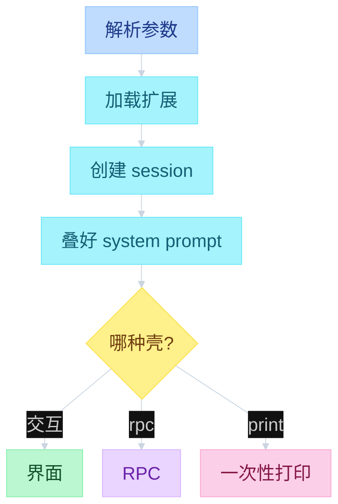
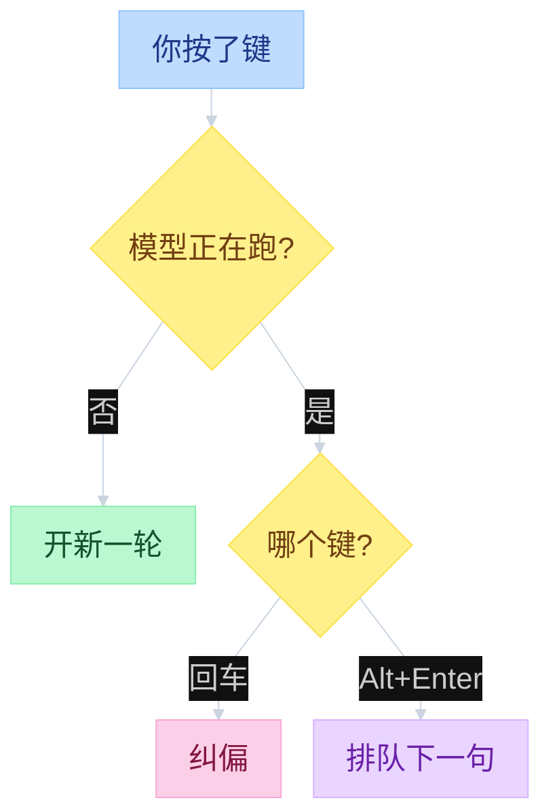
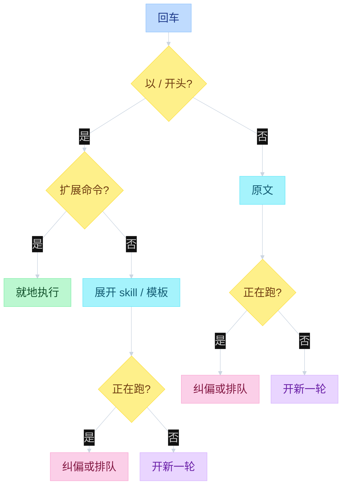

# Pi Interactive


---

## 目录

- [一、总图](#一总图)
- [二、怎么接到 Core](#二怎么接到-core)
- [三、何时用哪种壳](#三何时用哪种壳)
- [四、进循环前怎么处理输入](#四进循环前怎么处理输入)

Pi Core 是 agent 本身。Pi Interactive 是另一个包：命令行、界面、斜杠和 skill 拦截。三种壳都从 `Agent.prompt` 进同一套循环，`AgentSession` 不是第四套循环。三层调用栈见 [`02-agent-loop.md`](02-agent-loop.md)。事件怎么画到界面 / 文件，见 [`03-events.md`](03-events.md)。

---

## 一、总图

左 UI，中 Interactive，右 Core。三种壳共用同一个 session，都从 `Agent.prompt` 进循环。斜杠命令和 skill 展开停在 Interactive。

```text
function flow（Interactive 三层）

┌────────── UI ──────────┐  ┌──────── Interactive ────────┐  ┌──────── Pi Core ────────┐
│                        │  │                             │  │                         │
│  启动选壳               │  │                             │  │                         │
│  pi / --rpc / 管道     │─>│  cli.ts → main.ts           │  │                         │
│                        │  │    parseArgs / resolveAppMode│  │                         │
│                        │  │    先加载扩展，再建 session  │─>│  new Agent              │
│                        │  │    _rebuildSystemPrompt     │  │                         │
│  TUI / RPC / print     │<─┼── InteractiveMode.run       │  │                         │
│                        │  │    或 runRpcMode / print    │  │                         │
│                        │  │                             │  │                         │
│  回车                   │  │                             │  │                         │
│  Editor.submitValue    │─>│  session.prompt             │  │                         │
│                        │  │    / 命令就地执行            │  │  Core 看不见命令         │
│                        │  │    expand skill / 模板      │  │                         │
│                        │  │    空闲: _runAgentPrompt ───┼─>│  Agent.prompt           │
│                        │  │    在跑: steer / followUp ──┼─>│    runLoop              │
│                        │  │                             │  │                         │
│  画界面                 │  │                             │  │  runLoop emit           │
│  handleEvent           │<─┼── session.subscribe         │<─┼── processEvents         │
│    requestRender       │  │    _emit 不等待              │  │                         │
└────────────────────────┘  └─────────────────────────────┘  └─────────────────────────┘
```

---

## 二、怎么接到 Core

`pi` 先进 `cli.ts`，再进 `main.ts`。先装扩展（所以能注册参数、改工具、订事件），再创建 session，这才碰到 Core。SDK 也可以直接建 session，不经过命令行。

进循环前把 system prompt 叠好，不在循环里拼：有 `SYSTEM.md` 就整段换身份，`APPEND_SYSTEM.md` 往后面加，再挂上项目的 `AGENTS.md` 和 skill 目录。项目 `.pi/` 优先于用户目录 `~/.pi/agent/`。有 `read` 工具时，skill 只在 prompt 里挂名字、说明、路径，并告诉模型用 `read` 去加载。

```text
function flow（main）
  cli.ts → main.ts
    parseArgs
    appMode = resolveAppMode(...)
    resolve cwd / agentDir
    createAgentSessionServices                    # 扩展在这里加载；-ne 跳过
      loadExtensionsCached / discoverAndLoadExtensions
    createAgentSessionFromServices                # 这时才 new Agent + AgentSession
    createAgentSessionRuntime
    if rpc:         runRpcMode(runtime)
    if interactive: InteractiveMode(runtime).run()
    else:           runPrintMode(runtime)

  AgentSession._rebuildSystemPrompt(toolNames):
    customPrompt = resourceLoader.getSystemPrompt()       # SYSTEM.md | --system-prompt
    append       = resourceLoader.getAppendSystemPrompt() # APPEND_SYSTEM.md
    contextFiles = getAgentsFiles()                       # AGENTS.md / CLAUDE.md
    skills       = getSkills()
    return buildSystemPrompt(...)
      default | customPrompt
    + append
    + <project_context> AGENTS.md
    + formatSkillsForPrompt(skills)                       # 有 read 才挂
    + cwd
```



| 层 | 文件 | 函数 |
|----|------|------|
| CLI | `packages/coding-agent/src/cli.ts` · `main.ts` | 解析参数、加载扩展、建 session、选模式 |
| Session | `packages/coding-agent/src/core/agent-session.ts` | `prompt` / `_handlePostAgentRun` |
| 组装 | `packages/coding-agent/src/core/sdk.ts` | `createAgentSession` |
| TUI | `packages/tui/src/tui.ts` | 差分渲染、Component |
| 交互模式 | `packages/coding-agent/src/modes/interactive/interactive-mode.ts` | 快捷键、`/tree`、回车 = 纠偏 |

---

## 三、何时用哪种壳

命令行看参数和是不是终端：显式 rpc / json、管道或非终端走一次性打印，否则进交互界面。三种壳共用同一个 session。

界面是交互模式的壳，不是第二套 agent。自研差分渲染，所以不闪屏。每个部件自己画出这一行，自己处理按键。模型正在跑时，回车是纠偏，Alt+Enter 是排队下一句。RPC 客户端不经过这套界面，但仍用同一个 session。扩展可以换页眉页脚，或另挂窗口。

```text
function flow（三种模式）
  main.ts:
    parseArgs
    appMode = resolveAppMode(parsed, stdinIsTTY, stdoutIsTTY)
      parsed.mode == "rpc"  → "rpc"
      parsed.mode == "json" → "json"
      print | !TTY          → "print"
      else                  → "interactive"
    runtime = createAgentSessionRuntime(...)
    if rpc:         runRpcMode(runtime)
    if interactive: InteractiveMode(runtime).run()
    else:           runPrintMode(...)
  SDK 可直接 createAgentSession()，不经过 CLI

  InteractiveMode:
    订阅 AgentEvent
    editor.onSubmit(text):
      if isStreaming: session.prompt(text, { streamingBehavior: "steer" })
      else:           session.prompt(text)
    app.message.followUp:                           # Alt+Enter
      if isStreaming: session.prompt(text, { streamingBehavior: "followUp" })
      else:           onSubmit(text)
```



插话细节见 [`06-HITL.md`](06-HITL.md)。

---

## 四、进循环前怎么处理输入

用户回车后先在 Interactive 处理。命中扩展命令则不进循环。完整分流见 [`02-agent-loop.md`](02-agent-loop.md) 第二节。

斜杠有三种，进循环的东西不同：

| | 技能 | 提示模板 | 扩展命令 |
|--|------|----------|----------|
| 触发 | `/skill:name` | `/review` 这类 | 扩展自己注册的命令 |
| 进循环前 | 把文件 **全文** 包进标签 | 把 `$1` / `$@` 换成你打的字 | 当场执行，**不进循环** |
| system prompt | 只挂名字、说明、路径 | 不出现 | 不出现 |
| 模型看到什么 | 斜杠已带全文；没打斜杠时按说明自己去读 | 只看到展开后的句子 | 看不到这条 `/命令` |

大纲常说「界面只塞名字和路径，循环用 read」。那是 **skill 目录列表** 的行为。源码里 **显式 `/skill:` 会把全文塞进这一句**。自定义模板永远在进循环前展开。换一套命令行可以把 `/skill:` 改成别的写法，这件事发生在循环之外。

```text
function flow（进 Core 之前）
  AgentSession.prompt(text):
    if text.startsWith("/"):
      if _tryExecuteExtensionCommand: return          # 不进 Core
    emitInput → handled | transform
    expanded = _expandSkillCommand("/skill:name"):
      skill = resourceLoader.getSkills().find(name)
      body  = stripFrontmatter(readFileSync(SKILL.md))
      return <skill name location> 全文
    expanded = expandPromptTemplate(expanded)         # /review $1 / $@
    if isStreaming: _queueSteer | _queueFollowUp
    else: _runAgentPrompt → Agent.prompt

  formatSkillsForPrompt(skills) =
    <available_skills> name + description + location
```



读源码：`main.ts` → `sdk.ts` → `agent-session.ts` `prompt` → `interactive-mode.ts` → `tui.ts` → `skills.ts` / `prompt-templates.ts` / `slash-commands.ts`。
